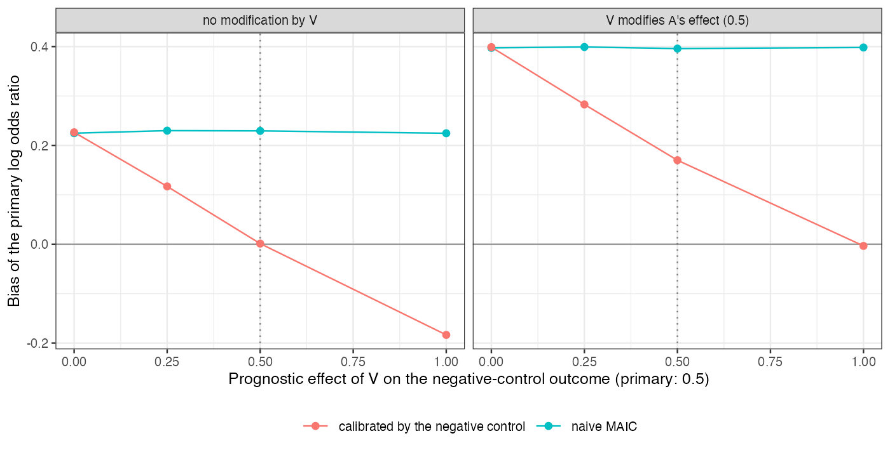

```{r setup}
s <- read.csv("../results/summary.csv")
f3 <- function(x) formatC(x, format = "f", digits = 3)
v <- function(gn, b, sh, col) s[s$g_n == gn & s$beta == b & s$shift == sh, col]
sh <- s[s$shift > 0, ]; n0 <- s[s$shift == 0, ]
```

# Abstract {.unnumbered}

**Background.** Negative-control outcomes detect and calibrate confounding within one data
source. Catalog problem IDN-09 asks whether they transfer to transport bias in indirect
comparisons, where the bias comes from population differences between studies.

**Methods.** Unanchored MAIC with an unmeasured covariate $V$ shifted by 0.5 SD between
populations or not; a negative-control outcome with no treatment effect whose dependence on $V$
was none, half, equal to or twice the primary outcome's; and $V$ either modifying A's effect or
not: 16 scenarios, 2000 replicates each. A control test and a calibrated contrast (primary minus
control) were compared with naive MAIC.

**Results.** The control test held its size without a shift (`r f3(min(n0$control_flag))` to
`r f3(max(n0$control_flag))`) and flagged the shift in `r f3(min(sh$control_flag))` to
`r f3(max(sh$control_flag))` of analyses depending on the control's dependence on $V$. Calibration
removed the bias only when the control's dependence equaled the primary's and $V$ did not modify
the effect (bias `r f3(v(0.5, 0, 0.5, "bias_cal"))` against `r f3(v(0.5, 0, 0.5, "bias_naive"))` naive).
With modification it left `r f3(v(0.5, 0.5, 0.5, "bias_cal"))`; with a control twice as dependent it
overcorrected to `r f3(v(1, 0, 0.5, "bias_cal"))`, and with modification it happened to cancel
(`r f3(v(1, 0.5, 0.5, "bias_cal"))`).

**Conclusion.** For transport a negative control must share the primary outcome's bias exactly,
including any modification of the treatment effect, which an outcome with no treatment effect
cannot do. Use a control signal to detect population differences, not to correct for them.

# The problem {#sec-problem}

A negative control [@lipsitch2010] shares the confounding pathway of the primary outcome within one
population. Across studies the bias is a transport gap: an unmeasured covariate distributed
differently between populations. It biases an unanchored MAIC [@signorovitch2010] through its
prognostic effect on the outcome and through any modification of the treatment effect. A control
outcome with no treatment effect can share only the first, and only if its prognostic dependence
matches.

# Design {#sec-design}

Registered protocol: `protocol.md`; ADEMP structure [@morris2019]. Individual data on 500 patients
of A; the target publishes B's (500) proportions for the primary outcome $Y$ and the control $N$ and
the mean of a measured covariate. $Y$: $\operatorname{logit} = -1 + 0.5x + 0.5V$, with B's effect $-0.4$ and
A's effect $\beta V$; $N$: $\operatorname{logit} = -1 + 0.5x + g_NV$. MAIC balances $x$. The calibrated contrast
subtracts the control contrast and adds its variance.

# Results {#sec-results}

{#fig-bias}

Calibration moved the estimate by the control's bias whatever the primary's was (@fig-bias). The
naive bias came from two sources, prognosis and modification; the control could carry only the
first, in proportion to its own dependence on $V$. The control test's power rose with that
dependence, so the controls that are easiest to detect with are the ones most likely to
overcorrect.

# What this does not answer {#sec-limits}

One control outcome rather than a bank with empirical calibration; unanchored comparisons only;
how often suitable control outcomes are reported in appraisal submissions was not surveyed. Peer
review has not been done.

# References {.unnumbered}
