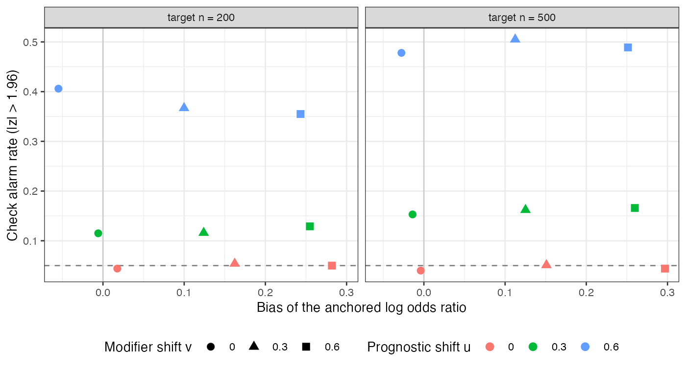

```{r setup}
s <- read.csv("../results/summary.csv")
au <- read.csv("../results/auroc.csv")$auroc
th <- read.csv("../results/thresholds.csv")
f3 <- function(x) formatC(x, format = "f", digits = 3)
cell <- function(u, v, n) s[s$mu_u == u & s$mu_v == v & s$n_t == n, ]
fa <- function(t) th$false_alarm[abs(th$z_tol - t) < 1e-6]; de <- function(t) th$detection[abs(th$z_tol - t) < 1e-6]
```

# Abstract {.unnumbered}

**Background.** When an anchored population-adjusted comparison shares a control
arm, the control-arm outcome transported from the individual-data trial can be
compared with the one the target trial observed. Agreement is read as support for
the analysis. Catalog problem IDN-10 asks what the check's operating characteristics
are.

**Methods.** Anchored MAIC with a binary outcome. Between the two trial populations
we shifted, independently, an unmeasured prognostic covariate $u$ and an unmeasured
modifier $v$ of the individual-data treatment's effect, over 18 scenarios with 1000
replicates each, and recorded the check's $z$-statistic and the anchored contrast's
error.

**Results.** A shift in $u$ raised the check's alarm rate to
`r f3(cell(0.6, 0, 500)$alarm)` while the contrast stayed essentially unbiased
(`r f3(cell(0.6, 0, 500)$bias)`); a shift in $v$ biased the contrast by
`r f3(cell(0, 0.6, 500)$bias)` on the log odds ratio scale and cut coverage to
`r f3(cell(0, 0.6, 500)$coverage)` while the alarm rate stayed at
`r f3(cell(0, 0.6, 500)$alarm)`. Pooled over all replicates, $\lvert z\rvert$ separated
biased from unbiased analyses with an AUROC of `r f3(au)`, and at every threshold its
detection rate equaled its false-alarm rate.

**Conclusion.** The check tests prognostic transport; the anchored contrast depends on
effect-modification transport. In an anchored comparison it is a test of the wrong
assumption and should not be reported as support for the relative effect.

# The problem {#sec-problem}

The control arm transports when the prognostic structure does; the relative effect
transports when the effect-modification structure does. In an anchored comparison a
purely prognostic imbalance cancels between arms, so the relative effect is protected
from exactly the failure the check detects, and unprotected from the one it cannot
see: a modifier of the treatment effect that does not move control-arm outcomes. The
check has been used in hidden-truth benchmarks of external controls [@gupta2025];
its operating characteristics as a screen for relative-effect bias had not been
measured.

# Design {#sec-design}

Registered protocol: `protocol.md`. Individual data on A versus C (300 per arm) in the
source; arm counts on B versus C in the target (200 or 500 per arm). Binary outcome
with $\operatorname{logit} p = \operatorname{logit}(0.3) + 0.5x + 0.6u + \text{treatment}$, A's
effect $-0.6 + 0.3x + 0.6v$, B's $-0.4 + 0.3x$. MAIC balances the measured $x$ (target
mean 0.5); $u$ and $v$ are unmeasured, with target means $\mu_u, \mu_v \in \{0, 0.3, 0.6\}$.
Estimand: the anchored B-versus-A marginal log odds ratio in the target. The check is
$z = (\operatorname{logit}\hat p_C^{\text{transported}} - \operatorname{logit}\hat p_C^{\text{observed}})/\text{SE}$.

# Results {#sec-results}

{#fig-check}

Alarm rate moved with $u$ and bias moved with $v$ (@fig-check). The design's four
cases held in every scenario:

| | control arm transports | contrast unbiased | alarm rate, target 500 per arm |
|---|:--:|:--:|---:|
| no shift | yes | yes | `r f3(cell(0, 0, 500)$alarm)` |
| prognostic shift only | no | yes | `r f3(cell(0.6, 0, 500)$alarm)` |
| modifier shift only | yes | no | `r f3(cell(0, 0.6, 500)$alarm)` |
| both | no | no | `r f3(cell(0.6, 0.6, 500)$alarm)` |

Across thresholds on $\lvert z\rvert$ the check flagged unbiased and biased analyses at
the same rate: `r f3(fa(1.96))` against `r f3(de(1.96))` at 1.96, `r f3(fa(1))` against
`r f3(de(1))` at 1. The AUROC of `r f3(au)` is chance. A prognostic shift slightly
reduced the contrast bias when combined with a modifier shift (for example
`r f3(cell(0, 0.6, 200)$bias)` to `r f3(cell(0.6, 0.6, 200)$bias)` at 200 per arm), through
the non-collapsibility of the odds ratio, but did not change the conclusion.

# What this does not answer {#sec-limits}

Binary outcome only; the survival-curve and RMST versions are not run. In an
unanchored comparison the relative effect does depend on prognostic transport, and
there the check targets a relevant assumption; that case, and offsetting prognostic
mechanisms, are not simulated. Outcome-definition and follow-up differences, which
also move control arms, are absent. Peer review has not been done.

# References {.unnumbered}
