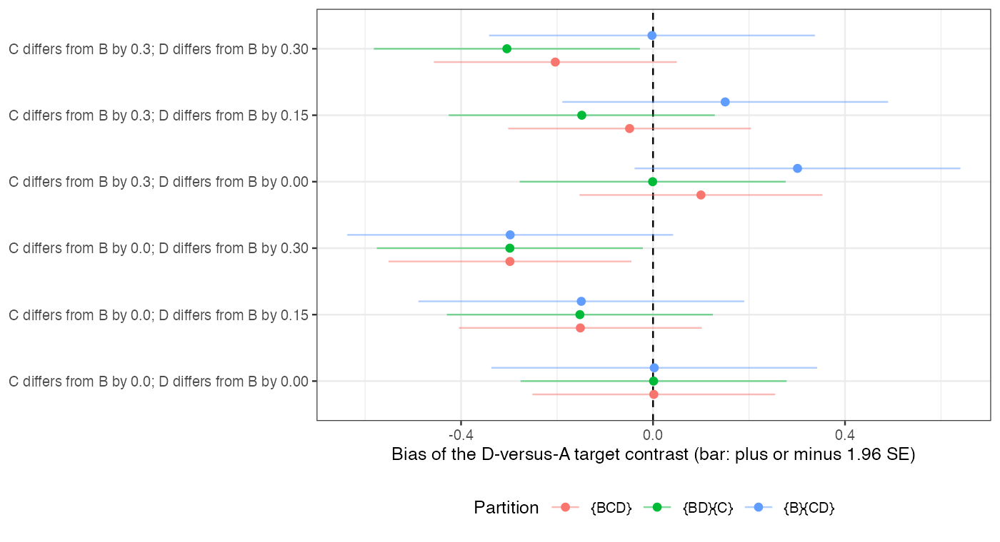

# A partition-sensitivity display for shared effect modifiers is stable
exactly when every candidate partition is wrong
Ahmad Sofi-Mahmudi
2026-09-23

# Abstract

**Background.** Multilevel network meta-regression identifies an
aggregate-only treatment’s interaction by assuming it shares effect
modification with other treatments in its class
([1](#ref-phillippo2020mlnmr)). Nothing governs the partition, and wider
classes fit and converge more easily. Catalog problem IDN-19 asks
whether the target contrast is sensitive to the partition and whether a
sensitivity display over defensible partitions would reveal a wrong one.

**Methods.** A network with individual data on A versus B, two aggregate
trials of A versus C at different covariate means, and one aggregate
trial of A versus D; D’s and C’s interactions differing from B’s or not;
three partitions that identify the D versus A target contrast; 4000
replicates per cell.

**Results.** When D’s interaction differed from both B’s and C’s (by
0.3) while theirs agreed, every partition returned the same answer,
biased by -0.298: the range over partitions had mean width 0.137,
contained the truth in 5% of replicates, and the only available fit test
rejected in 5%. The widest partition covered 0.366. When C’s interaction
differed from B’s, the partitions disagreed, the range widened to 0.307,
and the correct partition was in it.

**Conclusion.** Partition sensitivity reveals disagreement among the
candidate classes, not whether the aggregate-only treatment belongs to
any of them. A stable range is not evidence that the partition is right.

# The problem

An aggregate trial of D at one covariate mean identifies D’s effect at
that mean, not its interaction. Transporting D to a target at a
different mean needs the interaction, which a shared-modifier class
borrows from other treatments. The borrowed value can be tested only
against treatments whose own interactions are identified, so the
assumption is testable where it is not needed. A display of the target
contrast across admissible partitions is the natural safeguard; this
study measures when it works.

# Design

Registered protocol: `protocol.md`. Effect of treatment $k$ against A:
$d_k + g_kx$ with $g_B = 0.3$, $g_C = 0.3 + s$, $g_D = 0.3 + h$,
$s \in \{0, 0.3\}$, $h \in \{0, 0.15, 0.3\}$. Individual data on A
versus B (400 patients); aggregate A versus C at covariate means $-0.5$
and $0.5$; aggregate A versus D at 0; each aggregate effect with
variance 0.01. Target covariate mean 1. Partitions {BCD}, {BD}{C} and
{B}{CD} were fitted by generalized least squares on the sufficient
statistics; only {BCD} has residual degrees of freedom for a fit test.

# Results

Figure 1: Bias of the D-versus-A target contrast by partition. Bars span
1.96 SE either side of the bias.

Table 1: 4000 replicates per cell.

| C differs | D differs | range of estimates contains truth | range of intervals contains truth | range width (estimates) | widest partition coverage | its fit test rejects |
|---:|---:|---:|---:|---:|---:|---:|
| 0.0 | 0.00 | 36% | 99% | 0.138 | 0.947 | 5% |
| 0.3 | 0.00 | 48% | 98% | 0.307 | 0.884 | 41% |
| 0.0 | 0.15 | 21% | 95% | 0.135 | 0.781 | 5% |
| 0.3 | 0.15 | 69% | 100% | 0.304 | 0.933 | 39% |
| 0.0 | 0.30 | 5% | 70% | 0.137 | 0.366 | 5% |
| 0.3 | 0.30 | 48% | 98% | 0.307 | 0.647 | 41% |

The registered primary was confirmed
(<a href="#fig-partitions" class="quarto-xref">Figure 1</a>,
<a href="#tbl-main" class="quarto-xref">Table 1</a>). With C like B and
D unlike both, the widest partition was biased by -0.298 with coverage
0.366, and its fit test rejected at the nominal rate: the test compares
C’s interaction with B’s, the one comparison the data can make, and says
nothing about D’s. The other two partitions borrowed D’s interaction
from B or from C, which agreed, so they gave the same wrong answer and
the sensitivity range was narrow. Only when the candidate classes
themselves disagreed (C unlike B) did the range widen, and then it
contained the correct partition’s estimate, with {B}{CD} unbiased when D
shared C’s interaction and {BD}{C} when it shared B’s.

# What this does not answer

A small hand-built network with a continuous outcome and linear
modification, three admissible partitions, sufficient statistics drawn
directly; no overlap factor, larger networks or ML-NMR fits. Peer review
has not been done.

# References

1.
David M. Phillippo, Sofia Dias, A.
E. Ades, Mark Belger, Alan Brnabic, Alexander Schacht, Daniel Saure,
Zbigniew Kadziola, Nicky J. Welton. Multilevel network meta-regression
for population-adjusted treatment comparisons. Journal of the Royal
Statistical Society Series A. 2020;183(3):1189–210.
doi:[10.1111/rssa.12579](https://doi.org/10.1111/rssa.12579)

