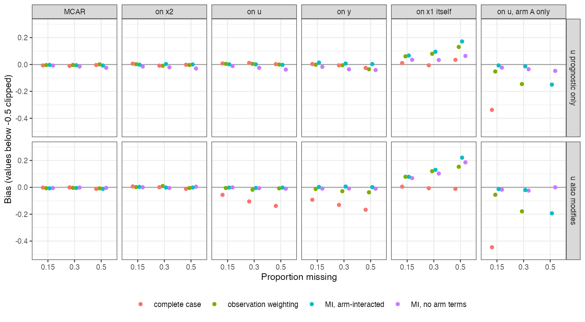

```{r setup}
s <- read.csv("../results/summary.csv")
f3 <- function(x) formatC(x, format = "f", digits = 3)
v <- function(me, r, b, m, col = "bias") s[s$mech == me & s$rate == r & s$bu == b & s$method == m, col]
cc <- s[s$method == "complete_case", ]
unb <- cc[cc$mech %in% c("MCAR", "MAR_x2", "MNAR_x1") | (cc$mech %in% c("MAR_u", "MAR_y") & cc$bu == 0), ]
mn <- s[s$mech == "MNAR_x1", ]
rep_mnar <- mn[mn$method != "complete_case", ]
mar <- s[!s$mech %in% c("MNAR_x1", "MAR_u_armA") & s$method != "complete_case", ]
gen <- mar[mar$method == "mi_generic", ]
```

# Abstract {.unnumbered}

**Background.** When a matched covariate is missing for some patients in the
individual-data trial, complete-case MAIC matches the target on the records it keeps,
so the balance table looks perfect whatever deletion did. Catalog problem MIS-01 asks
when this is biased and whether weighting or imputation repairs it.

**Methods.** Continuous-outcome anchored MAIC with a partly missing matched covariate
$x_1$, an observed matched covariate $x_2$ and an unmatched covariate $u$ correlated
with $x_1$. Missingness of 15%, 30% or 50% driven by nothing, $x_2$, $u$, the outcome,
$u$ in one arm only, or $x_1$ itself; $u$ prognostic only or also modifying: 36
scenarios, 1000 replicates each. Complete case, observation weighting
[@fang2026] and multiple imputation with and without arm interactions.

**Results.** Complete-case bias followed the mechanism, not the rate: unbiased in all
`r nrow(unb)` scenarios predicted unbiased, including missingness driven by $x_1$
itself, and biased already at 15% where predicted (for example
`r f3(v("MAR_u_armA", 0.15, 0, "complete_case"))` with arm-specific missingness). When
missingness depended on $x_1$ itself, weighting and imputation, which assume the data
missing at random, were biased by up to `r f3(max(abs(rep_mnar$bias)))` while complete
case stayed within `r f3(max(abs(mn$bias[mn$method == "complete_case"])))`. When 95% of one arm was
missing, weighting and arm-interacted imputation failed (bias
`r f3(v("MAR_u_armA", 0.5, 0.3, "ipw"))` and `r f3(v("MAR_u_armA", 0.5, 0.3, "mi_congenial"))`).
Otherwise imputation with arm interactions was the most reliable repair under missing at
random.

**Conclusion.** Report the missingness mechanism, not the rate. Complete case is the
right analysis when missingness depends only on the matched covariates, including the
missing one; imputation with arm interactions when it depends on unmatched variables or
the outcome.

# The problem {#sec-problem}

MAIC [@signorovitch2010] gives both arms of the individual-data trial the same weights,
so a shift in an unmatched covariate $u$ that deletion causes in both arms cancels in
the contrast unless $u$ modifies the effect. A shift confined to one arm does not
cancel, even for a purely prognostic $u$. Deletion driven by the matched covariates
themselves, including the missing one, leaves the conditional law of everything else
given the matched covariates unchanged, so MAIC on the complete cases still targets the
right population. Weighting and imputation assume the data missing at random given
observed variables, which fails exactly when missingness depends on $x_1$ itself.

# Design {#sec-design}

Registered protocol: `protocol.md`; ADEMP structure [@morris2019]. 250 per arm;
$u = 0.5x_1 + \text{noise}$; $y = 0.5(x_1 + x_2 + u) + A(-0.4 + 0.3x_1 + \beta_uu) + e$,
$\beta_u \in \{0, 0.3\}$; target means of $x_1, x_2$ 0.5. Missingness logistic in the
driver with an intercept set to the rate; for the arm-specific mechanism all missingness
falls in arm A at twice the rate (95% at most). Observation weighting models the
probability of a complete record on $x_2$, $u$ and $y$ interacted with arm; imputation
uses five draws, normal regression, and Rubin's rules [@rubin1987].

# Results {#sec-results}

{#fig-bias}

@fig-bias shows the pattern. Missingness driven by $u$ or $y$ biased complete case only
when $u$ modified the effect (`r f3(v("MAR_u", 0.3, 0.3, "complete_case"))` and
`r f3(v("MAR_y", 0.3, 0.3, "complete_case"))` at 30%). Missingness in one arm driven by
$u$ biased it whether or not $u$ modified (`r f3(v("MAR_u_armA", 0.3, 0, "complete_case"))`
at 30% with $u$ prognostic only).

Under missing at random, imputation with arm interactions was within 3 MCSE of zero in
`r sum(abs(mar$bias[mar$method == "mi_congenial"]) <= 3 * mar$mcse[mar$method == "mi_congenial"])`
of `r sum(mar$method == "mi_congenial")` scenarios; imputation without arm terms had
small systematic bias (up to `r f3(max(abs(gen$bias)))`), since it ignores the modification
of $x_1$'s relation to $y$ by arm. Observation weighting was unbiased except under
arm-specific missingness, where 60% to 95% of arm A was missing and weights became
extreme (bias `r f3(v("MAR_u_armA", 0.3, 0, "ipw"))` at 30% and
`r f3(v("MAR_u_armA", 0.5, 0, "ipw"))` at 50%).

When missingness depended on $x_1$ itself, the repairs were biased by
`r f3(v("MNAR_x1", 0.3, 0, "ipw"))` (weighting) and `r f3(v("MNAR_x1", 0.3, 0, "mi_congenial"))`
(imputation) at 30%, against `r f3(v("MNAR_x1", 0.3, 0, "complete_case"))` for complete case.

# What this does not answer {#sec-limits}

Missing outcomes, binary outcomes, STC, overlap levels and a pattern-mixture
sensitivity analysis for missingness not at random were not run. The mechanisms are
single-driver; mixtures make the choice between complete case and imputation depend on
their relative weight, which the data cannot reveal. Peer review has not been done.

# References {.unnumbered}
