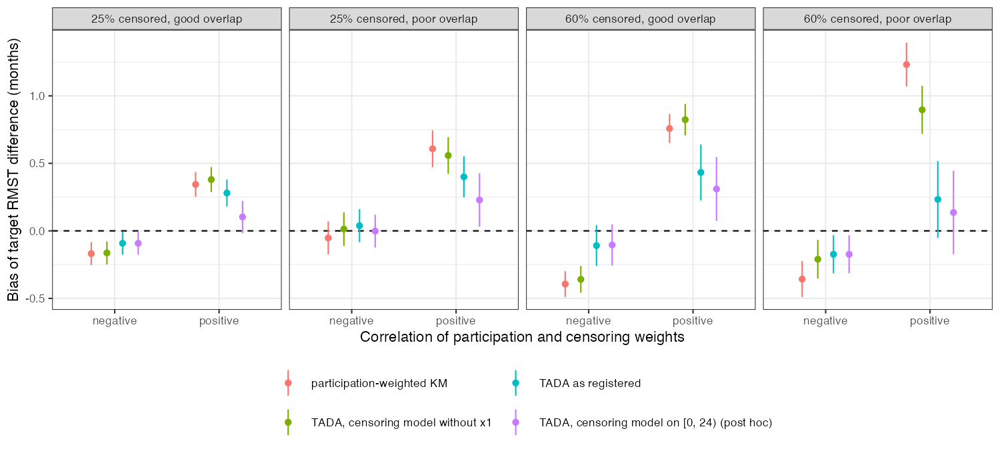

# TADA’s bootstrap undercovered under heavy censoring and poor overlap,
and a censoring model fitted through administrative follow-up left part
of the censoring bias in place
Ahmad Sofi-Mahmudi
2026-09-24

# Abstract

**Background.** TADA ([1](#ref-yan2025)) transports a survival effect to
a population known only through published means by multiplying
method-of-moments participation weights by
inverse-probability-of-censoring weights, with a bootstrap for variance.
Catalog problem MIS-02 asks how it behaves under heavy censoring, poor
overlap and censoring-model misspecification; the refuting sentence says
close to its published behavior.

**Methods.** A trial of A versus C (250 per arm) transported to a target
shifted on one covariate (good or poor overlap); censoring depending on
the same covariate so that the two weight sets are positively or
negatively correlated, 25% or 60% censored before 24 months; estimand
the target RMST difference to 24 months. Participation-weighted
Kaplan-Meier, TADA with bootstrap SE, TADA with a fixed-weight sandwich,
and TADA with a censoring model omitting the covariate; 10 cells, 500
replicates.

**Results.** In the registered primary cell (60% censored, poor overlap,
positive correlation) TADA’s bootstrap SE ratio was 0.80 and coverage
0.886: the registered verdict is **fails by variance**. The product’s
effective sample size was 25 against 112 for the participation weights
alone, and TADA’s RMSE (3.25) exceeded that of the estimator with no
censoring weights (2.23). After the run, the registered censoring model
was found to be fitted through the administrative end of follow-up at 36
months, which attenuated its covariate coefficient; refitted on the
24-month horizon (post hoc), TADA’s bias in the positively correlated
cells was 0.10 to 0.31 months (registered 0.23 to 0.43) and its
bootstrap coverage in the primary cell 0.874.

**Conclusion.** The refuting sentence fails. Under heavy censoring with
poor overlap the product of the two weight sets keeps too few effective
patients for the bootstrap to calibrate, and TADA trades censoring bias
for variance. Its censoring model has to be fitted on the analysis
horizon.

# The problem

With participation weights $w_p(x)$ matching the target’s published
moments and censoring survivor function $G(t \mid x)$, TADA’s RMST
estimate in arm $a$ is
$\sum_i w_p(x_i)\,\delta_i \min(T_i, \tau)/\hat G(\min(T_i, \tau)^- \mid x_i)$
normalized by the weights’ sum, where $\delta_i$ indicates that
$\min(T_i, \tau)$ was observed. When large $w_p$ and large $1/\hat G$
fall on the same patients the effective sample size of the product falls
faster than either factor’s, and a bootstrap that re-estimates both
weight sets inherits that instability.

# Design

Registered protocol: `protocol.md`. $x_1 \sim N(0, 1)$,
$x_2 \sim \text{Bern}(0.4)$ in the trial; target means
$\mu_T \in \{0.5, 1.2\}$ for $x_1$ and 0.6 for $x_2$. Weibull
proportional hazards (shape 1.2, control median 18 months) with log
hazard $0.5x_1 + 0.4x_2 + A(-0.5 + 0.3x_1)$. Exponential censoring with
hazard $\lambda_c e^{\kappa x_1}$, $\kappa = \pm 1.2$, administrative
end at 36 months. Censoring model: Cox on $x_1, x_2$ within arm
(omitting $x_1$ for the misspecified arm); 100 bootstrap resamples
re-estimating both weight sets. Controls: no censoring before the
horizon (TADA equals the weighted Kaplan-Meier) and censoring
independent of covariates.

# Results

Figure 1: Bias of the target RMST difference by cell, with 95% Monte
Carlo intervals. The post hoc arm refits the censoring model on the
24-month horizon.

Table 1: 500 replicates per cell; bias in months (truth 1.85 at good and
0.90 at poor overlap); TADA bias MCSE 0.04 to 0.16.

| censored | overlap | weight correlation | product / participation ESS | weighted KM bias | TADA bias | TADA SE ratio (bootstrap) | coverage | TADA bias, horizon-fitted censoring model (post hoc) |
|---:|----|----|---:|---:|---:|---:|---:|---:|
| 25% | good | positive | 0.64 | 0.344 | 0.280 | 0.94 | 0.924 | 0.103 |
| 60% | good | positive | 0.15 | 0.758 | 0.433 | 0.81 | 0.888 | 0.310 |
| 25% | poor | positive | 0.69 | 0.608 | 0.400 | 0.95 | 0.910 | 0.229 |
| 60% | poor | positive | 0.22 | 1.232 | 0.233 | 0.80 | 0.886 | 0.136 |
| 25% | good | negative | 0.86 | -0.169 | -0.092 | 0.99 | 0.940 | -0.092 |
| 60% | good | negative | 0.32 | -0.394 | -0.109 | 0.86 | 0.942 | -0.104 |
| 25% | poor | negative | 0.99 | -0.052 | 0.038 | 0.97 | 0.922 | -0.002 |
| 60% | poor | negative | 0.80 | -0.357 | -0.173 | 0.93 | 0.918 | -0.174 |

**Primary.** At 60% censoring, poor overlap and positive correlation
TADA with bootstrap SE had bias 0.233 (MCSE 0.145), SE ratio 0.80 and
coverage 0.886 (MCSE 0.014): **fails by variance**. The bias is not
resolved at 500 replicates, not shown to be zero. The fixed-weight
sandwich did no worse there (SE ratio 0.80, coverage 0.892):
re-estimating both weight sets in each resample bought nothing where it
was needed. Part of the undercoverage is the participation weights’
alone: with no censoring before the horizon the bootstrap’s SE ratio was
0.92 and coverage 0.916 at poor overlap. With negatively correlated
weights the sandwich’s SE ratio was 1.00 to 1.04 and the bootstrap’s
0.86 to 0.99.

**Weight collapse.** The product’s effective sample size relative to the
participation weights’ was 0.15 to 0.22 at 60% censoring with positive
correlation, 0.56 with covariate-independent censoring and 0.32 to 0.80
with negative correlation; the registered positive control (below 0.8 in
the primary cell) was met. The correlation of the two weight sets among
uncensored patients was only 0.18 to 0.35 in absolute value, so the
collapse is driven as much by the censoring weights’ spread, which this
design cannot vary separately.

**Bias against variance.** In the primary cell TADA removed most of the
weighted Kaplan-Meier’s bias (0.233 against 1.232) and lost on RMSE
(3.25 against 2.23); the censoring model without $x_1$ had RMSE 2.22.

**Censoring model fitted through administrative follow-up (post hoc).**
The registered code fits the Cox censoring model to the whole follow-up,
so the administrative end at 36 months enters as a covariate-free mass
of censoring events; the partial likelihood of a risk set in which
everyone fails pulls the coefficient toward zero. In a check with 20000
patients per arm the fitted coefficient was 0.88 against a true 1.2, and
1.23 when the censoring process was observed on $[0, 24)$ only, which is
all the weights use. Refitted that way with the registered seeds
(`R/05-corrected.R`), TADA’s bias in the positively correlated cells was
0.10 to 0.31 months (registered 0.23 to 0.43), its empirical SD rose
(primary cell 3.52 against 3.24), and in the primary cell its bootstrap
SE ratio was 0.78 with coverage 0.874 (500 replicates). The correction
does not change the registered verdict’s direction. Analysts who fit the
censoring model to all follow-up will reproduce the registered behavior.

**Controls.** With no censoring before the horizon TADA equaled the
weighted Kaplan-Meier exactly. With covariate-independent censoring the
weighted Kaplan-Meier’s bias was -0.180 (MCSE 0.074), inside the
registered 3 MCSE but at 2.4: a near miss. No replicate failed.

# What this does not answer

RMST only, with complete-case IPCW rather than TADA’s time-varying
weights in a Cox model; one covariate drives both weight sets, so
correlation and spread are confounded; no stacked M-estimation variance;
no censoring by unmeasured prognosis; target moments treated as exact.
The horizon-fitted censoring model is a post hoc correction of a
registered implementation error and is reported beside, not instead of,
the registered result. Peer review has not been done.

# References

1.
Yichen Yan, Quang Vuong, Rebecca
K. Metcalfe, Tianyu Guan, Haolun Shi, Jay J. H. Park. Target aggregate
data adjustment method for transportability analysis utilizing
summary-level data from the target population. Pharmaceutical
Statistics. 2025;24(5):e70029.
doi:[10.1002/pst.70029](https://doi.org/10.1002/pst.70029)

