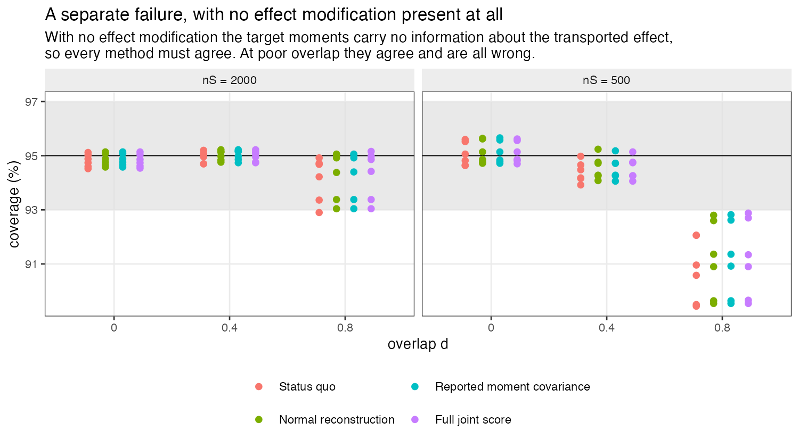
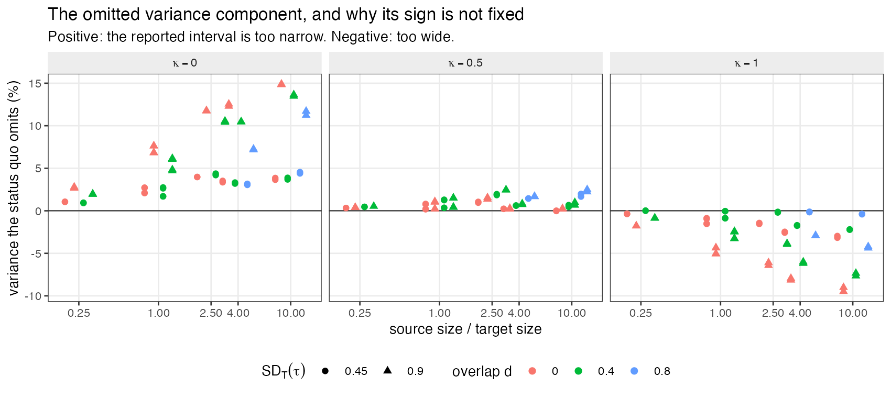
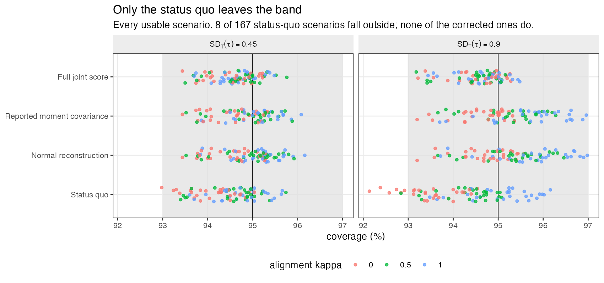
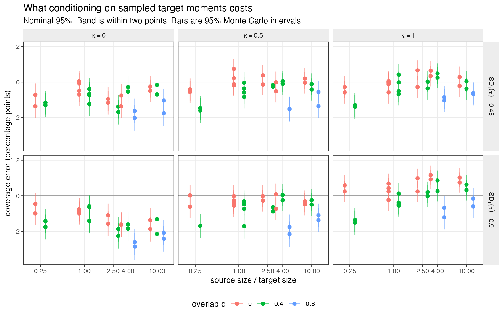
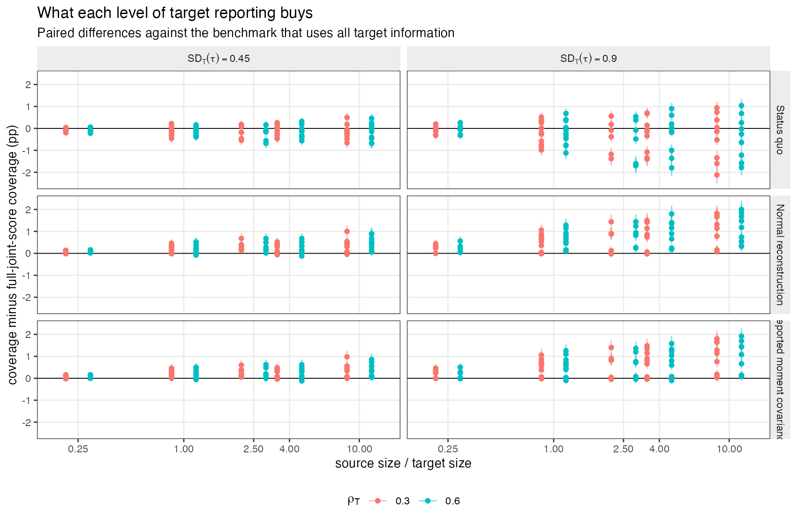

# What conditioning on sampled target moments costs a
population-adjusted indirect comparison
Ahmad Sofi-Mahmudi
2026-07-27

# The problem

A population-adjusted indirect comparison estimates the relative effect
of two treatments that have never been compared in one trial. Individual
patient data are available for a source trial comparing $A$ with a
common comparator $C$; for the target trial comparing $B$ with $C$, only
a publication is available. Matching-adjusted indirect comparison
([1](#ref-signorovitch2010)) reweights the source participants so their
covariate distribution matches the target’s, transports the $A$ versus
$C$ effect into the target population, and subtracts the target trial’s
own $B$ versus $C$ effect ([2](#ref-phillippo2018)).

Everything hangs on a small table. The target publication reports, per
covariate, a mean and a standard deviation, alongside the sample size.
Those numbers are the matching targets, and every standard estimator
treats them as exact.

They are not exact. They are sample moments computed from $n_T$
participants and they carry sampling error of order $n_T^{-1/2}$. A
reported confidence interval that conditions on them omits that
variability whenever the intended estimand refers to a target
*superpopulation* rather than to the particular people who happened to
enroll.

The catalog entry MIS-03 states the position precisely. The
weight-estimation half of the uncertainty problem is settled: sandwich,
effective-sample-size-rescaled and bootstrap variance estimators exist,
are implemented, and were benchmarked across 108 scenarios by
([3](#ref-chandler2024)). The published-moment half is untouched,
because a baseline table arrives without the covariance among its own
entries, so there is nothing to resample. MIS-03 asks for one number:
how much coverage does conditioning on those moments cost, at realistic
aggregate-data sample sizes. This study supplies it.

Two results in the transportability literature already propagate
target-summary uncertainty for entropy-balancing estimators
([4](#ref-sheng2026),[5](#ref-chen2026)). Neither has been carried into
indirect-comparison practice or software. This study is not a new
derivation; it is a measurement of what the omission costs, and a test
of what a publication would have to report for the correction to be
usable.

# The estimating system and what it omits

The source trial contributes $n_S$ participants with covariates
$X_i \in \mathbb{R}^3$, treatment indicator $A_i$ and outcome $Y_i$.
Write $h(X) = (X_1, X_2, X_3, X_1^2, X_2^2, X_3^2)^\top$; matching on
$h$ is matching on the reported means and standard deviations, because a
mean and a standard deviation together determine the first and second
raw moments. Let

$$\hat m_T = \frac{1}{n_T}\sum_{j=1}^{n_T} h(X_j)$$

be the six moments implied by the target publication. Matching-adjusted
indirect comparison solves, over the source participants,

<span id="eq-calib">$$\sum_{i=1}^{n_S} w_i(\lambda)\,\{h(X_i) - \hat m_T\} = 0, \qquad w_i(\lambda) = \exp\{\lambda^\top h(X_i)\}, \qquad(1)$$</span>

which is the method-of-moments weighting of ([1](#ref-signorovitch2010))
and the dual of entropy balancing ([6](#ref-hainmueller2012)). Stacking
<a href="#eq-calib" class="quarto-xref">Equation 1</a> with the two
weighted arm-mean equations gives an M-estimator
([7](#ref-stefanski2002)) in $\psi = (\lambda, \mu_A, \mu_C)$ with
per-participant score

$$u_i = \big(\,w_i\{h(X_i) - \hat m_T\},\ \ \mathbb{1}(A_i)\,w_i(Y_i - \mu_A),\ \ \mathbb{1}(C_i)\,w_i(Y_i - \mu_C)\,\big)^\top.$$

The transported effect is $\hat\theta_{AC} = \hat\mu_A - \hat\mu_C$ and
the anchored estimate is
$\hat\theta_{AB} = \hat\theta_{AC} - \hat\theta_{BC}$, with
$\hat\theta_{BC}$ the target trial’s own unadjusted arm-mean difference.
With $\hat A$ the empirical Jacobian of the mean score,
$\hat B = n_S^{-1}\sum_i u_i u_i^\top$ and
$c = (0,0,0,0,0,0,1,-1)^\top$, the usual sandwich is

<span id="eq-vs">$$V_S = c^\top \hat A^{-1} \hat B \hat A^{-\top} c \,/\, n_S . \qquad(2)$$</span>

<a href="#eq-vs" class="quarto-xref">Equation 2</a> conditions on
$\hat m_T$. To see what that costs, differentiate the estimating system
with respect to the reported moments. Since
$\partial u_{i,\lambda} / \partial \hat m_T^\top = -w_i I_6$ and the
arm-mean equations do not involve $\hat m_T$, the implicit function
theorem gives

<span id="eq-jacobian">$$J \;=\; \frac{\partial \hat\theta_{AC}}{\partial \hat m_T} \;=\; -\,c^\top \hat A^{-1} C, \qquad C = \begin{pmatrix} -\bar w I_6 \\ 0 \\ 0 \end{pmatrix}. \qquad(3)$$</span>

$J$ is the sensitivity of the transported effect to the published table.
It is zero exactly when no covariate in $h$ modifies the treatment
effect, which is why the study’s negative control is a scenario with no
effect modification.

Two things follow, and the second is the one the field has missed.
First, if $\hat m_T$ were an independent estimate the interval would
simply be too narrow, by $J^\top \Omega_{hh} J / n_T$ where
$\Omega_{hh} = \mathrm{Var}\{h(X)\}$ in the target. Second, and in the
ordinary case, $\hat m_T$ and $\hat\theta_{BC}$ come from **the same
people**. Writing $\phi_{BC}$ for the influence function of the target
arm-mean difference, the correct unconditional variance uses the joint
covariance of $\{h(X), \phi_{BC}\}$ with gradient $(J, -1)$:

<span id="eq-joint">$$V = V_S + (J, -1)^\top \,\Omega_T\, (J, -1) \,/\, n_T . \qquad(4)$$</span>

The cross term $-2\,J^\top \mathrm{Cov}\{h(X), \phi_{BC}\} / n_T$ is
**negative** when the target treatment’s effect is modified by the same
covariates as the source treatment’s. Conditioning on $\hat m_T$
therefore does not simply understate the variance. It omits a positive
term and a negative term whose balance depends on a quantity that
appears nowhere in a publication.

# Methods

The full protocol was registered before the run and is reproduced at
`studies/MIS-03-target-moment-uncertainty/protocol.md`. Reporting
follows ADEMP ([8](#ref-morris2019)).

## Data-generating mechanism

Covariates are trivariate normal with unit variances and
equicorrelation, centered at $0$ in the source with correlation $0.30$
and at $d$ in the target with correlation $\rho_T$. Outcomes are
continuous: $Y = f(X) + \mathbb{1}(A)\tau_{AC}(X) + \varepsilon$ in the
source and $Y = f(X) + \mathbb{1}(B)\tau_{BC}(X) + \varepsilon$ in the
target, with $\varepsilon \sim N(0,1)$, a common prognostic function $f$
containing linear and quadratic terms, and

$$\tau_{AC}(X) = -0.10 + s\,g(X), \qquad \tau_{BC}(X) = -0.10 + \kappa\,s\,g(X).$$

The target trial’s participants are generated and then discarded. The
estimator receives $n_T$, three means, three standard deviations, and
$\hat\theta_{BC}$ with its standard error.

Two features of this design are worth stating because earlier drafts
lacked them and would have produced a different answer.

**Effect-modification strength is calibrated, not fixed.** The scale $s$
is set per scenario so the treatment effect has a prespecified standard
deviation across individuals *in the target population*. Because the
quadratic coefficients of $g$ are half the linear ones, shifting the
covariate means multiplies the effective linear coefficient by $(1+d)$:
one fixed coefficient vector gives an effect modifier of standard
deviation 0.477 at $d = 0$ and 0.745 at $d = 0.8$. Varying overlap with
fixed coefficients would vary effect-modification strength at the same
time and confound the two factors.

**The alignment $\kappa$ varies continuously.** At $\kappa = 0$ only the
source treatment is effect-modified and the omitted term is a pure
positive variance, so the interval must be too narrow. At $\kappa = 1$
both are modified identically, the omitted covariance is negative, and
the interval is too wide. Using only those endpoints fixes the sign of
the result by construction; $\kappa = 0.5$ is included so the
cancellation is located rather than assumed.

## Factors

| Factor                                    | Levels         |
|-------------------------------------------|----------------|
| Source size $n_S$                         | 500, 2000      |
| Target size $n_T$                         | 200, 500, 2000 |
| Overlap $d$                               | 0, 0.4, 0.8    |
| Effect modification $\mathrm{SD}_T(\tau)$ | 0, 0.45, 0.90  |
| Alignment $\kappa$                        | 0, 0.5, 1      |
| Target correlation $\rho_T$               | 0.30, 0.60     |

Fully factorial except that $\kappa$ is collapsed where there is no
effect modification: **252 scenarios**, 5000 replicates each, 1,260,000
in total.

$n_S$ is a factor because the omitted term is $J^\top \Omega J / n_T$
against a retained term of order $1/\mathrm{ESS}_S$, so what governs
whether the omission matters is the ratio of source to target
information rather than $n_T$ alone. A pilot holding $n_S = 500$ found
the omission was 1% to 7% of total variance and would have supported
concluding that nothing was wrong; at $n_S = 2000$ the same quantity
reached 23%.

## Estimand

The target-superpopulation marginal $A$ versus $B$ mean difference,

$$\theta_{AB,T} = \mathbb{E}_T\{\tau_{AC}(X)\} - \mathbb{E}_T\{\tau_{BC}(X)\} = (1-\kappa)\,s\,(0.30\,d + 0.15\,d^2),$$

exact in closed form, verified against a $3\times 10^6$-draw evaluation
in every cell to within $2\times10^{-4}$. The superpopulation qualifier
is essential: conditioning on the reported moments is *correct* when the
estimand is defined by those moments or when they are exact
administrative counts. The problem exists only for a superpopulation
estimand.

## Methods compared

All four share the same point estimate, so the comparison isolates the
interval.

| Method | Interval variance | What the target must publish |
|----|----|----|
| **Status quo** | $V_S + \widehat{\mathrm{Var}}(\hat\theta_{BC})$ | $n_T$, means, SDs, effect and its SE |
| **Normal reconstruction** | $V_S + J^\top \Omega_{\mathrm{norm}} J / n_T + \widehat{\mathrm{Var}}(\hat\theta_{BC})$ | the same, plus a borrowed correlation matrix |
| **Reported moment covariance** | $V_S + J^\top \Omega_{hh} J / n_T + \widehat{\mathrm{Var}}(\hat\theta_{BC})$ | additionally the $6\times6$ covariance of $h(X)$ |
| **Full joint score** | <a href="#eq-joint" class="quarto-xref">Equation 4</a> | additionally its covariance with the outcome influence function |

$\Omega_{\mathrm{norm}}$ is reconstructed from the reported means and
standard deviations and a borrowed correlation under a multivariate
normal model, using $\mathrm{Cov}(X_j,X_k)=\Sigma_{jk}$,
$\mathrm{Cov}(X_j,X_k^2)=2\mu_k\Sigma_{jk}$ and
$\mathrm{Cov}(X_j^2,X_k^2)=2\Sigma_{jk}^2+4\mu_j\mu_k\Sigma_{jk}$.
**This is the only one an analyst can compute today.** The other two are
enhanced-reporting benchmarks: they receive covariance matrices computed
inside the simulation and never microdata, and their purpose is to price
the reporting addition each would require.

## Performance measures

Primary: coverage of the nominal 95% interval for $\theta_{AB,T}$, as
the signed error in percentage points. Secondary: paired coverage
differences, bias, empirical and model standard errors, relative error
in model standard error, bias-eliminated coverage, interval width,
effective sample size, and convergence. Every measure carries a Monte
Carlo standard error; at nominal coverage that error is 0.31 points, so
a two-point coverage error is more than six Monte Carlo standard errors
from nominal.

# Results

Convergence was at least 99.96% in every one of the 252 scenarios. The
point estimate is not at fault anywhere: the largest absolute bias was
0.052 empirical standard errors, and coverage and bias-eliminated
coverage never differed by more than 0.24 percentage points. Everything
below is a property of the interval.

## The registered gates fire, and why

The protocol declares the run uninformative if the full-joint-score
reference or any negative control leaves 0.93 to 0.97. Read across the
whole grid, that condition is met and the registered conclusion is
**uninformative**.

The reason is a second failure, and it is worth reporting on its own
account. At $d = 0.8$ the effective sample size falls to a median of
about 148 of 500 and the Wald sandwich undercovers for *every* method,
including scenarios with no effect modification at all
(<a href="#fig-overlap" class="quarto-xref">Figure 1</a>). Where
$\mathrm{SD}_T(\tau) = 0$ the reported moments carry no information
about the transported effect, $J$ is zero in expectation, and all four
intervals must coincide. They do coincide, and at poor overlap they are
all wrong together, by up to seven percentage points. That is a
finite-sample failure of the sandwich under extreme weighting,
consistent with ([3](#ref-chandler2024)) finding conventional estimators
anticonservative under poor and moderate overlap, and it is not about
target moments.

<div id="fig-overlap">



Figure 1: With no effect modification the target moments carry no
information about the transported effect, so all four methods must
agree. They do, and at poor overlap they are all wrong together.

</div>

Applying the same prespecified criterion per scenario rather than across
the grid leaves **196 of 252** scenarios in which the reference and its
matched negative control are both valid. This is recorded as a dated
amendment in the protocol; it restricts the analysis set on a criterion
that was itself prespecified and changes no threshold, factor or
measure. Everything that follows is confined to those scenarios.

## The omission is real, bounded, and of variable sign

Across usable scenarios with effect modification present, conditioning
on the reported moments omits between -9.5% and 14.9% of the variance.
The sign is governed almost entirely by $\kappa$
(<a href="#fig-omitted" class="quarto-xref">Figure 2</a>):

<div id="tbl-kappa">

Table 1: Variance omitted by the status quo, by the alignment between
the two trials’ effect modification. Positive means the reported
interval is too narrow.

<div class="cell-output-display">

| Alignment | Minimum | Median | Maximum |
|----------:|--------:|-------:|--------:|
|       0.0 |     0.9 |    4.1 |    14.9 |
|       0.5 |    -0.0 |    0.7 |     2.5 |
|       1.0 |    -9.5 |   -2.3 |     0.0 |

</div>

</div>

At $\kappa = 0$, where only the source treatment’s effect is modified,
the reported interval is always too narrow. At $\kappa = 1$, where both
treatments are modified identically, it is mostly too wide. The
cancellation sits near $\kappa = 0.5$.

<div id="fig-omitted">



Figure 2: The omitted variance component. Its magnitude grows with the
ratio of source to target information; its sign is set by an alignment
that no publication reports.

</div>

Magnitude tracks the ratio of source to target information, as
<a href="#eq-jacobian" class="quarto-xref">Equation 3</a> predicts: the
omitted term scales as $1/n_T$ while the retained term scales as
$1/\mathrm{ESS}_S$, so a large source trial matched to a small target
publication is the worst case, not a small target trial as such.

## What it costs in coverage

<div id="tbl-methods">

Table 2: Coverage of nominal 95% intervals across usable scenarios with
effect modification present. Only the status quo leaves the band, and it
leaves it in both directions.

<div class="cell-output-display">

| Method                     | Minimum | Median | Maximum | Outside 93 to 97% |
|:---------------------------|--------:|-------:|--------:|------------------:|
| Status quo                 |   92.1% |  94.5% |   96.2% |          8 of 167 |
| Normal reconstruction      |   93.2% |  95.1% |   97.0% |          0 of 167 |
| Reported moment covariance |   93.2% |  95.1% |   97.0% |          0 of 167 |
| Full joint score           |   93.2% |  94.7% |   95.8% |          0 of 167 |

</div>

</div>

The status-quo interval covers between 92.1% and 96.2%, leaving the 93%
to 97% band in 8 of 167 scenarios. All three corrections stay inside it
in every scenario
(<a href="#fig-methods" class="quarto-xref">Figure 3</a>,
<a href="#fig-coverage" class="quarto-xref">Figure 4</a>).

<div id="fig-methods">



Figure 3: Only the status quo leaves the band.

</div>

<div id="fig-coverage">



Figure 4: Status-quo coverage error against the ratio of source to
target information, by alignment and effect-modification strength.

</div>

The prespecified categories resolve to *material at ordinary
effect-modification strength*, but that category is triggered by a
single marginal scenario and should not be leaned on. The robust reading
is the one in <a href="#tbl-methods" class="quarto-xref">Table 2</a> and
<a href="#tbl-kappa" class="quarto-xref">Table 1</a>: the cost is
bounded by roughly three percentage points of coverage in either
direction, is largest when effect modification is strong and unshared
and the source trial is large relative to the target publication, and is
negligible when the two trials’ effects are modified alike.

## What a publication would have to report

The normal reconstruction needs nothing beyond what is already published
plus a correlation matrix borrowed from the source. It restored coverage
in every usable scenario, at a median interval-width cost of 2.24% and a
maximum of 8.70%. Giving it the target’s true moment covariance instead
of a reconstruction changed coverage by a median of 0.02 percentage
points (<a href="#fig-reporting" class="quarto-xref">Figure 5</a>).
Getting the borrowed correlation wrong, at $\rho_T = 0.60$ against a
source value of $0.30$, did not break it.

<div id="fig-reporting">



Figure 5: What each level of target reporting buys, as paired
differences against the benchmark using all target information.

</div>

This is the practically useful finding. The deployable correction is as
good as the one requiring enhanced reporting, so the case for asking
journals to publish moment covariance matrices is weak. The case for
analysts computing
<a href="#eq-jacobian" class="quarto-xref">Equation 3</a> and adding
$J^\top \Omega_{\mathrm{norm}} J / n_T$ is strong: it costs about 2% of
interval width and removes a coverage error of up to three points whose
sign they cannot otherwise determine.

# What this answers, and what it does not

**Answers.** MIS-03 asked how much coverage is lost by conditioning on
target moments at realistic aggregate-data sample sizes. In anchored
matching-adjusted indirect comparison on a continuous outcome, where the
sandwich is otherwise valid: between about three points lost and one
point gained, with the sign determined by the alignment between the two
trials’ effect modification. The problem is real and is worth
correcting, and the correction is available now.

**Does not answer.** The study covers one estimator, one outcome type
and one information structure.

Covariates are multivariate normal, which is also the assumption under
which the deployable correction is derived, so its performance here is
measured under conditions favorable to it. Skewed, bounded and
categorical covariates are untested.

The outcome is continuous and the effect additive, so marginal and
conditional effects coincide. Nothing here transfers directly to binary
or time-to-event outcomes, where matching-adjusted indirect comparison
is most often used and where noncollapsibility adds a term this design
cannot see.

Effect modification lies exactly in the span of the six matched moments,
so there is no unmeasured effect modifier and no extrapolation. This is
a variance result under otherwise correct identification, not a
statement about bias.

The target moments and the target treatment effect come from the same
randomized trial. That is the common case and the one with the largest
cross-covariance, but summaries drawn from a separate sample, or a
covariate-adjusted published effect with a different influence function,
would behave differently.

Simulated treatment comparison, multilevel network meta-regression,
multilevel unanchored meta-regression and network meta-interpolation
have different sensitivities $J$ and are not covered. The direction of
the argument in <a href="#sec-math" class="quarto-xref">Section 2</a>
applies to all of them; the magnitudes here do not.

Accordingly this study **answers MIS-03 in part** and **answers one
named component of EST-07**, namely sampling error in reported moments.
EST-07’s remaining components, model uncertainty in reconstructed
correlations, ambiguity in inclusion criteria and secular drift, are not
sampling error and are untouched.

**A finding nobody asked for.** The poor-overlap sandwich failure in
<a href="#sec-gates" class="quarto-xref">Section 4.1</a> is larger than
the effect this study was built to measure. It is consistent with
([3](#ref-chandler2024)) and it deserves its own study.

# Reproducibility

R: R version 4.6.0 (2026-04-24) Platform: aarch64-apple-darwin23 Running
under: macOS Tahoe 26.5

## Packages

| package | version |
|---------|---------|
| base    | 4.6.0   |
| stats   | 4.6.0   |
| future  | 1.70.0  |
| furrr   | 0.4.0   |

## Run

- **study**: MIS-03 / EST-07 target-moment uncertainty
- **scenarios**: 252
- **replicates_per_scenario**: 5000
- **total_replicates**: 1260000
- **master_seed**: 20260727

Replicate seeds derive from one master seed through L’Ecuyer-CMRG
streams, so a run gives identical results on any number of cores and an
interrupted run resumes rather than restarting. Code, protocol and
results are at
<https://github.com/choxos/ITC-open-problems/tree/main/studies/MIS-03-target-moment-uncertainty>.

``` bash
Rscript R/03-run.R        # 252 scenarios, resumable
Rscript R/04-analyze.R    # summary.csv, paired.csv, decision.md
Rscript R/05-figures.R
```

# References

<div id="refs" class="references csl-bib-body">

<div id="ref-signorovitch2010" class="csl-entry">

<span class="csl-left-margin">1.
</span><span class="csl-right-inline">James E. Signorovitch, Eric Q. Wu,
Andrew P. Yu, Charles M. Gerrits, Evan Kantor, Yanjun Bao, Shiraz R.
Gupta, Parvez M. Mulani. Comparative effectiveness without head-to-head
trials: A method for matching-adjusted indirect comparisons applied to
psoriasis treatment with adalimumab or etanercept. PharmacoEconomics.
2010;28(10):935–45.
doi:[10.2165/11538370-000000000-00000](https://doi.org/10.2165/11538370-000000000-00000)</span>

</div>

<div id="ref-phillippo2018" class="csl-entry">

<span class="csl-left-margin">2.
</span><span class="csl-right-inline">David M. Phillippo, A. E. Ades,
Sofia Dias, Stephen Palmer, Keith R. Abrams, Nicky J. Welton. Methods
for population-adjusted indirect comparisons in health technology
appraisal. Medical Decision Making. 2018;38(2):200–11.
doi:[10.1177/0272989X17725740](https://doi.org/10.1177/0272989X17725740)</span>

</div>

<div id="ref-chandler2024" class="csl-entry">

<span class="csl-left-margin">3.
</span><span class="csl-right-inline">Conor Chandler, Irina
Proskorovsky. Uncertain about uncertainty in matching-adjusted indirect
comparisons? A simulation study to compare methods for variance
estimation. Research Synthesis Methods. 2024;15(6):1094–110.
doi:[10.1002/jrsm.1759](https://doi.org/10.1002/jrsm.1759)</span>

</div>

<div id="ref-sheng2026" class="csl-entry">

<span class="csl-left-margin">4.
</span><span class="csl-right-inline">Ying Sheng, Yifei Sun, Chiung-Yu
Huang. Transportable inference using target population summary
statistics under covariate shift \[Internet\]. 2026. Available from:
<https://arxiv.org/abs/2603.02474></span>

</div>

<div id="ref-chen2026" class="csl-entry">

<span class="csl-left-margin">5.
</span><span class="csl-right-inline">Yi Chen, Xinyuan Chen, Menggang
Yu. Confidence interval construction for causally generalized estimates
with target sample summary information. Statistics in Medicine.
2026;45(1-2):e70358.
doi:[10.1002/sim.70358](https://doi.org/10.1002/sim.70358)</span>

</div>

<div id="ref-hainmueller2012" class="csl-entry">

<span class="csl-left-margin">6.
</span><span class="csl-right-inline">Jens Hainmueller. Entropy
balancing for causal effects: A multivariate reweighting method to
produce balanced samples in observational studies. Political Analysis.
2012;20(1):25–46.
doi:[10.1093/pan/mpr025](https://doi.org/10.1093/pan/mpr025)</span>

</div>

<div id="ref-stefanski2002" class="csl-entry">

<span class="csl-left-margin">7.
</span><span class="csl-right-inline">Leonard A. Stefanski, Dennis D.
Boos. The calculus of m-estimation. The American Statistician.
2002;56(1):29–38.
doi:[10.1198/000313002753631330](https://doi.org/10.1198/000313002753631330)</span>

</div>

<div id="ref-morris2019" class="csl-entry">

<span class="csl-left-margin">8.
</span><span class="csl-right-inline">Tim P. Morris, Ian R. White,
Michael J. Crowther. Using simulation studies to evaluate statistical
methods. Statistics in Medicine. 2019;38(11):2074–102.
doi:[10.1002/sim.8086](https://doi.org/10.1002/sim.8086)</span>

</div>

</div>
