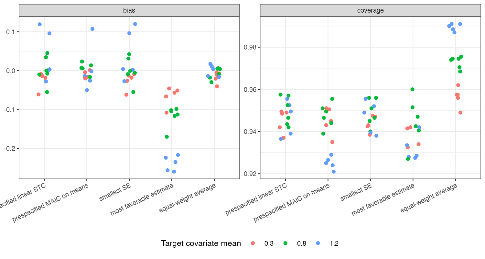

```{r setup}
s <- read.csv("../results/summary.csv")
f3 <- function(x) formatC(x, format = "f", digits = 3)
r <- function(k) s[s$rule == k, ]
```

# Abstract {.unnumbered}

**Background.** Analysts often fit several population-adjustment methods and report one, with that
method's interval. Catalog problem MIS-04 asks whether the selection matters and what averaging over
the candidates would change.

**Methods.** Re-scoring of 32,000 stored replicates from DIA-08 (anchored binary-outcome comparison,
16 scenarios), each with estimates and SEs from MAIC on means, MAIC on means and SDs, linear STC and
quadratic STC. Rules: a prespecified method; the method with the smallest SE; the method with the most
favorable estimate; and an equal-weight average with between-model variance added.

**Results.** Choosing the most precise method reproduced the prespecified linear STC in most
replicates and covered `r f3(min(r("min_se")$coverage))` to `r f3(max(r("min_se")$coverage))`. Choosing the most
favorable estimate biased it by up to `r f3(min(r("most_favorable")$bias))` on the log odds ratio scale while
coverage stayed at `r f3(min(r("most_favorable")$coverage))` or more, because the favored method was often a
wide-interval MAIC. Averaging with between-model variance over-covered (up to
`r f3(max(r("averaged")$coverage))`), since the candidates share the same data. The registered rule counts that
difference, so the refuting sentence fails as registered.

**Conclusion.** Among outcome and weighting models the candidates are close and a conditional interval
loses little coverage, but selecting by result moves the estimate materially while its interval looks
fine. Prespecify the method. Averaging needs weights that account for the candidates' shared data;
adding between-model variance to the mean within-model variance is too conservative.

# The problem {#sec-problem}

Model selection is part of inference [@buckland1997], and a conditional interval ignores it. For
population adjustment the candidates are estimates from the same individual data, so they are strongly
correlated: how much selection costs depends on how far apart they are and on which rule chooses.

# Design {#sec-design}

Registered protocol: `protocol.md`, committed before any scoring (DIA-08's RMSE rankings were already
known). The four candidates' estimates and SEs per replicate came from DIA-08's run: threshold,
interaction, quadratic and linear modification at target covariate means 0.3, 0.8 and 1.2, skewed
covariates, and no modification.

# Results {#sec-results}

{#fig-rules}

@fig-rules shows the asymmetry. The result-selected estimate was shifted in the favored direction in
every scenario, most at poor overlap where the candidates differed most, but its interval, often from
the least precise candidate, still covered. A reader would see a nominal interval around a biased
estimate. The averaged interval was the widest of all rules.

# What this does not answer {#sec-limits}

Selection over outcome and weighting models only; treatment partitions and bridges, where candidates can
be observationally equivalent and no data-based weight exists, were not studied. Equal weights rather
than stacking. Peer review has not been done.

# References {.unnumbered}
