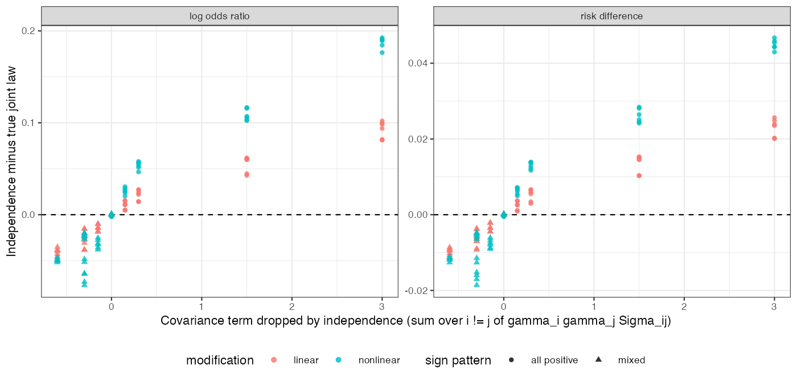

# Standardizing over an independence reconstruction of the target biased
the marginal log odds ratio by up to 0.21; a correlation matrix removed
the bias, and the error was linear in one covariance term
Ahmad Sofi-Mahmudi
2026-09-24

# Abstract

**Background.** Standardizing an outcome model over the target
population needs the target’s joint covariate law, and publications
report marginal means and SDs. G-computation and multiple imputation
marginalization are established ([1](#ref-remiroazocar2022)); catalog
problem MOD-01’s residual is the error left by reconstructing the joint
law from marginals. The refuting sentence: the standardized contrast
depends on the joint law only through quantities the marginals fix.

**Methods.** A logistic outcome model fitted correctly in an
individual-data trial (500 patients) and standardized over the target;
target covariates built from Gaussian, Clayton or Gumbel copulas with
correlation 0, 0.3 or 0.6 and exact published marginals; 2 or 5
covariates, all-positive or alternating prognostic signs, linear or
quadratic effect modification, log odds ratio or risk difference, good
or poor overlap. G-computation over the true law, an independence
reconstruction and a Gaussian copula with the correlation matrix
borrowed from the trial; an interval over declared correlations; STC at
target means as a reference. 224 cells, 476 replicates.

**Results.** In the registered primary cells (5 or 2 covariates,
all-positive signs, quadratic modification, correlation 0.6)
independence biased the target log odds ratio by 0.126 on average and
0.210 in the worst cell, against a material threshold of 0.05, with
coverage 0.898; the borrowed correlation matrix was within 0.002 of the
true law. The registered verdict: **the reconstruction matters, and is
fixable**. The error was linear in the covariance term independence
drops (R-squared 0.92 to 0.99 by block). Mixed prognostic signs reversed
the error rather than cancelling it, so the registered falsifier fired.
Copula family beyond the correlation matrix changed the estimate by at
most 0.004.

**Conclusion.** The refuting sentence fails. Reporting the target’s
correlation matrix would remove the residual this entry names; the
copula family would not need reporting.

# The problem

For $\eta = \alpha + \gamma^\top x + \tau(x)A$ the target marginal log
odds ratio depends, to second order, on
$\mathrm{Var}_T(\gamma^\top x) = \gamma^\top \Sigma_T \gamma$. Published
marginals fix the diagonal of $\Sigma_T$; independence sets the rest to
zero, so its error is proportional to
$\sum_{i \ne j} \gamma_i \gamma_j \Sigma_{T,ij}$, which an analyst can
compute from the fitted $\gamma$ and a declared correlation.

# Design

Registration: the design and decision rule are `DESIGN.md` sections 4 to
8, and the rule is applied by `R/07-decision.R`. Both were committed on
2 August 2026 before the grid was launched. There is no separate
protocol document, and `DESIGN.md`’s header still reads “not
registered”; the replicate count (476, derived from the MCSE the two
registered outcomes need) replaced the design’s 2000 in the same commit.
Every cell publishes the same marginal means and SDs, so only the joint
law behind them varies. Truth: the target marginal contrast over 50000
draws of the true law; each method standardizes over 80000 points of its
law, with a delta-method variance. The reconstruction interval spans
exchangeable correlations declared from $-0.3$ to 0.7.

# Results

Figure 1: Independence minus true-law estimate by cell against the
covariance term independence drops; mixed signs give negative terms.

Table 1: Registered primary cells (all-positive signs, quadratic
modification, correlation 0.6), log odds ratio; 12 cells, 476 replicates
each.

| method | mean bias | worst-cell bias | coverage | interval width |
|----|---:|---:|---:|---:|
| G-computation, borrowed correlation | 0.004 | 0.016 | 0.944 | 0.689 |
| G-computation, true joint law | 0.006 | 0.019 | 0.945 | 0.688 |
| STC at target means (reference) | 0.029 | 0.148 | 0.940 | 1.115 |
| interval over declared correlations | 0.068 | 0.113 | 0.971 | 1.011 |
| G-computation, independence | 0.126 | 0.210 | 0.898 | 0.838 |

**Primary.** Independence was biased by more than the material 0.05
while the borrowed correlation was not: the registered “matters and is
fixable” branch (<a href="#tbl-main" class="quarto-xref">Table 1</a>).
The interval over declared correlations covered at 0.971 with width 1.01
against 0.69 for the true law.

**Mechanism.** Across all 224 cells the independence error was linear in
$\sum_{i \ne j} \gamma_i \gamma_j \Sigma_{T,ij}$, with R-squared 0.92 to
0.99 in each scale, modification and dimension block
(<a href="#fig-gap" class="quarto-xref">Figure 1</a>). The slope
differed by block (0.009 to 0.194), so no single constant converts the
term into a bias; a bound using the fitted slopes contained the realized
error in 335 of 448 cells, an in-sample check of its shape only.

**Falsifier.** The design predicted that mixed signs would cancel the
covariance term and leave independence adequate. With two covariates and
signs $(+, -)$ the term is not cancelled but reversed, and with five it
shrinks from 3.0 to $-0.6$ at correlation 0.6 without vanishing.
Independence was biased by -0.056 (worst -0.077) under mixed signs with
quadratic modification and -0.035 with linear: the registered falsifier
fired. The mechanism held; the prediction drawn from it was wrong,
because a sign pattern does not fix the term, the correlations do.

**Scale.** On the risk-difference scale the mean absolute error of
independence was 0.011 against 0.044 on the log odds ratio, about a
quarter, not zero: collapsibility fixes the relation between marginal
and mean conditional effect, not that mean against the joint law.

**Copula family.** All families were matched on Pearson correlation. The
borrowed-correlation estimate differed from the true-law estimate by
-0.004 to 0.000 across families, modifications and scales: the family
carried no dependence the correlation matrix missed, at these strengths.

**Controls.** With one covariate every reconstruction equaled the truth
to 0.005 (tolerance 0.008); at correlation zero the independence and
true-law estimates agreed to 0.004. Both exact controls passed.

# What this does not answer

Reported marginals are exact; the outcome model is correct; covariates
are continuous; the borrowed correlation is optimistic because the trial
shares the target’s dependence. One sample size. A formatting error in
`R/07-decision.R` (a missing argument to one `sprintf` call reporting
the withdrawn control’s ratio) was fixed after the run; the rule was not
changed. Peer review has not been done.

# References

1.
Antonio Remiro-Azócar, Anna Heath,
Gianluca Baio. Parametric G-computation for compatible indirect
treatment comparisons with limited individual patient data. Research
Synthesis Methods. 2022;13(6):716–44.
doi:[10.1002/jrsm.1565](https://doi.org/10.1002/jrsm.1565)

