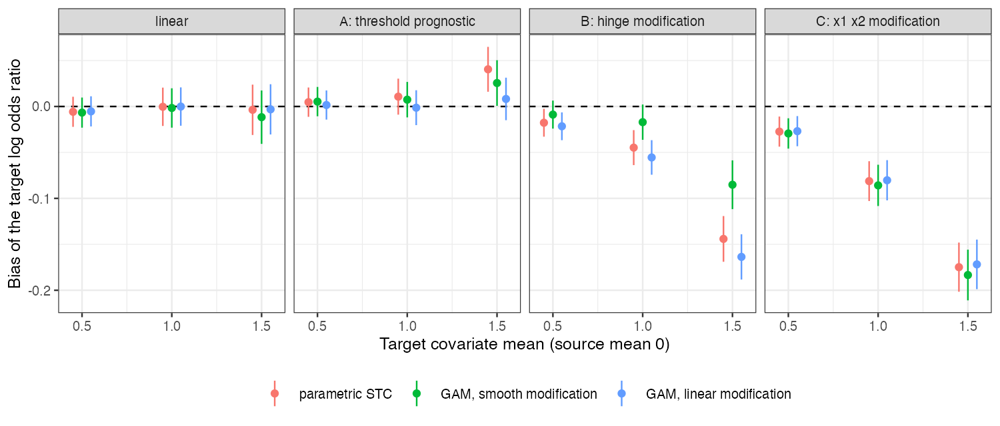

```{r setup}
s <- read.csv("../results/summary.csv"); f3 <- function(x) formatC(x, format = "f", digits = 3)
q <- function(sf, mu, m) s[s$surface == sf & s$mu == mu & s$method == m, ]
```

# Abstract {.unnumbered}

**Background.** Flexible outcome models are proposed to remove the misspecification bias of
parametric simulated treatment comparison (STC). Catalog problem MOD-02 asks whether they do
so under adversarial response surfaces, and at what cost to interval validity.

**Methods.** A binary-outcome trial with one adversarial feature at a time (a threshold
prognostic effect, a hinge in the treatment effect, or a covariate-by-covariate modification);
targets 0.5, 1 and 1.5 SD from the source; parametric STC, a generalized additive model with
smooth treatment modification, and one with linear modification, each standardized by
G-computation; 500 replicates per cell.

**Results.** Under the hinge modification at the farthest target, STC was biased by
`r f3(q("B", 1.5, "stc")$bias)` and the smooth-modification GAM by `r f3(q("B", 1.5, "gam_full")$bias)` (coverage `r f3(q("B", 1.5, "gam_full")$coverage)`): a
reduction of about 40%, short of the registered halving, with the same RMSE because its variance
was larger. Under the covariate-by-covariate modification every method was biased by about
`r f3(q("C", 1.5, "stc")$bias)`, because additive smooths cannot represent a product. The threshold prognostic
term cancelled in all methods.

**Conclusion.** Flexibility helped only against misspecification in the shape it could
represent and only partly where the target lay beyond the data. Transport bias from surfaces
outside the model's span is unchanged by flexibility within it.

# The problem {#sec-problem}

Transport integrates the fitted outcome model over the target. Where the target's covariates
fall beyond the source's, the fitted surface there is an extrapolation, and a flexible model's
extrapolation is set by its smoothing penalty [@wood2011] rather than by data. The catalog's
refuting sentence says flexibility trades transparent for opaque misspecification.

# Design {#sec-design}

Registered protocol: `protocol.md`. Source $x_1, x_2 \sim N(0, 1)$, 300 per arm;
$\operatorname{logit}p = -0.6 + 0.5x_1 + 0.3x_2 + \text{PROG} + a(-0.6 + 0.3x_1 + \text{MOD})$ with PROG $= 0.8\,\mathbb 1(x_1 > 1)$ (A),
MOD $= 0.8\max(x_1 - 0.5, 0)$ (B) or $0.4x_1x_2$ (C). Target $x_1 \sim N(\mu, 1)$, $x_2 \sim N(\mu/2, 1)$. The
smooth-modification GAM has baseline smooths and centered treatment-difference smooths in
each covariate (mgcv, REML); the structured GAM has smooth prognostic terms and linear
modification. Delta-method SEs; the GAM formula was corrected before any result was read
(`protocol.md`, section 4).

# Results {#sec-results}

{#fig-bias}

| surface | target mean | STC: bias (coverage) | GAM, smooth modification | GAM, linear modification |
|---|---:|---|---|---|
`r z <- s[s$method == "stc", ]; paste(sprintf("| %s | %.1f | %s (%s) | %s (%s) | %s (%s) |", z$surface, z$mu, f3(z$bias), f3(z$coverage), f3(vapply(seq_len(nrow(z)), function(i) q(z$surface[i], z$mu[i], "gam_full")$bias, 0)), f3(vapply(seq_len(nrow(z)), function(i) q(z$surface[i], z$mu[i], "gam_full")$coverage, 0)), f3(vapply(seq_len(nrow(z)), function(i) q(z$surface[i], z$mu[i], "gam_struct")$bias, 0)), f3(vapply(seq_len(nrow(z)), function(i) q(z$surface[i], z$mu[i], "gam_struct")$coverage, 0))), collapse = "\n")`

: 500 replicates per cell; bias MCSE at most 0.015. {#tbl-main}

The registered primary found the refuting sentence to hold (@tbl-main, @fig-bias). Bias grew with
target distance for every method on surfaces B and C. The smooth-modification GAM tracked the
hinge better than STC at every distance but still lost most of its advantage to variance at the
farthest target (RMSE `r f3(q("B", 1.5, "gam_full")$rmse)` against `r f3(q("B", 1.5, "stc")$rmse)`). The structured GAM,
which imposes linear modification, was no better than STC on B. Coverage stayed near 0.90 to
0.93 in the biased cells because the intervals were wide (empirical SD about 0.3).

# What this does not answer {#sec-limits}

No BART, random forest, doubly robust or ML-NMR arm; logit link, one sample size; model-based
intervals only. MOD-10's question, whether flexibility helps at low and hurts at high
unsupported mass, is read off these cells in its note. Peer review has not been done.

# References {.unnumbered}
