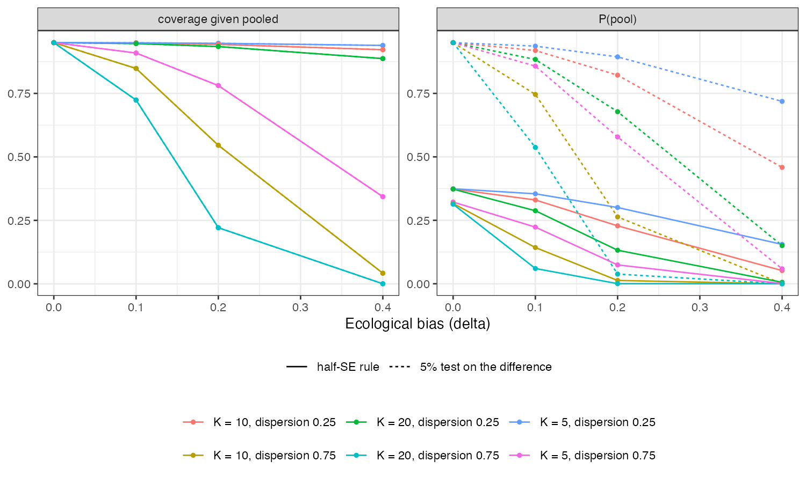

```{r setup}
s <- read.csv("../results/summary.csv")
f3 <- function(x) formatC(x, format = "f", digits = 3)
h <- s[s$policy == "half_sA", ]; nv <- s[s$policy == "never_pool", ]; ap <- s[s$policy == "always_pool", ]
p0 <- h$pass[h$delta == 0]
cc <- h$cond_cover_pass[h$delta <= 0.2 & h$pass > 0]
g0 <- merge(nv[nv$delta == 0, c("K", "disp", "rmse")], ap[ap$delta == 0, c("K", "disp", "rmse")], by = c("K", "disp"), suffixes = c("_n", "_a"))
chk <- readLines("../results/check.md")
```

# Abstract {.unnumbered}

**Background.** An individual-data network meta-analysis has within-trial and
across-trial information about a treatment-covariate interaction. The only published
criterion for pooling them is that the within-trial estimate lie within half a
standard error of the across-trial estimate [@freeman2018], described as relatively
strict and never calibrated.

**Methods.** Under equality the difference of the two estimates has standard error
$\sqrt{s_W^2 + s_A^2}$, not $s_A$, so the rule's operating characteristics are
bivariate-normal integrals. We computed them exactly for 24 network configurations
(5, 10 or 20 trials of 200; trial covariate means spread with SD 0.25 or 0.75;
ecological bias 0 to 0.4), and checked the standard errors and two exact quantities
against 2000 individual-level networks.

**Results.** The rule pools with probability at most $P(\lvert Z\rvert < 0.5) = 0.383$
under equality; in the configurations studied `r f3(min(p0))` to `r f3(max(p0))`.
When it does pool under ecological bias, the pooled interval's coverage falls to
`r f3(min(cc))`. Its RMSE is within 0.3% of never pooling in every configuration, so
it forgoes the `r round(100 * min(1 - g0$rmse_a / g0$rmse_n))`% to
`r round(100 * max(1 - g0$rmse_a / g0$rmse_n))`% RMSE reduction pooling offers when the
two estimates agree.

**Conclusion.** The rule is strict in every regime, not only some, and it is strict
in the wrong way: it refuses pooling most of the time when pooling is valid, and when
it admits pooling under bias the interval is not trustworthy. A test on the
difference in its own standard error is the minimal repair; no rule of this kind can
detect bias small relative to the across-trial standard error.

# The problem {#sec-problem}

Across-trial interaction information is identified only if there is no trial-level
confounding of the association between trial covariate means and trial effects
[@berlin2002; @hua2017]. Pooling it with the within-trial estimate gains precision
at the risk of ecological bias $\delta$. Write
$\hat\beta_W \sim N(\beta, s_W^2)$ and $\hat\beta_A \sim N(\beta + \delta, s_A^2)$,
independent. The rule pools when $\lvert D\rvert < \tfrac12 s_A$ with
$D = \hat\beta_W - \hat\beta_A \sim N(-\delta, s_W^2 + s_A^2)$. Under $\delta = 0$,

$$P(\text{pool}) = P\!\left(\lvert Z\rvert < \frac{0.5\,s_A}{\sqrt{s_W^2 + s_A^2}}\right) \le 0.383,$$

approached when $s_A \gg s_W$. The catalog's design argued the rule is "not
necessarily strict" and loosest with few trials. It is strict everywhere; the ratio
$s_W/s_A$ only decides how strict.

# Methods {#sec-methods}

Registered protocol: `protocol.md`. Standard errors came from a network of $K$ trials
of 200 (1:1), within-trial covariate SD 1, residual SD 1:
$s_W^2 = 4/(200K)$ and $s_A^2 = (4/200)/\sum_k(\bar x_k - \bar x)^2$. Conditional on $D$,
the within-trial error is normal with mean $s_W^2(D + \delta)/(s_W^2 + s_A^2)$, so the
error of whatever a policy reports, and its interval's coverage, integrate exactly
over $D$. Policies: never pool; always pool; the half-$s_A$ rule; tests on $D$ at
size 5% and 20%. The individual-level check (`R/01-check.R`, 2000 networks per row)
reproduced the standard errors and the exact pass probability and conditional
coverage, for example a pass rate of 0.366 against 0.374 exact.

# Results {#sec-results}

{#fig-rule}

```{r}
#| label: tbl-half
#| tbl-cap: "The half-SE rule by configuration and ecological bias."
x <- h[, c("K", "disp", "delta", "ratio", "pass", "cond_cover_pass", "rmse")]
x$ratio <- f3(x$ratio); x$pass <- f3(x$pass); x$cond_cover_pass <- ifelse(is.na(x$cond_cover_pass), "", f3(x$cond_cover_pass)); x$rmse <- f3(x$rmse)
names(x) <- c("K", "dispersion", "delta", "sW/sA", "P(pool)", "coverage given pooled", "RMSE")
knitr::kable(x, row.names = FALSE)
```

The rule pools in about a third of analyses where pooling is valid (@tbl-half). As
ecological bias grows, pooling becomes rarer but not rare enough: at 20 trials with
dispersed trial means and $\delta = 0.2$ it pools in
`r f3(h$pass[h$K == 20 & h$disp == 0.75 & h$delta == 0.2])` of analyses, and the pooled
interval then covers in `r f3(h$cond_cover_pass[h$K == 20 & h$disp == 0.75 & h$delta == 0.2])`
(@fig-rule). Averaged over pooling and not pooling, the rule behaves like never
pooling: its RMSE matches never pooling to within 0.3%. The size-5% test pools more
often under equality and fails similarly under bias; always pooling has the lowest
RMSE without bias and the worst with it. Never pooling had the lowest worst-case RMSE
over $\delta \in [0, 0.2]$ in five of six network configurations.

# What this does not answer {#sec-limits}

The two estimates are treated as independent and normal with known standard errors;
between-trial heterogeneity in the treatment effect, which widens $s_A$, is not
modeled, and the network is IPD in every trial. The ML-NMR case, where aggregate
trials inform only the across-trial component, is not computed. Nothing here tests
whether trial-level confounding is present; no agreement rule can. Peer review has
not been done.

# References {.unnumbered}
