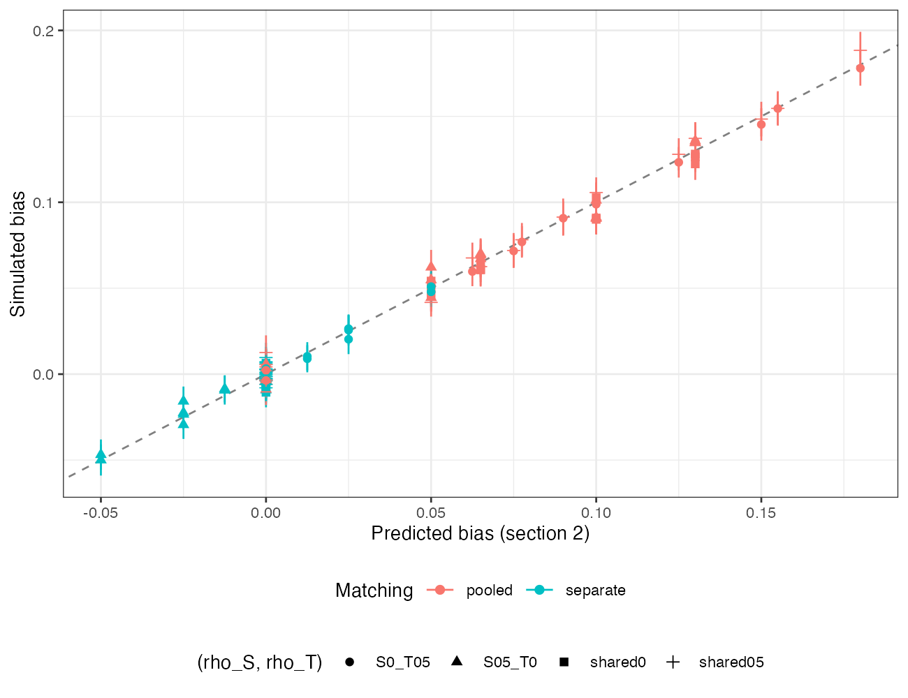

```{r setup}
s <- read.csv("../results/summary.csv")
f3 <- function(x) formatC(x, format = "f", digits = 3)
imp <- s[s$kappa != "random", ]; rnd <- s[s$kappa == "random", ]
sep <- imp[imp$method == "separate", ]; poo <- imp[imp$method == "pooled", ]
sl <- function(m) { z <- imp[imp$method == m, ]; f <- lm(bias ~ predicted, data = z, weights = 1 / z$mcse^2); c(coef(f)[[2]], sqrt(diag(vcov(f)))[[2]]) }
sp <- sl("pooled"); ss <- sl("separate")
shared <- sep[sep$corr %in% c("shared0", "shared05") & sep$gu > 0 & sep$kappa != "0", ]
rr <- merge(rnd[rnd$method == "separate", c("cell", "rmse")], rnd[rnd$method == "pooled", c("cell", "rmse")], by = "cell")
ratio <- rr$rmse.x / rr$rmse.y
k2 <- imp[imp$kappa == "0.2" & imp$gu == 0.5 & imp$beta == 0.3, ]
```

# Abstract {.unnumbered}

**Background.** An anchored MAIC can weight the individual-data trial with one weight
function (pooled) or weight each arm to the corresponding aggregate arm
(arm-separate) [@petto2019]. Catalog problem MOD-16's design predicted that
arm-separate matching is biased by the product of an unmatched covariate's prognostic
strength and the aggregate trial's arm imbalance.

**Methods.** Continuous outcome, one matched covariate $X$ reported by arm and one
unreported prognostic covariate $U$, 96 scenarios crossing an imposed aggregate-arm
imbalance in $X$ (0 to 0.2 SD, or chance), $U$'s prognostic strength, the $X$-$U$
correlation in each trial, and shared effect modification; 1000 replicates each.
Unadjusted, pooled, arm-separate and two-stage [@remiroazocar2022] MAIC.

**Results.** Conditional on an imbalance $\kappa$, pooled matching was biased by
$\kappa(\beta/2 + \gamma_X + \gamma_U\rho_T)$ (slope of simulated on predicted bias
`r f3(sp[1])`) and arm-separate matching by $\kappa\gamma_U(\rho_T - \rho_S)$ (slope
`r f3(ss[1])`). With the $X$-$U$ correlation shared between trials, arm-separate bias
was within Monte Carlo error of zero in all `r nrow(shared)` scenarios with an
unmatched prognostic covariate. Arm-separate matching had smaller bias than pooled in
every scenario with an imposed imbalance, and under chance imbalance its RMSE was
`r round(100 * (1 - max(ratio)))`% to `r round(100 * (1 - min(ratio)))`% lower.

**Conclusion.** The design's product claim is wrong. Arm-separate matching reproduces
the aggregate trial's chance imbalance inside the individual-data contrast, so it
cancels in the anchored difference; it is biased only when an unmatched prognostic
covariate relates to the matched one differently in the two trials. Pooled matching
preserves the individual trial's randomization but leaves the aggregate trial's
imbalance in the answer.

# The problem {#sec-problem}

Write the outcome as $y = \gamma_X x + \gamma_U u + \delta_t + \beta x\,\mathbb 1[t \ne C] + e$.
The aggregate B-versus-C estimate contains the trial's chance imbalance,
$\gamma_X\kappa + \gamma_U(\bar u_B - \bar u_C)$, with
$E[\bar u_B - \bar u_C] = \rho_T\kappa$. Pooled matching weights both individual-data
arms to the pooled aggregate mean, which removes nothing of this, so the anchored
contrast is biased by $\kappa(\beta/2 + \gamma_X + \gamma_U\rho_T)$. Arm-separate
matching weights arm A to the B-arm mean and arm C to the C-arm mean, which builds
the same imbalance into the individual-data contrast, $\gamma_X\kappa + \gamma_U\rho_S\kappa$,
and it cancels except for $\kappa\gamma_U(\rho_T - \rho_S)$. DESIGN.md's product of
$\gamma_U$ and $\kappa$ omits the correlation mismatch the bias needs.

# Design {#sec-design}

Registered protocol: `protocol.md`. Individual-data trial A versus C and aggregate
trial B versus C, 300 per arm; $(X, U)$ bivariate normal with correlation $\rho_S$ in
the source and $\rho_T$ in the target (means 0.5); the aggregate B arm's $X$ mean set to
$0.5 + \kappa$ exactly, with $U$ drawn given $X$. $\gamma_X = 0.5$,
$\gamma_U \in \{0, 0.25, 0.5\}$, $(\rho_S, \rho_T) \in \{(0,0), (0.5,0.5), (0.5,0), (0,0.5)\}$,
$\beta \in \{0, 0.3\}$ shared by A and B, $\kappa \in \{0, 0.1, 0.2\}$ or chance.
Estimand: $\delta_B - \delta_A = 0.2$. Sandwich variances with weights fixed.

# Results {#sec-results}

{#fig-bias}

Both formulas held (@fig-bias). At $\kappa = 0.2$, $\gamma_U = 0.5$ and $\beta = 0.3$,
pooled bias was `r f3(min(k2$bias[k2$method == "pooled"]))` to
`r f3(max(k2$bias[k2$method == "pooled"]))` and arm-separate bias
`r f3(min(k2$bias[k2$method == "separate"]))` to `r f3(max(k2$bias[k2$method == "separate"]))`,
the extremes being the two mismatched-correlation structures. Two-stage MAIC behaved
like pooled matching: it corrects the individual trial's chance imbalance, not the
aggregate trial's.

Under chance imbalance every method except the unadjusted one was unbiased, and the
difference was precision: arm-separate RMSE over pooled `r f3(min(ratio))` to
`r f3(max(ratio))`. Its sandwich interval overcovered (`r f3(min(rnd$coverage[rnd$method == "separate"]))`
to `r f3(max(rnd$coverage[rnd$method == "separate"]))`) because it adds the two trials'
variances while their imbalances are positively correlated. The design's candidate
diagnostic, the weighted difference in $U$ between individual-data arms, estimates
$\rho_S\kappa$ and cannot see $\rho_T$; its correlation with arm-separate bias was
`r f3(cor(sep$u_diff, sep$bias))`, with the sign set by which trial has the stronger
correlation.

# What this does not answer {#sec-limits}

Continuous outcome and linear model; one matched and one unmatched covariate; shared
effect modification. On a non-collapsible scale arm-separate matching compares arms
in different populations and its estimand needs separate treatment. The arm-separate
interval's conservatism is not repaired here. Peer review has not been done.

# References {.unnumbered}
