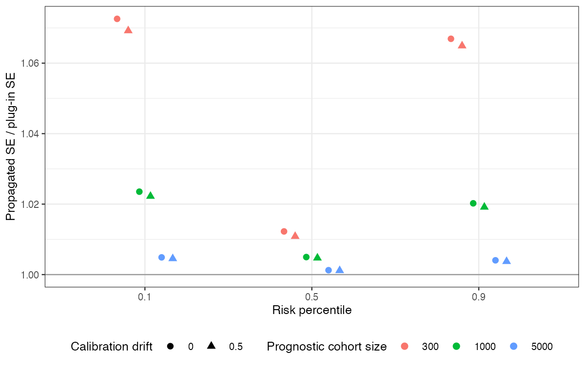

# Treating an estimated risk score as data costs little in risk-modeling
meta-regression, most at the tails
Ahmad Sofi-Mahmudi
2026-09-23

# Abstract

**Background.** Risk-modeling approaches fit a prognostic score in one
cohort and use it as a regressor for treatment-effect heterogeneity in
trials, treating the score as observed. Catalog problem MOD-18 asks
whether the plug-in interval is too narrow, especially at the tails of
risk where recommendations are made.

**Methods.** Logistic prognostic score from a cohort of 300, 1000 or
5000 patients with eight covariates, used in a pooled six-trial logistic
regression of outcome on score, treatment and their interaction, with or
without trial calibration drift (6 scenarios, 500 replicates each).
Plug-in intervals for the treatment effect at the 10th, 50th and 90th
risk percentiles were compared with intervals adding bootstrap variance
from refitting the score.

**Results.** Propagating the score’s uncertainty widened intervals by
0.001 to 0.024 (proportion) with cohorts of 1000 or more and by 0.011 to
0.073 with 300. The widening was larger at the tails than at the median
(1.065 to 1.073 against 1.011 to 1.012 for the ratio with 300). Plug-in
coverage was 0.924 to 0.970; the registered rule required 0.93
everywhere and was missed in one scenario with the 300-patient cohort.

**Conclusion.** With a prognostic cohort of about a thousand patients or
more, the plug-in interval is adequate here; with smaller cohorts,
propagate the score’s uncertainty, which matters most at the risk
percentiles where decisions are made.

# The problem

In risk-modeling heterogeneity analysis ([1](#ref-kent2020)) the score
$\hat r = X\hat\gamma$ is estimated, and a model using it as a regressor
omits $\operatorname{Var}(\hat r)$ from every coefficient multiplying
it. The omitted term is largest where the score is least precise, at
extreme covariate values.

Uniform shrinkage of the score’s slopes is a linear rescaling that the
trial intercepts and the treatment-by-score interaction absorb, so
effects at score percentiles do not depend on it; DESIGN.md’s claim that
shrinkage compounds the problem does not apply to that form of
shrinkage.

# Design

Registered protocol: `protocol.md`; ADEMP structure
([2](#ref-morris2019)). Eight covariates, true risk logit $-1 + X\gamma$
with $\gamma = (0.6, 0.5, 0.4, 0.3, 0.2, 0.1, 0, 0)$; six trials of 400
per arm with calibration shifts $N(0, \text{drift}^2)$; treatment effect
$-0.4 - 0.25(r + 1)$ on the log odds scale. Estimand: the effect at the
10th, 50th and 90th percentiles of true risk; estimate at the same
percentiles of the fitted score. Twenty bootstrap refits of the score
per replicate.

# Results

Figure 1: Ratio of the propagated to the plug-in SE by risk percentile,
cohort size and calibration drift.

The widening shrank with cohort size and was concentrated at the tails
(<a href="#fig-wide" class="quarto-xref">Figure 1</a>). The score’s
estimation error was small relative to the trials’ sampling error even
with 300 cohort patients, because six trials of 800 patients determine
the interaction more loosely than 300 patients determine eight score
coefficients. Calibration drift was absorbed by the trial intercepts.

# What this does not answer

A pairwise six-trial analysis rather than a network; frequentist fits
with a bootstrap rather than a joint Bayesian or cut model; a
well-specified score. Peer review has not been done.

# References

1.
David M. Kent, Jessica K. Paulus,
David van Klaveren, others. The predictive approaches to treatment
effect heterogeneity (PATH) statement. Annals of Internal Medicine.
2020;172(1):35–45.
doi:[10.7326/M18-3667](https://doi.org/10.7326/M18-3667)

2.
Tim P. Morris, Ian R. White,
Michael J. Crowther. Using simulation studies to evaluate statistical
methods. Statistics in Medicine. 2019;38(11):2074–102.
doi:[10.1002/sim.8086](https://doi.org/10.1002/sim.8086)

