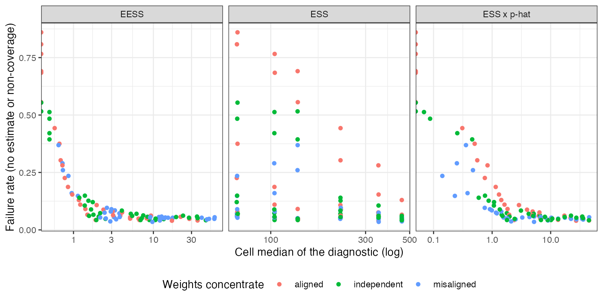

# Effective sample size counted in events: right direction, no gain over
ESS times the event rate
Ahmad Sofi-Mahmudi
2026-09-23

# Abstract

**Background.** With rare binary outcomes, the information in a MAIC
estimate is carried by events, which Kish’s ESS does not count. Catalog
problem OUT-02 proposed an event-based effective sample size (EESS) and
argued it would reveal weights that concentrate away from the patients
who have events.

**Methods.** $\mathrm{EESS} = (\sum_i w_iy_i)^2/\sum_i w_i^2y_i$ is the
reciprocal of the sandwich variance of a weighted log odds for small
risks, and its ratio to $\mathrm{ESS}\cdot\bar p$ is
$E_w[w]E_w[p]/E_w[wp]$. We compared EESS, ESS times the event rate and
ESS as predictors of interval failure in 108 scenarios (event risk 0.005
to 0.1, target shift that concentrates weights on high-risk, low-risk or
no particular patients, 300 or 1000 per arm, null or nonzero effect),
1000 replicates each.

**Results.** The direction held in every scenario, reversed from the
design’s statement: EESS was below ESS times the event rate when weights
concentrated on high-risk patients (ratio 0.473 to 0.794) and above it
when they concentrated on low-risk patients (1.281 to 2.401). As
predictors of failure (no estimate or non-coverage), EESS and ESS times
the event rate were equivalent (AUROC 0.839 and 0.858) and ESS alone was
poor (0.662). Among analyses that produced an estimate, non-coverage was
0.057 and no diagnostic predicted it (AUROC 0.535 to 0.589).

**Conclusion.** Counting events matters: ESS alone misreads rare-event
information. Counting them by EESS rather than ESS times the event rate
adds nothing a planner or reader can use, because EESS is what the
sandwich variance already reports.

# The problem

For a weighted proportion,
$\mathrm{Var}(\operatorname{logit}\hat p) \approx
\sum_i w_i^2y_i/(\sum_i w_iy_i)^2 = 1/\mathrm{EESS}$ when risks are
small, so EESS is the effective number of events. Against the
weights-only reading,
$E[\mathrm{EESS}]/(\mathrm{ESS}\cdot\bar p) = E_w[w]E_w[p]/E_w[wp]$,
which falls below 1 when weights and risk covary positively. DESIGN.md
stated the opposite direction. Its refuting sentence was that ESS and
event risk together are sufficient.

# Design

Registered protocol: `protocol.md`. Source trial A versus C with three
normal covariates, only $x_1$ prognostic (log odds 1 per SD). MAIC to a
target shifted by $s$ in $x_1$ upward (weights on high-risk patients),
downward, or in the non-prognostic $x_2$. Target control-arm risk 0.005,
0.02 or 0.10; $s \in \{0.3, 0.6, 0.9\}$; 300 or 1000 per arm;
conditional log odds ratio 0 or $-0.5$. Estimand: target marginal log
odds ratio by quadrature. Weighted log odds ratio with a sandwich
variance; no estimate when an arm has no events. Diagnostics combined
over arms as $1/(1/a_1 + 1/a_0)$.

# Results

Figure 1: Cell failure rate against each diagnostic’s cell median.

Failure was dominated by analyses with no events in an arm, up to 0.858
of replicates at the lowest risk and smaller size, and both event-based
diagnostics track it closely
(<a href="#fig-diag" class="quarto-xref">Figure 1</a>); ESS does not,
because it is the same whatever the risk. The registered rule, which
required EESS to beat ESS times the event rate by at least 0.05, reads
refuted: the difference was -0.018 (bootstrap SE 0.001). Coverage among
estimated analyses was 0.874 to 1.000.

The exploratory restriction to analyses with an estimate
(`R/05-exploratory.R`, written after the registered analysis) shows why
neither diagnostic predicts non-coverage: EESS is the reciprocal of the
variance the interval already uses.

# What this does not answer

One prognostic covariate and MAIC on means; the Firth, penalized,
Bayesian and fail-closed estimators in DESIGN.md were not run, so what
happens to a zero-event analysis under those methods is not measured.
Unanchored comparisons and separation in multivariable outcome models
are outside the design. Peer review has not been done.

# References
