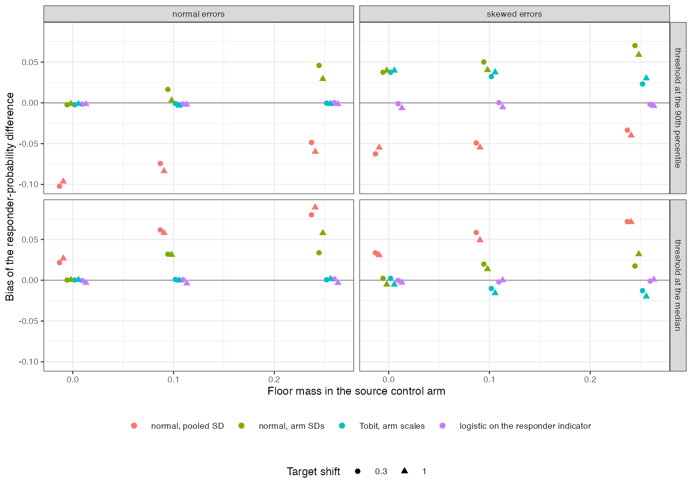

```{r setup}
s <- read.csv("../results/summary.csv")
f3 <- function(x) formatC(x, format = "f", digits = 3)
s$mx <- pmax(abs(s$bias_near), abs(s$bias_tail))
m <- function(k, cond = TRUE) s[s$method == k & cond, ]
np0 <- m("normal_pooled", s$floor_mass == 0); np2 <- m("normal_pooled", s$ratio == 2)
v <- function(k, r, sk, fl, sh, col) s[s$method == k & s$ratio == r & s$skew == sk & s$floor_mass == fl & s$m == sh, col]
lin_fl <- m("normal_arm_sd", s$floor_mass == 0.25)
```

# Abstract {.unnumbered}

**Background.** Continuous outcomes are transported by G-computation from normal linear
models, often with one residual SD. The target mean does not involve the residual, but a
responder probability does. Catalog problem OUT-05 asks how large the difference is and
whether floor effects on bounded scales make it depend on the target population.

**Methods.** Source trial of 300 per arm, residual SD equal in both arms or twice as large under
treatment, normal or skewed errors, a floor holding 0%, 10% or 25% of the control arm, and a
target shifted by 0.3 or 1 SD: 24 scenarios, 1000 replicates each. Estimands: the target mean
difference and the difference in the probability of exceeding the target control arm's median
or 90th percentile. Methods: normal model with pooled or arm-specific SD, Tobit with
arm-specific scales, and logistic regression of the responder indicator.

**Results.** Without a floor the pooled-SD model's mean contrast was unbiased (at most
`r f3(max(abs(np0$bias_mean)))`) while its responder contrasts were biased by up to
`r f3(max(np2$mx))` when the SDs differed, with opposite signs at the two thresholds (for example
`r f3(v("normal_pooled", 2, "none", 0, 0.3, "bias_near"))` and `r f3(v("normal_pooled", 2, "none", 0, 0.3, "bias_tail"))`).
Arm-specific SDs removed that bias for normal errors but not with a floor (up to
`r f3(max(m("normal_arm_sd", s$floor_mass > 0 & s$skew == "none")$mx))`) or skew. Tobit handled the floor
(at most `r f3(max(m("tobit", s$skew == "none")$mx))`) but not skew. Logistic regression of the
responder indicator was unbiased in every scenario (at most `r f3(max(m("logistic_responder")$mx))`).
The floor biased the linear model's mean contrast by at most `r f3(max(abs(lin_fl$bias_mean)))`,
more at the larger target shift, but under 2% of the effect.

**Conclusion.** Report responder probabilities from a model of the responder indicator, or at
least with arm-specific dispersion and a model for the floor; a pooled normal residual biases
them in a direction set by the threshold, even where the mean is right.

# The problem {#sec-problem}

With an identity link and a correct mean model, the target mean contrast
$\int\{\mu_1(x) - \mu_0(x)\}dF_T$ contains no residual term. A responder probability
$\Phi\{(\mu(x) - c)/\sigma\}$ contains $\sigma$: a pooled value too small for the treated arm
overstates response when the conditional mean is above the threshold and understates it
below, so the error does not average out. A floor adds a point mass that a normal model
spreads below the boundary; censored regression [@tobin1958] models it, and how much it
matters depends on how close the target sits to the floor.

# Design {#sec-design}

Registered protocol: `protocol.md`; ADEMP structure [@morris2019]. Latent
$Y^* = 20 + 5x + A(4 + 2x) + \sigma_Ae$ with $\sigma_C = 6$, $\sigma_A = 6r$, $r \in \{1, 2\}$; $e$
normal or standardized Gamma(4); $Y = \max(Y^*, \text{floor})$. Truths from $4\times10^5$ Monte
Carlo draws.

# Results {#sec-results}

{#fig-resp}

The dissociation registered as the primary outcome held (@fig-resp): the same fitted mean
model gave an unbiased mean contrast and biased responder contrasts. The direction reversed
between the median and the tail threshold, so averaging over thresholds would hide it. Each
parametric repair fixed the feature it models and missed the others; the direct binary model
needed no distributional assumption for the outcome and paid in variance
(RMSE `r f3(v("logistic_responder", 2, "none", 0, 0.3, "rmse_tail"))` against
`r f3(v("normal_arm_sd", 2, "none", 0, 0.3, "rmse_tail"))` for the correct normal model at the tail).

# What this does not answer {#sec-limits}

One source trial with arm-specific dispersion rather than several studies with study-specific
dispersion; no ceiling; bias and RMSE only, without intervals; no ML-NMR. Peer review has not
been done.

# References {.unnumbered}
