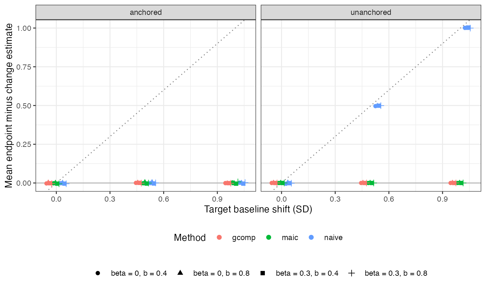

```{r setup}
s <- read.csv("../results/summary.csv"); d <- read.csv("../results/differences.csv")
f4 <- function(x) formatC(x, format = "f", digits = 4)
adj <- d[d$method != "naive", ]
nu <- d[d$method == "naive" & d$design == "unanchored", ]
cf <- summary(lm(diff ~ shift + I(beta * shift), data = nu))$coefficients
na <- d[d$method == "naive" & d$design == "anchored", ]
```

# Abstract {.unnumbered}

**Background.** Catalog problem OUT-06 proposes that when baseline severity modifies
the treatment effect, change-score and endpoint analyses imply different
effect-modification structures and diverge after population adjustment, in
proportion to the product of the baseline-by-treatment interaction and the baseline
shift between populations.

**Methods.** Because baseline is measured before treatment, the target contrasts of
follow-up and of change are the same quantity under any adjustment. We tested the
implication in 24 scenarios (anchored and unanchored comparisons, baseline shift 0 to
1 SD, interaction 0 or 0.3, baseline-to-follow-up correlation 0.4 or 0.8), 1000
replicates each, for naive comparison, MAIC matching the baseline mean, and
G-computation, each in both representations.

**Results.** For MAIC and G-computation the mean endpoint-minus-change difference
never exceeded `r f4(max(abs(adj$diff)))` and was within 3 Monte Carlo SE of zero in
every scenario; in unanchored comparisons the two representations were identical to
`r formatC(max(adj$max_abs[adj$design == "unanchored"]), format = "e", digits = 0)` in
every replicate. The only divergence was in naive unanchored comparisons, where the
difference was `r f4(cf["shift", 1])` (SE `r f4(cf["shift", 2])`) times the shift and
`r f4(cf["I(beta * shift)", 1])` (SE `r f4(cf["I(beta * shift)", 2])`) times the
interaction-by-shift product.

**Conclusion.** The proposed product structure does not exist. Change and endpoint
analyses diverge only when baseline is left unadjusted across populations, and then
by the baseline shift alone, independent of effect modification. Where baseline is
adjusted for, the choice of representation affects precision and not the target
estimate.

# The problem {#sec-problem}

Combining trials that report change from baseline with trials that report follow-up
values is generally valid in conventional meta-analysis [@dacosta2013], because the
change contrast equals the follow-up contrast minus the baseline contrast and
randomization makes the latter zero in expectation. OUT-06 asks whether population
adjustment breaks this: DESIGN.md argued that with baseline as an effect modifier the
two representations "agree at the source and diverge at the target".

They cannot diverge at the level of the estimand. Baseline $Y_0$ is pre-treatment,
so $Y_0(1) = Y_0(0)$ and, for any target law $F_T$,

$$E_T[Y_1(b) - Y_1(a)] = E_T[(Y_1 - Y_0)(b) - (Y_1 - Y_0)(a)].$$

Estimators can still differ. A linear model for $Y_1 - Y_0$ with $Y_0$ as a covariate
has the same treatment and treatment-by-$Y_0$ coefficients as the model for $Y_1$;
only the $Y_0$ coefficient shifts by one. MAIC that matches the baseline mean makes
the weighted baseline equal the target's exactly. Without adjustment for baseline,
an unanchored comparison of follow-up is biased by $(b + \beta)s$ and of change by
$(b + \beta - 1)s$, for baseline slope $b$, interaction $\beta$ and shift $s$: they
differ by $s$ whatever $\beta$ is. In an anchored comparison each trial's
randomization removes the baseline contrast in expectation.

# Design {#sec-design}

Registered protocol: `protocol.md`. Individual-data trial A versus C with
$Y_0 \sim N(0, 1)$; aggregate trial B versus C with $Y_0 \sim N(s, 1)$ reporting arm
means of $Y_0$, $Y_1$ and $Y_1 - Y_0$. $Y_1 = bY_0 + \delta_t + \beta Y_0\mathbb 1[t = A] + e$,
$e \sim N(0, 1 - b^2)$, $\delta_A = -0.4$, $\delta_B = -0.2$, 300 per arm. Factors:
anchored or unanchored; $s \in \{0, 0.5, 1\}$; $\beta \in \{0, 0.3\}$;
$b \in \{0.4, 0.8\}$. Estimand $E_T[Y_1(B) - Y_1(A)] = \delta_B - \delta_A - \beta s$.
Methods: naive, MAIC on the baseline mean, and G-computation with a linear model in
$Y_0$, each in both representations. 1000 replicates per scenario.

# Results {#sec-results}

{#fig-diff}

Adjusted estimators did not diverge (@fig-diff). The anchored MAIC and G-computation
differences are the aggregate trial's chance baseline imbalance, mean zero; in
unanchored comparisons the individual-data side is algebraically identical and the
difference is at machine precision. Naive anchored comparisons also agree in
expectation (largest mean difference `r f4(max(abs(na$diff)))`) though both are biased
when $\beta \neq 0$, because neither adjusts for the modifier.

```{r}
#| label: tbl-bias
#| tbl-cap: "Bias (Monte Carlo SE) at shift 1, b = 0.4."
x <- s[s$shift == 1 & s$b == 0.4, ]
x$v <- sprintf("%s (%s)", f4(x$bias), f4(x$mcse))
w <- reshape(x[, c("design", "beta", "method", "v")], idvar = c("design", "beta"),
             timevar = "method", direction = "wide")
names(w) <- sub("^v\\.", "", names(w))
knitr::kable(w[, c("design", "beta", "naive_end", "naive_chg", "maic_end", "maic_chg", "gcomp_end", "gcomp_chg")],
             row.names = FALSE)
```

In naive unanchored comparisons the endpoint and change estimates are biased in
opposite directions when $b < 0.5$ (@tbl-bias), matching $(b + \beta)s$ and
$(b + \beta - 1)s$. Both registered controls passed: every method was unbiased at
$s = 0$, and the naive unanchored biases matched their predictions at $s = 1$.

# What this does not answer {#sec-limits}

A continuous outcome with a linear conditional mean. Under a nonlinear link (for
example a log-transformed outcome analyzed on the original scale) the equivalence of
coefficients fails, although the estimand identity does not. Responder
probabilities defined by a threshold on change and on follow-up are different
estimands by definition and are not compared. The joint repeated-measures model is
represented only by G-computation with baseline as a covariate. Peer review has not
been done.

# References {.unnumbered}
