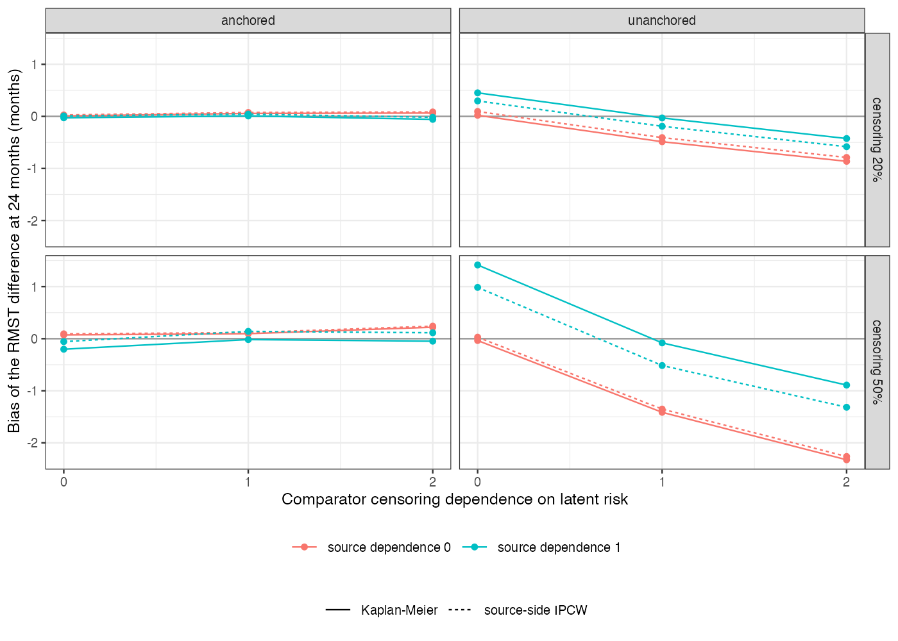

# Informative censoring does not cancel in an unanchored comparison, and
adjusting one side can make it worse
Ahmad Sofi-Mahmudi
2026-09-23

# Abstract

**Background.** When censoring depends on patients’ risk, Kaplan-Meier
estimates in each trial are biased. It is often argued that the biases
cancel in an indirect comparison. Catalog problem OUT-07 asks when they
do.

**Methods.** A shared frailty drove both event and censoring hazards,
with separate dependence in the source (none or moderate) and the
comparator (none, moderate or strong), censoring of 20% or 50%, in
unanchored and anchored comparisons: 24 scenarios, 1000 replicates each.
Estimand: RMST difference at 24 months (0.62 months unanchored).
Methods: Kaplan-Meier, inverse probability of censoring weighting on the
source side with a baseline proxy of risk, and a one-sided comparator
sensitivity analysis.

**Results.** Unanchored, with differing mechanisms the bias ranged from
-2.33 to 1.42 months, and the sign of the comparison was wrong in up to
0.973 of analyses. Equal mechanisms nearly cancelled (-0.080 to -0.030).
Anchored comparisons were protected in every scenario (-0.202 to 0.219),
because both arms of each trial shared its mechanism. Source-side
weighting reduced source bias only partly and, where the mechanisms were
equal, broke the cancellation (bias -0.080 to -0.515 at 50% censoring).
The comparator sensitivity parameter that reproduced the truth lay
outside the conventional range 0.5 to 2 in up to 0.703 of analyses.

**Conclusion.** Cancellation needs equal mechanisms, which an external
or single-arm comparator seldom has. Anchoring protects; adjusting the
source alone does not, and a one-sided sensitivity analysis must allow
larger departures than usual.

# The problem

Each Kaplan-Meier RMST ([1](#ref-royston2013)) carries a censoring bias
$c$; an unanchored contrast carries $c_S - c_T$ and an anchored one the
difference of within-trial differences, in which each trial’s shared
mechanism largely cancels. Inverse probability of censoring weighting
([2](#ref-robins2000)) needs the censoring predictors, which exist for
the individual-data source and not for an aggregate comparator.

# Design

Registered protocol: `protocol.md`; ADEMP structure
([3](#ref-morris2019)). Frailty $U \sim N(0, 1)$; event hazard
$\lambda e^{0.7U}$ ($\lambda_A = 0.045$, $\lambda_B = 0.05$,
$\lambda_C = 0.07$ per month); censoring hazard $\kappa e^{\alpha U}$,
$\kappa$ set for the censoring prevalence by 24 months; administrative
end at 36; 300 per arm. The source records $W = 0.7U + \text{noise}$.
The sensitivity analysis gives censored comparator patients a remaining
hazard of $\delta$ times the arm’s crude rate ($\delta = 1$ is
independent censoring).

# Results

Figure 1: Bias of the RMST difference by comparator censoring
dependence, for each level of source dependence.

Unanchored bias followed $c_S - c_T$
(<a href="#fig-bias" class="quarto-xref">Figure 1</a>): positive when
only the source censored its high-risk patients, negative when only the
comparator did, and roughly twice as large at 50% censoring. With a true
difference of 0.62 months, a comparator with strong dependence reversed
the comparison in 0.973 of analyses at 50% censoring.

Weighting on a proxy correlated 0.7 with the latent risk removed about a
third of the source bias. Applied only to the source, it turned a
cancelled comparison into a biased one. In the sensitivity analysis the
$\delta$ that reproduced the truth had a median of 2.43 with strong
comparator dependence, so a range capped at 2 would often not reach it.

# What this does not answer

No covariate shift between trials, so the population-adjustment layer is
absent; time-constant censoring hazards; one sensitivity
parameterization; a single baseline proxy stands in for the source’s
time-varying censoring predictors. Peer review has not been done.

# References

1.
Patrick Royston, Mahesh K. B.
Parmar. Restricted mean survival time: An alternative to the hazard
ratio for the design and analysis of randomized trials with a
time-to-event outcome. BMC Medical Research Methodology. 2013;13:152.
doi:[10.1186/1471-2288-13-152](https://doi.org/10.1186/1471-2288-13-152)

2.
James M. Robins, Dianne M.
Finkelstein. Correcting for noncompliance and dependent censoring in an
AIDS clinical trial with inverse probability of censoring weighted
(IPCW) log-rank tests. Biometrics. 2000;56(3):779–88.
doi:[10.1111/j.0006-341X.2000.00779.x](https://doi.org/10.1111/j.0006-341X.2000.00779.x)

3.
Tim P. Morris, Ian R. White,
Michael J. Crowther. Using simulation studies to evaluate statistical
methods. Statistics in Medicine. 2019;38(11):2074–102.
doi:[10.1002/sim.8086](https://doi.org/10.1002/sim.8086)

