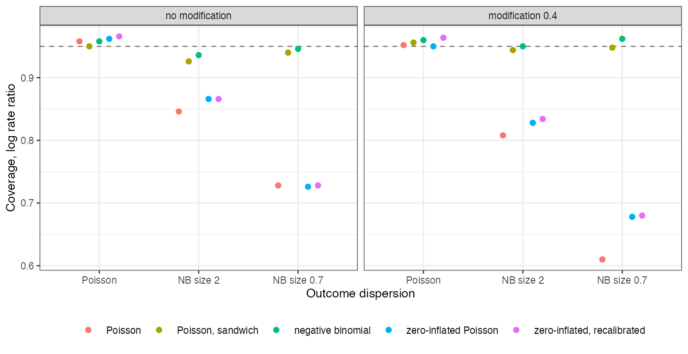
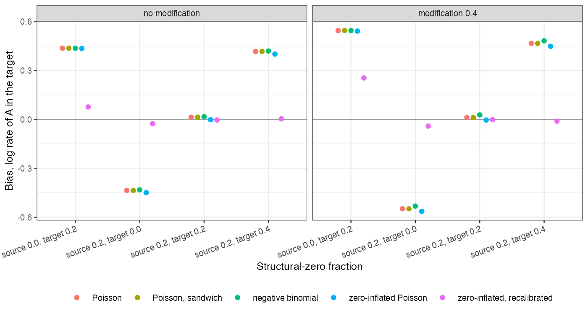

# Transporting count outcomes: overdispersion breaks the interval, a
differing zero fraction breaks the absolute rate
Ahmad Sofi-Mahmudi
2026-09-23

# Abstract

**Background.** Count outcomes such as exacerbations are transported
from an individual-data trial to a target population with Poisson or
negative binomial G-computation. Catalog problem OUT-08 asks what
overdispersion and structural zeros do to the transported estimate.

**Methods.** A versus C trial of 300 per arm, one covariate, target
shifted by 0.5 SD. Part A: negative binomial counts with size $\infty$,
2 or 0.7 and no structural zeros. Part B: Poisson counts with a
structural-zero fraction of 0.2 in the source and 0, 0.2 or 0.4 in the
target, or 0 and 0.2. Each with or without effect modification: 14
scenarios, 500 replicates each. Poisson, Poisson with a sandwich
variance, negative binomial, zero-inflated Poisson, and zero-inflated
Poisson with its zero part recalibrated to the target’s reported
proportion of control patients without events.

**Results.** Overdispersion left the Poisson rate ratio unbiased and cut
its coverage to 0.610; a sandwich variance restored 0.926 to 0.948 and
the negative binomial 0.936 to 0.962. The registered rule required the
sandwich to reach 0.93 in every cell and missed by 0.004 in one (MCSE
0.012). A structural-zero fraction that differed between populations
biased the transported absolute log rate by up to 0.564 in every count
model, with coverage near zero. The rate ratio was protected without
effect modification (bias at most 0.007) and biased by up to 0.115 with
it. Recalibrating the zero part to the target’s reported zero proportion
removed the absolute-rate bias when the source had structural zeros (at
most 0.041), but not when it had none (0.254).

**Conclusion.** Overdispersion is a variance problem that a sandwich or
negative binomial fixes. A differing zero fraction is a transport
problem that no dispersion parameter fixes; it needs target information
on zeros and a source in which the zero process is identifiable.

# The problem

Under a negative binomial with the correct mean, the Poisson score
equations are unbiased, so the estimate is consistent and only the
model-based variance is wrong ([1](#ref-zeileis2006)). Structural zeros
are different. If a fraction $\pi(x)$ of patients cannot have events,
the target rate is $\int\{1 - \pi_T(x)\}\mu_a(x)\,dF_T$, and a model
fitted to the source learns $\{1 - \pi_S(x)\}\mu_a(x)$. The rate ratio
cancels $1 - \pi$ when the effect is constant; with effect modification
the at-risk composition enters the ratio too. A zero-inflated model
([2](#ref-lambert1992)) separates the two parts, but its zero part still
describes the source.

# Design

Registered protocol: `protocol.md`; ADEMP structure
([3](#ref-morris2019)). Counts: structural zero with probability
$\operatorname{logit}^{-1}(z_{\text{pop}} + 0.8x)$, otherwise NB with
mean $1.2\exp\{0.4x + A(-0.4 + bx)\}$, $b \in \{0, 0.4\}$. The two parts
are not crossed, so the zero-inflated fit is not misspecified by
dispersion in part B. G-computation over the target law; delta-method
SEs. The recalibrated model shifts the zero-part intercept until its
predicted zero proportion in the target control arm matches the reported
one; its SE ignores the sampling error of that proportion.

# Results

Figure 1: Coverage of the transported log rate ratio by outcome
dispersion (part A).

Part A (<a href="#fig-disp" class="quarto-xref">Figure 1</a>): every
mean model was unbiased for the rate ratio (Poisson at most 0.010); only
the intervals differed. The zero-inflated Poisson, misspecified by the
dispersion, lost coverage like the Poisson (0.678).

Figure 2: Bias of A’s transported log rate by structural-zero fractions
(part B).

Part B (<a href="#fig-zeros" class="quarto-xref">Figure 2</a>): with
equal zero fractions every model transported correctly. With the
target’s fraction higher or lower than the source’s, the absolute rate
was off by the log of the ratio of at-risk fractions, and the
zero-inflated model was no better than the Poisson. Recalibration needs
the zero part’s slope from the source, which is not identified when the
source has no structural zeros; there it overcorrected. Its coverage
(0.872 to 0.950 where it was unbiased) reflects the ignored uncertainty
in the reported zero proportion.

# What this does not answer

One covariate; frailty models, exposure-time weighting (CMP-20),
recurrent-event models and zero-inflated negative binomial fits were not
run. The target’s zero proportion was assumed reported for its control
arm. Peer review has not been done.

# References

1.
Achim Zeileis. Object-oriented
computation of sandwich estimators. Journal of Statistical Software.
2006;16(9):1–16.
doi:[10.18637/jss.v016.i09](https://doi.org/10.18637/jss.v016.i09)

2.
Diane Lambert. Zero-inflated
poisson regression, with an application to defects in manufacturing.
Technometrics. 1992;34(1):1–14.
doi:[10.2307/1269547](https://doi.org/10.2307/1269547)

3.
Tim P. Morris, Ian R. White,
Michael J. Crowther. Using simulation studies to evaluate statistical
methods. Statistics in Medicine. 2019;38(11):2074–102.
doi:[10.1002/sim.8086](https://doi.org/10.1002/sim.8086)

