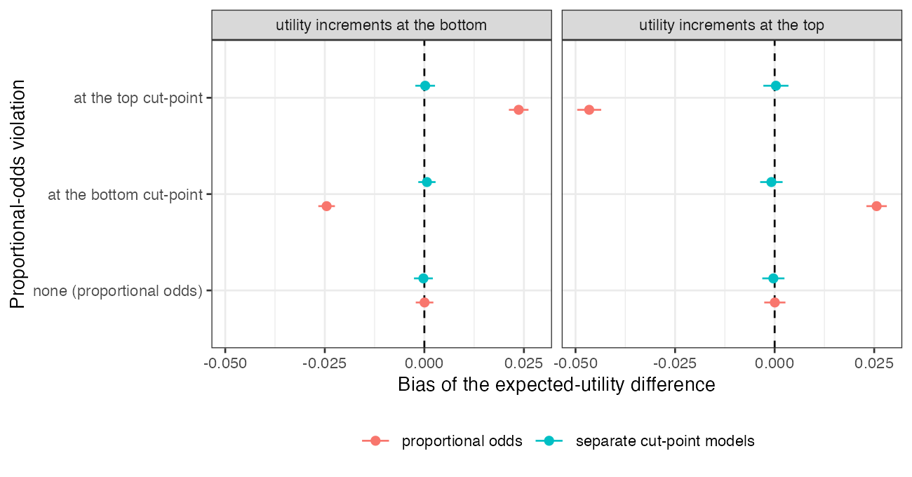

```{r setup}
s <- read.csv("../results/summary.csv"); f3 <- function(x) formatC(x, format = "f", digits = 3)
q <- function(v, u, m) s[s$violation == v & s$utility == u & s$method == m, ]
```

# Abstract {.unnumbered}

**Background.** Target-standardized category probabilities from a proportional-odds model
feed decision models with category utilities. Catalog problem OUT-10 asks whether a
proportional-odds violation reaches the decision only through the utility increment at the
violated cut-point, and whether relaxing the assumption changes the standardized decision
quantity.

**Methods.** A trial with a four-category outcome and a treatment effect that was
proportional, concentrated at the bottom cut-point, or concentrated at the top; utilities with
their increments at the bottom or top; proportional-odds regression and separate cut-point
logistic regressions, each standardized over a shifted target; 400 replicates per cell.

**Results.** Under a violation the proportional-odds estimate of the expected-utility
difference was biased whichever end carried the utility increments: by
`r f3(q("bottom", "bottom_heavy", "po")$bias)` and `r f3(q("top", "top_heavy", "po")$bias)` when the increments sat at the violated cut-point, and by
`r f3(q("bottom", "top_heavy", "po")$bias)` and `r f3(q("top", "bottom_heavy", "po")$bias)` when they sat at the other end, with coverage 0.67 to 0.85. The
separate cut-point models were unbiased with coverage 0.93 to 0.98 in every cell.

**Conclusion.** The single proportional-odds coefficient is a compromise that understates the
effect at the violated cut-point and overstates it at the others, so the decision is biased
whichever way the utilities fall. A proportional-odds check must be read against the utilities,
and the relaxed model costs little.

# The problem {#sec-problem}

The expected-utility difference is $\sum_k (u_{k+1} - u_k)\,\Delta P(Y > k)$. A proportional-odds fit
[@mccullagh1980] replaces the cut-point-specific treatment effects by one least-false value. The
catalog's design predicted that the error reaches the decision in proportion to the utility
increment at the violated cut-point. That requires the other cut-points' errors to be small; the
least-false averaging makes them not small but opposite in sign.

# Design {#sec-design}

Registered protocol: `protocol.md`. $\operatorname{logit}P(Y > k) = \alpha_k + 0.8x + a\beta_k$, $\alpha = (1.2, 0, -1.2)$,
$\beta = (0.5, 0.5, 0.5)$, $(1.2, 0.3, 0.2)$ or $(0.2, 0.3, 1.2)$; 300 per arm; target $x \sim N(0.5, 1)$; utilities
$(0, 0.6, 0.8, 1)$ or $(0, 0.2, 0.4, 1)$; G-computation standardization with 60-resample bootstrap SEs.

# Results {#sec-results}

{#fig-bias}

| violation | utility increments | truth | proportional odds: bias (coverage) | separate models: bias (coverage) |
|---|---|---:|---|---|
`r z <- s[s$method == "po", ]; paste(sprintf("| %s | %s | %s | %s (%s) | %s (%s) |", z$violation, ifelse(z$utility == "bottom_heavy", "bottom", "top"), f3(z$truth), f3(z$bias), f3(z$coverage), f3(vapply(seq_len(nrow(z)), function(i) q(z$violation[i], z$utility[i], "separate")$bias, 0)), f3(vapply(seq_len(nrow(z)), function(i) q(z$violation[i], z$utility[i], "separate")$coverage, 0))), collapse = "\n")`

: 400 replicates per cell; bias MCSE at most 0.002. {#tbl-main}

The registered primary was not confirmed (@tbl-main, @fig-bias): the bias with the utility
increments at the opposite end was about as large as with them at the violated cut-point,
and of opposite sign, instead of being small. The one exception in magnitude was the top
violation, where the aligned bias was about twice the misaligned one. Under proportional odds
both models were unbiased and nominal.

# What this does not answer {#sec-limits}

One individual-data trial rather than an ML-NMR network; separate logistic regressions as the
relaxed model (no partial proportional odds or monotonicity constraint); fixed utilities; no
dichotomized-publication arm. Peer review has not been done.

# References {.unnumbered}
