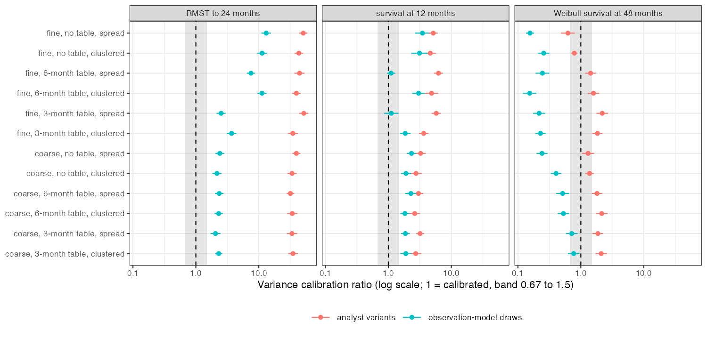

# Reconstruction ensembles were not imputations: their spread overstated
the error in restricted mean survival and understated it in the
extrapolated tail
Ahmad Sofi-Mahmudi
2026-09-23

# Abstract

**Background.** Individual data reconstructed from a published
Kaplan-Meier curve by Guyot’s algorithm ([1](#ref-guyot2012)) are often
reconstructed several times and pooled as if the repetitions were
multiple imputations ([2](#ref-rubin1987)). That is valid only if their
spread matches the error of the reconstruction. Catalog problem OUT-13’s
refuting sentence: the ensembles analysts already build are calibrated.

**Methods.** One arm of 250 patients, Weibull event times, rendered as a
pixel-rounded curve (fine or coarse) with a 3-monthly, 6-monthly or no
risk table and spread or clustered censoring; 300 replicates per cell.
Two ensembles: six analyst variants (30, 60 or 120 digitized points,
event total given or not) and 20 observation-model draws (pixel
positions and censoring times redrawn). Calibration ratio: the
ensemble’s between-reconstruction variance times $1 + 1/M$ over the
variance of its mean’s error against the true data; one for an
imputation.

**Results.** For RMST to 24 months at a 6-month risk table the ratio was
31.79 to 44.30 for the variants and 2.30 to 11.24 for the draws: both
far from one, the registered outcome. Across all cells the draws
overstated the error of RMST (2.05 to 13.08) and of 12-month survival
(1.11 to 3.48) and understated it for Weibull survival at 48 months
(0.15 to 0.77). The variants’ mean was biased by 0.17 to 0.19 months of
RMST in every cell. Reconstruction error itself was small against
sampling error: a single reconstruction’s RMSE was 0.02 to 0.08 of the
sampling SD for RMST and 0.11 to 0.26 for 48-month survival, and
population coverage stayed at 0.91 to 0.98.

**Conclusion.** Neither ensemble is an imputation. The miscalibration
has a direction that depends on the functional: conservative for RMST,
anticonservative in the extrapolated tail, which is where the
reconstruction error is concentrated.

# The problem

Write $\theta(D)$ for a functional of the true data $D$ and $P$ for the
publication. An ensemble $\theta_1, \dots, \theta_M$ computed from
reconstructions pools as an imputation when the $\theta_m$ are draws
from $\theta(D) \mid P$. Then the ensemble mean’s error
$\bar\theta - \theta(D)$ has variance $E(B)(1 + 1/M)$, with $B$ the
between-reconstruction variance, and the calibration ratio
$E(B)(1 + 1/M)/\mathrm{Var}(\bar\theta - \theta(D))$ equals one. Analyst
variants are not draws from anything: they differ by choices whose
effects are deterministic. Observation-model draws redraw what the
publication does not fix (the position of each step within its pixel and
each censoring within its risk-table interval) but hold Guyot’s
event-count rounding fixed and use no likelihood for the published
ordinates, so they approximate the posterior at best.

# Design

Registered protocol: `protocol.md`. One arm, $n = 250$, Weibull event
times (shape 1.2, median 18 months), uniform accrual over 24 months and
follow-up to 36; in the clustered pattern 30% also drop out just before
a 6-monthly visit. The publication is the curve read at pixel-column
centers of a $1500 \times 1000$ (fine) or $300 \times 200$ (coarse) plot
with ordinates rounded to the pixel grid, the risk table and the event
total. Reconstruction by IPDfromKM 0.1.10. Functionals: RMST to 24
months and survival at 12 months from the Kaplan-Meier curve, survival
at 48 months from a Weibull fit. The error is each reconstruction’s
value minus the value on the true data of the same replicate, so the
ratio estimates the expected conditional variance. Near one: 0.67 to
1.5; far: below 0.5 or above 2. MCSEs by bootstrap over replicates. 12
cells plus a null control (fine, monthly table, spread censoring).

# Results

Figure 1: Variance calibration ratio by design cell and functional, with
95% Monte Carlo intervals; shaded, the registered band of calibration.

Table 1: Ranges over the 12 main cells, 298 to 300 replicates each. RMST
in months.

| functional | ensemble | variance ratio | MSE ratio | mean error | coverage of the true-data value (nominal 0.90) |
|----|----|---:|---:|---:|---:|
| rmst24 | variants | 31.79 to 51.80 | 0.42 to 0.53 | 0.168 to 0.191 | 0.59 to 0.91 |
| rmst24 | draws | 2.05 to 13.08 | 1.72 to 9.50 | -0.006 to 0.001 | 0.95 to 1.00 |
| s12 | variants | 2.62 to 6.26 | 0.78 to 1.04 | 0.006 to 0.008 | 0.73 to 0.85 |
| s12 | draws | 1.11 to 3.48 | 1.06 to 3.49 | 0.000 | 0.46 to 1.00 |
| s48 | variants | 0.62 to 2.19 | 0.47 to 2.11 | -0.002 to 0.013 | 0.49 to 0.90 |
| s48 | draws | 0.15 to 0.77 | 0.15 to 0.63 | 0.000 to 0.002 | 0.42 to 0.77 |

**Primary.** In the four 6-month-table cells the variants’ ratio was
31.79 to 44.30 and the draws’ 2.30 to 11.24, all far from one: the
registered “both far” outcome
(<a href="#fig-ratio" class="quarto-xref">Figure 1</a>).

**Analyst variants.** The variants’ mean missed the true-data RMST by
0.17 to 0.19 months in every cell, with a variance ratio of 31.79 to
51.80 but an MSE ratio of 0.42 to 0.53. A large variance ratio with an
MSE ratio below one is the signature of a deterministic disagreement
between variants repeated in every replicate: their spread is analyst
choice, not uncertainty about the data. A post hoc rerun of the first 10
replicates of two 6-month-table cells (`R/05-mechanism.R`) located it:
the RMST error was 0.29 to 0.34 months with 30 digitized points, 0.15 to
0.16 with 60 and 0.06 with 120, identical with and without the event
total. Sparse digitization misses drops and keeps the curve high; the
ensemble’s spread is that ordering.

**Observation-model draws.** For RMST the draws overstated the error, by
a factor of 2.52 to 13.08 at fine resolution and 2.05 to 2.40 at coarse
resolution; for survival at 48 months they understated it (0.15 to
0.77), and their 90% intervals covered the true-data value in only 0.42
to 0.77 of replicates. In the same post hoc rerun, the
between-reconstruction variance of RMST came mainly from random
censoring placement at fine resolution (median ratio to the combined
variance: censoring only 1.02, pixel jitter only 0.25) and from pixel
jitter at coarse resolution (1.03 against 0.52); for 12-month survival
it was pixel jitter alone (0.93 and 1.00 against at most 0.04). What the
draws miss in the tail was not located; Guyot’s event-count rounding,
which they hold fixed, is an untested candidate.

**Non-uniformity.** Width inflation from Rubin pooling differed across
the three functionals by a factor of at least 2 in 12 of 12 cells,
meeting the registered criterion; but the draws’ inflation was at most
0.010 in every cell, and the variants’ reached 0.23 only for 48-month
survival without a risk table.

**Materiality.** A single reconstruction’s RMSE was 0.02 to 0.08 of the
sampling SD for RMST, 0.03 to 0.13 for 12-month survival and 0.11 to
0.26 for 48-month survival. Coverage of the population value was 0.91 to
0.98 for every method, and interval widths were 0.95 to 1.11 times the
true-data analysis’s.

**Controls.** Null control (fine, monthly table): single-reconstruction
RMSE 0.020 and 0.050 of the sampling SD for RMST and 12-month survival,
below the registered 0.10, on 161 of 300 replicates (below). Positive
control: in the coarse, no-table, clustered cell the single
reconstruction’s RMSE for 12-month survival was 0.131 of the sampling
SD, short of the registered 0.25, so the entry’s concern about milestone
survival is not reachable in this design.

**Failed replicates.** The reconstruction carried a 20-second wall-clock
guard against hangs. The null control ran while the shared machine’s
load average was 500 to 900, and the guard fired on reconstructions that
would have finished: 139 of its 300 replicates were lost when the single
reconstruction timed out, and ensembles shrank in others (to one member
in three), so its ensemble ratios are not reported. In the main cells 2
replicates were dropped (cell 9) and four ensembles ran one or two
members short. Two of the lost replicates, rerun from their seeds,
completed without error, so the losses are plausibly independent of the
data; a full rerun with a CPU-time guard was not done.

# What this does not answer

Observation-model draws hold Guyot’s event-count rounding fixed and use
no likelihood for the published ordinates, so they are not the
posterior; a principled imputation was not built. One arm, no downstream
comparison: how the tail miscalibration propagates into a
population-adjusted or component comparison is CMP-17’s question. No
human digitization error, line width or censoring marks; one sample
size. The positive control failed, so milestone survival was never
materially affected here. The mechanism analyses are post hoc. Peer
review has not been done.

# References

1.
Patricia Guyot, A. E. Ades, Mario
J. N. M. Ouwens, Nicky J. Welton. Enhanced secondary analysis of
survival data: Reconstructing the data from published Kaplan-Meier
survival curves. BMC Medical Research Methodology. 2012;12:9.
doi:[10.1186/1471-2288-12-9](https://doi.org/10.1186/1471-2288-12-9)

2.
Donald B. Rubin. Multiple
imputation for nonresponse in surveys. New York: Wiley; 1987.
doi:[10.1002/9780470316696](https://doi.org/10.1002/9780470316696)

