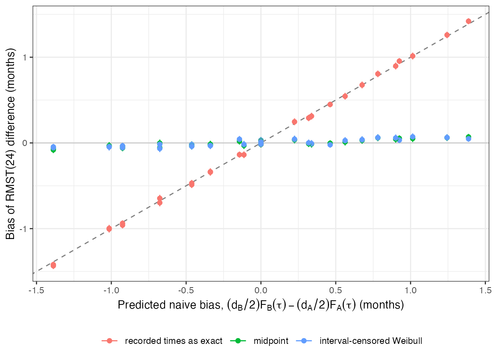

# Different assessment schedules bias a cross-trial RMST difference by
half the visit spacing times the event probability
Ahmad Sofi-Mahmudi
2026-09-23

# Abstract

**Background.** Progression is detected at scheduled visits, so a
recorded event time is the first visit after the event. When two trials
in an unanchored comparison use different schedules, the recording delay
differs between the arms. Catalog problem OUT-14 asks how much this
biases a transported restricted mean survival time (RMST) difference.

**Methods.** Two single arms of 300, Weibull event times, visit spacing
0 (continuous), 1, 2 or 3 months in trial A and 0 or 3 months in trial
B, two event rates and two true differences: 32 scenarios, 1000
replicates each. RMST at 24 months from Kaplan-Meier on recorded times,
Kaplan-Meier after moving events back half a spacing, and an
interval-censored Weibull model.

**Results.** Treating recorded times as exact biased the RMST difference
by $(d_B/2)F_B(\tau) - (d_A/2)F_A(\tau)$ (simulated against predicted
slope 1.014), up to 1.43 months where the schedules differed by 2 months
or more. The true difference was 2.57 or 1.22 months. The midpoint shift
and the interval-censored model reduced the bias to at most 0.081 and
0.071 months.

**Conclusion.** A 3-month difference in visit spacing produces a
spurious RMST difference of the same size as a real treatment effect.
Covariate balancing cannot remove it because it acts on the time axis.
Move events to the interval midpoint or fit an interval-censored model.

# The problem

An event in $(v_{k-1}, v_k]$ is recorded at $v_k$, on average $d/2$
late. RMST up to $\tau$ ([1](#ref-royston2013)) accumulates the delay
for every event before $\tau$, so treating recorded times as exact
inflates it by about $(d/2)F(\tau)$. DESIGN.md gave $d/2$ without the
factor $F(\tau)$. Within one trial the delay is shared by both arms and
nearly cancels. Across trials with different spacing it enters the
contrast, and weighting on covariates does not act on it.

# Design

Registered protocol: `protocol.md`; ADEMP structure
([2](#ref-morris2019)). Weibull shape 1.2; A’s median 8 or 16 months,
B’s median equal or 3 months longer; dropout uniform on 12 to 60 months;
administrative censoring at 36 months; $\tau = 24$. Recorded times are
used directly, which is what an ideal reconstruction of published curves
returns. The interval-censored Weibull model treats each event as lying
between the previous and the recorded visit; it is correctly specified
here, which favors it.

# Results

Figure 1: Bias of the RMST difference against the predicted naive bias,
with 95% Monte Carlo intervals.

The naive bias followed the prediction across all scenarios
(<a href="#fig-bias" class="quarto-xref">Figure 1</a>), with either sign
depending on which trial had the coarser schedule. With no true
difference, a 3-month schedule in one trial alone produced an apparent
difference of 1.42 months. With A’s median 16 months and a true
difference of 1.22 months, a 3-month schedule in A alone removed 1.00
months of it. With equal schedules the bias was near zero where the arms
had equal event probabilities; it was -0.137 and -0.138 where they did
not (predicted -0.144 and -0.114), so the registered control, which
assumed zero there, failed in 2 of 8 cells for a reason the mechanism
predicts.

The midpoint shift left bias within 3 MCSE of zero in 27 of 32 scenarios
and the interval-censored model in 28 of 32; the remaining bias was
below 0.1 month.

# What this does not answer

The binary event-by-time endpoint and comparisons with different maximum
follow-up were not run. Reconstruction error from digitized curves was
not simulated. Visits were exactly on schedule; real visit windows add
jitter that the midpoint shift ignores. Peer review has not been done.

# References

1.
Patrick Royston, Mahesh K. B.
Parmar. Restricted mean survival time: An alternative to the hazard
ratio for the design and analysis of randomized trials with a
time-to-event outcome. BMC Medical Research Methodology. 2013;13:152.
doi:[10.1186/1471-2288-13-152](https://doi.org/10.1186/1471-2288-13-152)

2.
Tim P. Morris, Ian R. White,
Michael J. Crowther. Using simulation studies to evaluate statistical
methods. Statistics in Medicine. 2019;38(11):2074–102.
doi:[10.1002/sim.8086](https://doi.org/10.1002/sim.8086)

