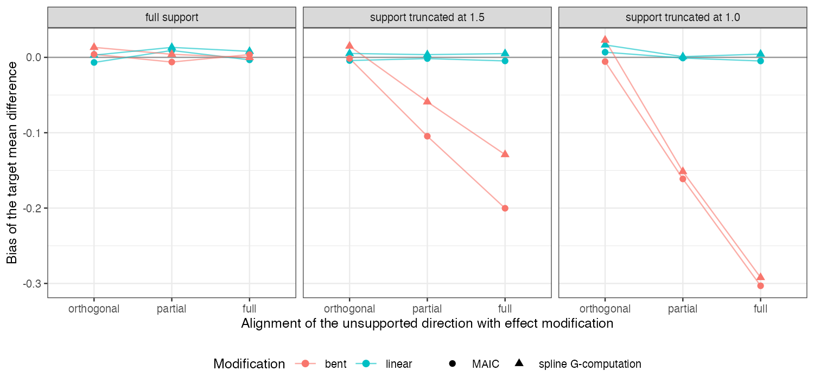

# Unsupported target mass matters only where the effect is modified, and
weight diagnostics cannot see where that is
Ahmad Sofi-Mahmudi
2026-09-23

# Abstract

**Background.** When part of the target population lies outside the
source trial’s covariate support, weighting and outcome-model methods
must extrapolate. Catalog problem OVL-01 asks whether support
diagnostics (effective sample size, unsupported mass, weight
concentration) identify the analyses that fail.

**Methods.** Anchored transport of a continuous outcome with one
covariate truncated in the source, leaving 0%, 14% or 27% of the target
unsupported. The unsupported direction was orthogonal, partly or fully
aligned with effect modification, which was linear or bent beyond the
support boundary: 36 scenarios, 1000 replicates each. MAIC, spline
G-computation and G-computation trimmed to the supported region.
Covariate laws did not depend on alignment or shape, so every weight
diagnostic had the same distribution across them.

**Results.** Bias appeared only where modification bent in the
unsupported direction: at the largest unsupported mass, -0.292 for
G-computation and -0.303 for MAIC with full alignment, against 0.023 and
-0.006 with orthogonal alignment and under 0.017 with linear
modification. Within an overlap level the weight diagnostics
discriminated failed analyses at chance (AUROC 0.481 to 0.528). A score
weighting unsupported distance by the estimated interaction reached
0.592 for G-computation and 0.657 for MAIC; the registered margin of
0.10 over effective sample size was missed by 0.01, and neither was
usable (registered verdict). Trimming gave unbiased estimates of the
restricted population’s effect (at most 0.026).

**Conclusion.** Unsupported mass is harmful only where the effect
changes in a way the source cannot show, and no diagnostic built from
covariates and weights can tell whether that is so. Report the
restricted estimand, or state the extrapolation assumption, rather than
reading effective sample size as a safety check.

# The problem

The transport bias from the unsupported region $\mathcal U$ is
$F_T(\mathcal U)\cdot E_{F_T}[\hat\tau - \tau \mid \mathcal U]$.
Effective sample size and related diagnostics ([1](#ref-phillippo2018))
are functions of covariates and weights and can see only the first
factor. The second depends on how the effect behaves where the source
has no patients, which a correctly specified model extrapolates and a
misspecified one does not.

# Design

Registered protocol: `protocol.md`; ADEMP structure
([2](#ref-morris2019)). Source 300 per arm, $x_1, x_2 \sim N(0, 1)$ with
$x_1$ truncated at $c \in \{\infty, 1.5, 1\}$; target $x \sim N(0.4, I)$
with known law. $y = 0.5(x_1 + x_2) + A\tau(x) + e$,
$\tau = -0.5 + b\{w_1g(x_1) + w_2g(x_2)\}$, $b \in \{0.3, 0.6\}$,
alignment $(w_1, w_2) \in \{(0, 1), (0.5, 0.5), (1, 0)\}$, $g(x) = x$ or
$x + 3(x - 1)_+$. MAIC ([3](#ref-signorovitch2010)) balanced the target
means; G-computation used natural splines with 3 degrees of freedom,
linear beyond the observed range. Failure: the 95% interval excluded the
truth.

# Results

Figure 1: Bias of MAIC and spline G-computation by alignment and
modification shape, strength 0.6.

<a href="#fig-bias" class="quarto-xref">Figure 1</a> shows the product
structure: no bias at full support, none with linear modification at any
truncation (the falsifier: a correct model recovers the unsupported
region), and bias growing with alignment only when modification bent
beyond the support. Effective sample size fell from 0.72 to 0.41 of the
sample with truncation in every panel alike, so it tracked the first
factor and nothing else. Pooled across overlap levels it did predict
large absolute errors (AUROC 0.754), but through variance: lower
effective sample size means wider sampling error, not detected
extrapolation bias.

The outcome-informed score helped because it multiplies unsupported
distance by the estimated interaction, but it cannot distinguish linear
from bent modification beyond the support, so it also flagged the linear
scenarios where extrapolation was harmless.

# What this does not answer

Continuous outcome and two covariates; ML-NMR, ML-UMR and NMI were not
run; failure was defined by interval non-coverage because no decision
context fixes a material threshold. Peer review has not been done.

# References

1.
David M. Phillippo, A. E. Ades,
Sofia Dias, Stephen Palmer, Keith R. Abrams, Nicky J. Welton. Methods
for population-adjusted indirect comparisons in health technology
appraisal. Medical Decision Making. 2018;38(2):200–11.
doi:[10.1177/0272989X17725740](https://doi.org/10.1177/0272989X17725740)

2.
Tim P. Morris, Ian R. White,
Michael J. Crowther. Using simulation studies to evaluate statistical
methods. Statistics in Medicine. 2019;38(11):2074–102.
doi:[10.1002/sim.8086](https://doi.org/10.1002/sim.8086)

3.
James E. Signorovitch, Eric Q. Wu,
Andrew P. Yu, Charles M. Gerrits, Evan Kantor, Yanjun Bao, Shiraz R.
Gupta, Parvez M. Mulani. Comparative effectiveness without head-to-head
trials: A method for matching-adjusted indirect comparisons applied to
psoriasis treatment with adalimumab or etanercept. PharmacoEconomics.
2010;28(10):935–45.
doi:[10.2165/11538370-000000000-00000](https://doi.org/10.2165/11538370-000000000-00000)

