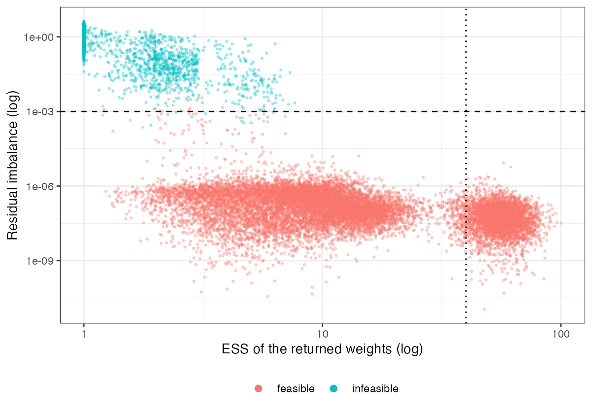

# An infeasible MAIC is signaled by its own balance table, not by its
effective sample size
Ahmad Sofi-Mahmudi
2026-09-23

# Abstract

**Background.** Method-of-moments MAIC has a solution only if the target
mean lies in the convex hull of the source covariates
([1](#ref-glimm2022)). Without one, the optimizer returns weights that
satisfy nothing. Catalog problem OVL-02 asks whether this is signaled,
and whether a low effective sample size is the signal.

**Methods.** Binary-outcome MAIC with 3 or 8 covariates, the target
shifted so that 0% to 90% of source samples were infeasible by linear
program, with and without effect modification; 24 scenarios, 1000
replicates each. Detectors: Kish ESS, maximum weight, the residual
imbalance of the returned weights, and the optimizer’s convergence code.

**Results.** The residual imbalance separated infeasible from feasible
calibrations almost perfectly (AUROC 1.000; above $10^{-3}$ in 0.999 of
infeasible and 0.001 of feasible analyses). The optimizer reported
convergence on 17% of infeasible problems. ESS ranked analyses well
(AUROC 0.996) but the conventional reading, ESS below 10% of $n$,
flagged every infeasible analysis and 73% of feasible ones near the hull
boundary. Near the boundary feasible analyses were themselves
unreliable, with coverage 0.617 to 0.853.

**Conclusion.** Infeasibility is decidable and already visible: the
balance of the returned weights on the matched moments is zero at any
solution and bounded away from zero without one. Balance tables should
be computed from the returned weights, not assumed; a threshold on ESS
cannot tell “impossible” from “hard”.

# The problem

MAIC minimizes $\sum_i \exp\{\alpha^\top(x_i - m_T)\}$. If $m_T$ lies
outside the convex hull of the $x_i$, there is a direction in which
every term decreases, the objective has no minimizer, and a quasi-Newton
routine drifts until a tolerance stops it. The returned weights then put
almost all mass on the few rows nearest the target and match nothing.
Our DIA-03 study found post-weighting balance on matched moments
identically zero; that holds only when a solution exists. The catalog’s
refuting sentence is that infeasibility is rare and yields an ESS low
enough that existing conventions catch it.

# Design

Registered protocol: `protocol.md`. Source trial of 400 with
$d \in \{3, 8\}$ independent normal covariates; target mean at distance
$s$ along the equal-weight direction, with $s$ set by probe to give 10%,
30%, 50%, 70% and 90% infeasibility (`results/shifts.csv`), plus a
feasible-with-margin shift of 1.5. Binary outcome with prognostic
coefficient 0.4 per covariate and modification 0 or 0.5 on $x_1$.
Feasibility by linear program (Rglpk).

# Results

Figure 1: Each replicate’s ESS against its residual imbalance. The
dashed line is the 0.001 residual threshold; the dotted line is ESS at
10% of n.

The two detectors carry different information
(<a href="#fig-det" class="quarto-xref">Figure 1</a>). Residual
imbalance is effectively binary: at most about $10^{-4}$ for feasible
analyses and at least $10^{-2}$ for infeasible ones. ESS is continuous
and small on both sides of the boundary: median ESS was 3.037 to 14.279
for feasible and about 1 for infeasible analyses. Silent failure
depended on dimension: the optimizer reported convergence on 0% to 8% of
infeasible problems in three dimensions and 22% to 34% in eight.
Infeasible analyses produced no usable estimate or an absurd one;
feasible analyses close to the boundary undercovered badly, so passing
the feasibility check is necessary, not sufficient.

# What this does not answer

Feasibility of the mean constraint only; a feasible calibration can
still correspond to a target joint law with no support in the source,
which published marginals cannot reveal. Normal covariates, MAIC on
means, one sample size. The computability taxonomy of the proposed
diagnostics in DESIGN.md is analytic and was not simulated. Peer review
has not been done.

# References

1.
Ekkehard Glimm, Lillian Yau.
Geometric approaches to assessing the numerical feasibility for
conducting matching-adjusted indirect comparisons. Pharmaceutical
Statistics. 2022.
doi:[10.1002/pst.2210](https://doi.org/10.1002/pst.2210)

