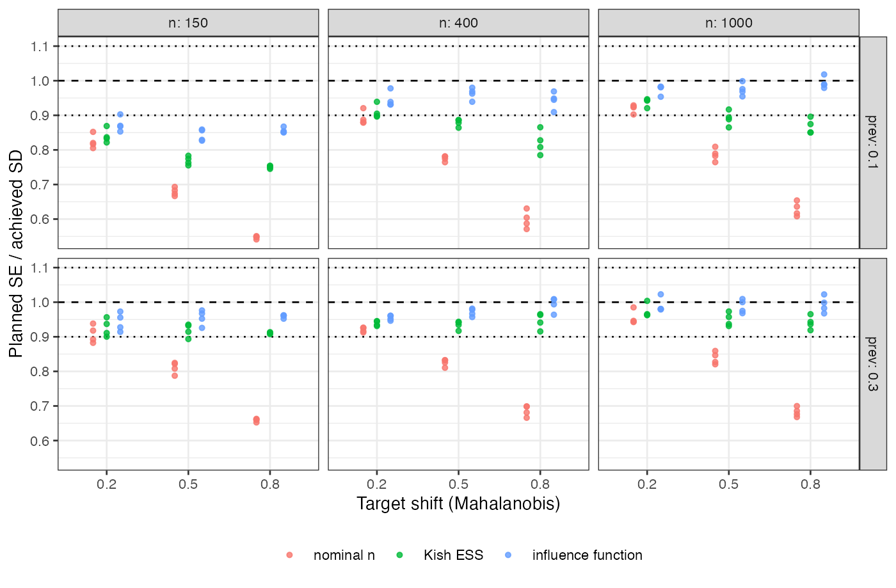

```{r setup}
s <- read.csv("../results/summary.csv")
f3 <- function(x) formatC(x, format = "f", digits = 3)
w10 <- function(x) round(100 * mean(abs(x - 1) <= 0.10))
bad <- s[abs(s$ratio_influence - 1) > 0.10, ]
```

# Abstract {.unnumbered}

**Background.** A MAIC's precision depends on overlap, the balancing constraints, the
outcome and the allocation, not on nominal sample size alone. Catalog problem OVL-06
asks whether a precision calculation made before any data exist can predict what the
analysis will achieve.

**Methods.** For each of 72 scenarios (total size 150 to 1000, target shift, 2 or 5
covariates, 1:1 or 2:1 allocation, event prevalence 0.1 or 0.3) we computed three
planned standard errors from the posited source and target laws: nominal $n$; $n$
replaced by each arm's Kish ESS; and the estimator's influence-function variance,
evaluated on a large draw from the posited laws. Each was compared with the standard
deviation MAIC achieved over 1000 replicates.

**Results.** The influence-function plan was within 10% of the achieved SD in
`r w10(s$ratio_influence)`% of scenarios (median ratio `r f3(median(s$ratio_influence))`),
Kish ESS in `r w10(s$ratio_kish)`% (median `r f3(median(s$ratio_kish))`), nominal $n$ in
`r w10(s$ratio_nominal)`% (median `r f3(median(s$ratio_nominal))`). The Kish plan
understated the achieved SD in `r round(100 * mean(s$ratio_kish < 1))`% of scenarios.
Every miss of the influence-function plan was at 150 patients with 10% prevalence,
where the asymptotic variance does not yet hold.

**Conclusion.** Planning in Kish ESS is optimistic, not pessimistic, and misses by more
than 10% in four scenarios of ten. The estimator's own influence function, which a
planner can evaluate at posited distributions, predicts achieved precision within 10%
except where events are too few for any asymptotic calculation.

# The problem {#sec-problem}

Kish's ESS is a functional of the weights alone; it ignores allocation, outcome
variance and the estimation of the weights, and it is recorded as likely an
underestimate of the true effective sample size [@phillippo2018]. The variance of a
weighted estimator is $\mathbb{E}[\psi^2]/n$ for its influence function $\psi$, which
carries all of those things, and it can be computed from posited source and target
laws before any data exist. The catalog's refuting sentence is that nominal $n$ with a
crude overlap adjustment predicts achieved precision well enough for planning.

# Design {#sec-design}

Registered protocol: `protocol.md`. Individual-data trial A versus C with $d$
independent normal covariates; binary outcome
$\operatorname{logit} p = \operatorname{logit}(\pi) + 0.4\sum_j x_j/\sqrt d + A(-0.5 + 0.4x_1)$;
MAIC on means to a target at Mahalanobis distance $s$. Estimand: the SD of the MAIC
estimate of the marginal log odds ratio, achieved over 1000 replicates. Plans:
nominal, $1/(n_1p_1(1-p_1)) + 1/(n_0p_0(1-p_0))$; Kish, the same with $n_a$ multiplied by
the arm's population ESS fraction; influence function, the stacked sandwich
$A^{-1}BA^{-\top}/n$ over weights and arm risks evaluated on 100,000 draws from the
posited laws.

# Results {#sec-results}

{#fig-plans}

| plan | within 10% | median ratio | range |
|---|---:|---:|---|
| nominal $n$ | `r w10(s$ratio_nominal)`% | `r f3(median(s$ratio_nominal))` | `r f3(min(s$ratio_nominal))` to `r f3(max(s$ratio_nominal))` |
| Kish ESS | `r w10(s$ratio_kish)`% | `r f3(median(s$ratio_kish))` | `r f3(min(s$ratio_kish))` to `r f3(max(s$ratio_kish))` |
| influence function | `r w10(s$ratio_influence)`% | `r f3(median(s$ratio_influence))` | `r f3(min(s$ratio_influence))` to `r f3(max(s$ratio_influence))` |

Both simpler plans are optimistic, increasingly so with the shift (@fig-plans): Kish
ESS corrects nominal $n$ for weight concentration but not for how the weights interact
with the outcome and the allocation. The influence-function plan's
`r nrow(bad)` misses were all at 150 patients and 10% prevalence, about eight events
per arm, and its median ratio rose from `r f3(median(s$ratio_influence[s$n == 150]))` at
150 patients to `r f3(median(s$ratio_influence[s$n == 1000]))` at 1000.

# What this does not answer {#sec-limits}

The planner is assumed to know the source and target laws; misspecifying them is a
separate error not studied. Binary outcome and anchored-side precision only: the
unanchored bias floor, which no sample size removes, and survival outcomes, where the
unit is weighted risk-set information, are not run. MAIC on means only. Peer review
has not been done.

# References {.unnumbered}
