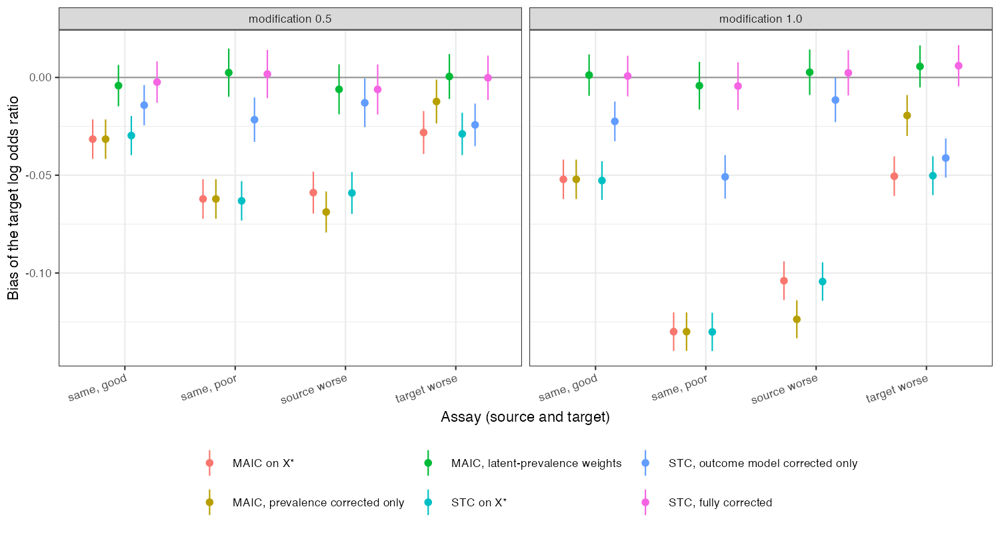

```{r setup}
s <- read.csv("../results/summary.csv")
f3 <- function(x) formatC(x, format = "f", digits = 3)
m <- function(k) s[s$method == k, ]
same <- m("maic_naive")[m("maic_naive")$assay %in% c("same_good", "same_poor"), ]
```

# Abstract {.unnumbered}

**Background.** A binary effect modifier recorded with error enters population adjustment through
the balancing step and through the outcome model. Catalog problem QBA-06 asks whether correcting
the outcome model alone is enough.

**Methods.** Anchored transport of an A-versus-C contrast with a misclassified binary modifier
(prevalence 0.3 in the source and 0.5 in the target), four assay scenarios (identical good,
identical poor, worse in the source, worse in the target) and two modification strengths: 8
scenarios, 1000 replicates each. MAIC on the recorded covariate, with prevalence correction, and with
latent-prevalence weights; STC on the recorded covariate, with only its outcome model corrected, and
fully corrected. Assay sensitivity and specificity were known.

**Results.** MAIC on the recorded covariate was biased even when both studies used the same assay
(`r f3(min(same$bias))` to `r f3(max(same$bias))`), and correcting the target prevalence alone did not help
(up to `r f3(min(m("maic_prev_only")$bias))`). Correcting only STC's outcome model left
`r f3(min(m("stc_outcome_only")$bias))` to `r f3(max(m("stc_outcome_only")$bias))`. Full correction of STC and MAIC
with latent-prevalence weights were unbiased (at most `r f3(max(abs(m("stc_corrected")$bias)))` and
`r f3(max(abs(m("maic_corrected")$bias)))`).

**Conclusion.** Balancing a misclassified covariate does not balance the true one, whatever the
assays, because reweighting recorded categories leaves each category's true composition at the
source's. Both paths need correcting: the outcome model and the population it is averaged over, or
for MAIC, weights chosen on the latent prevalence.

# The problem {#sec-problem}

With recorded $X^\star$, MAIC [@signorovitch2010] reweights the $X^\star = 1$ and $X^\star = 0$ categories to
match the target's reported prevalence. The weighted source's true prevalence is then
$\sum_{x^\star}s(x^\star)P_S(X = 1 \mid x^\star)$, which depends on the source's prevalence through Bayes'
rule and does not equal the target's. DESIGN.md said identical assays make balance on $X^\star$
imply balance on $X$; they do not. An outcome model on $X^\star$ is attenuated [@carroll2006], and
correcting it still averages over the wrong population if the target's reported prevalence is used
as the true one.

# Design {#sec-design}

Registered protocol: `protocol.md`; ADEMP structure [@morris2019]. Source trial 400 per arm;
$\operatorname{logit}P(Y = 1) = -1 + 0.5X + A(-0.5 + bX)$, $b \in \{0.5, 1\}$; the target reports the prevalence
of $X^\star$ from 800 patients. Latent-prevalence MAIC chooses the weight share $s$ of $X^\star = 1$ with
$s\,P_S(X = 1 \mid X^\star = 1) + (1 - s)P_S(X = 1 \mid X^\star = 0)$ equal to the target's corrected
prevalence. The corrected STC is a latent-class logistic likelihood with the known source assay.

# Results {#sec-results}

{#fig-bias}

The naive MAIC and STC behaved identically (@fig-bias): with one binary covariate both average the
same category-specific effects. Their bias grew with modification strength and with a poorer source
assay. Each partial correction fixed one path and left the other.

# What this does not answer {#sec-limits}

Known assay parameters, so validation-substudy and prior uncertainty were not propagated; a single
binary covariate; no interval assessment. Peer review has not been done.

# References {.unnumbered}
