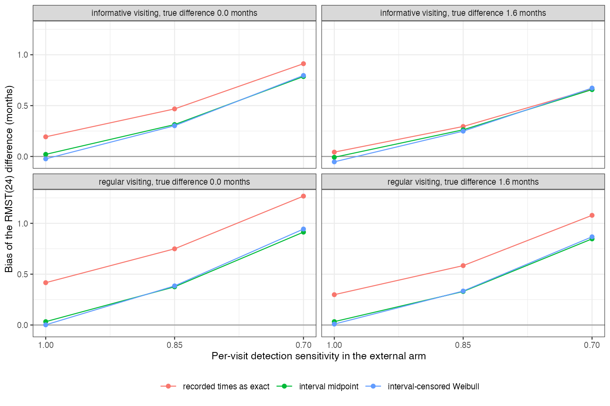

```{r setup}
s <- read.csv("../results/summary.csv")
f2 <- function(x) formatC(x, format = "f", digits = 2)
ic <- s[s$method == "interval", ]; nv <- s[s$method == "naive", ]
v <- function(se, vis, tr, m, col = "bias") s[s$se_b == se & s$visiting == vis & abs(s$truth - tr) < 0.01 & s$method == m, col]
```

# Abstract {.unnumbered}

**Background.** A trial assesses progression at scheduled visits with adjudication; a routine-care
comparator sees patients irregularly and can miss progression. Catalog problem QBA-07 asks which of
these ascertainment differences an interval-censored analysis covers.

**Methods.** Unanchored RMST(24) comparison of a trial arm (visits every 2 months, every event detected)
with an external arm (visits about every 3 months, regular or more frequent for higher-risk patients,
per-visit detection probability 1, 0.85 or 0.7), with a true difference of 0 or 1.59 months: 12
scenarios, 1000 replicates each. Kaplan-Meier on recorded times, interval midpoints, and an
interval-censored Weibull model.

**Results.** With every event detected, the interval-censored model was within
`r f2(max(abs(ic$bias[ic$se_b == 1])))` months of the truth under both visiting patterns, where recorded times
were biased by up to `r f2(max(nv$bias[nv$se_b == 1]))`. When the external arm missed events, every method was
biased: `r f2(min(ic$bias[ic$se_b == 0.85]))` to `r f2(max(ic$bias[ic$se_b == 0.85]))` months at a per-visit
sensitivity of 0.85 and `r f2(min(ic$bias[ic$se_b == 0.7]))` to `r f2(max(ic$bias[ic$se_b == 0.7]))` at 0.7, up to more
than half the true difference.

**Conclusion.** Interval censoring handles grid differences, and here risk-dependent visiting too; missed
detections need their own bias parameter, the per-visit sensitivity, in a sensitivity analysis.

# The problem {#sec-problem}

With every event detected at the next visit and visits unrelated to risk, the event is known to lie
between the last negative and the detecting visit, and an interval-censored likelihood is correct
(OUT-14). A missed detection moves the recorded event one or more visits later while the last negative
visit, as recorded, is already after the event, so the bracket itself is wrong. RMST [@royston2013]
accumulates the delay.

# Design {#sec-design}

Registered protocol: `protocol.md`; ADEMP structure [@morris2019]. Weibull event times (shape 1.2,
median 12 months in A) with a normal frailty on the log hazard (SD 0.6). Risk-dependent visiting: each
external patient's spacing proportional to $e^{-0.5Z}$ with the same average. Administrative end at 36
months and uniform dropout from 12 to 60 months.

# Results {#sec-results}

{#fig-bias}

The midpoint and interval-censored methods tracked each other (@fig-bias) and removed the grid bias. Visiting that depended on risk reduced the recorded-time bias rather than creating one, because the patients most
likely to progress were seen most often; the interval-censored model was unaffected at this strength,
against DESIGN.md's prediction. Missed detections added bias roughly in proportion to the miss probability, and no
method in the grid addressed it.

# What this does not answer {#sec-limits}

No recording lag, linkage loss or false-positive events; one frailty strength and visiting dependence;
no sensitivity analysis implemented over the detection parameter; no covariates or population
adjustment. Peer review has not been done.

# References {.unnumbered}
