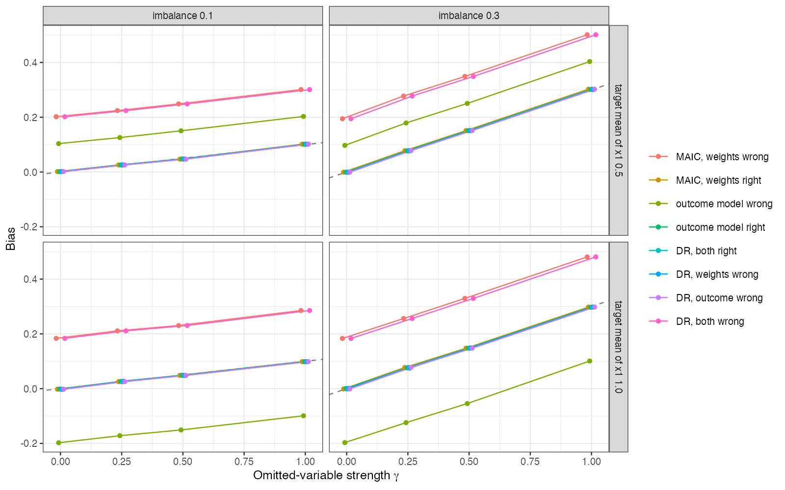

# Double robustness does not cover an omitted confounder, and the two
errors add
Ahmad Sofi-Mahmudi
2026-09-23

# Abstract

**Background.** Doubly robust (augmented weighting) estimators for
unanchored comparisons ([1](#ref-campbell2026)) are consistent if either
the weighting or the outcome model is correct. Catalog problem QBA-11
asks what this does and does not protect against, in particular an
omitted confounder and a sensitivity grid built on a misspecified model.

**Methods.** Unanchored transport of a continuous outcome with a
quadratic covariate effect, target covariate variances differing from
the source’s, and an omitted binary confounder with strength
$\gamma \in \{0, 0.25, 0.5, 1\}$ and source-target prevalence difference
0.1 or 0.3, at two overlap levels: 16 scenarios, 2000 replicates each.
MAIC, outcome regression and the augmented estimator under every
combination of correct and misspecified weighting and outcome models.

**Results.** With both models correct the augmented estimator’s bias
equaled the omitted-variable bias $\gamma\delta$ in every scenario and
coincided with the correctly specified single-model estimators (largest
difference 0.002). At $\gamma = 0$ it was unbiased with either model
wrong (at most 0.003), where the corresponding single-model estimator
was biased by up to 0.202. With both models wrong, the misspecification
bias and the omitted-variable bias added (largest interaction 0.008).
With exact-balance weights, augmentation by an outcome model built from
the balanced terms reproduced MAIC.

**Conclusion.** Double robustness protects against one wrong nuisance
model and nothing else. An omitted confounder biases every consistent
estimator equally, and a sensitivity grid built on a misspecified
analysis is shifted by the misspecification bias, which moves its
tipping point while its width looks right.

# The problem

Every estimator consistent for the observed-data functional converges to
$\Delta^\star = \Delta + \gamma\delta$ when a confounder with outcome
effect $\gamma$ and prevalence difference $\delta$ is omitted. Double
robustness concerns which nuisance models must be right to reach
$\Delta^\star$; it says nothing about the distance from $\Delta^\star$
to $\Delta$. A sensitivity analysis indexes that distance by
$(\gamma, \delta)$ but starts from the estimate, so any misspecification
bias translates the whole region.

With exact-balance (entropy) weights, $\sum_iw_i\hat m(x_i) = E_T\hat m$
whenever $\hat m$ is linear in the balanced functions, so the
augmentation term vanishes and the augmented estimator equals MAIC
([2](#ref-zhao2017)). The probe showed this for two of DESIGN.md’s four
augmented arms; augmentation changes the estimate only when the outcome
model contains terms the weights do not balance.

# Design

Registered protocol: `protocol.md`; ADEMP structure
([3](#ref-morris2019)). Source: 300 patients of A, $x \sim N(0, I_2)$;
$y = 1 + 0.5x_1 + 0.5x_2 + 0.4(x_1^2 - 1) + \gamma u + e$. Target
$x_1 \sim N(\mu_1, 0.7^2)$, $x_2 \sim N(0.3, 1)$, reporting means and
SDs; $\mu_1 \in \{0.5, 1\}$. Omitted $u$ with prevalence $0.3 + \delta$
in the source and 0.3 in the target. Weighting on means only is wrong
because the variances differ; on means and second moments it is right. A
linear outcome model is wrong; one with $x_1^2$ is right. Estimand: the
target mean of $Y(A)$.

# Results

Figure 1: Bias against omitted-variable strength. The dashed line is the
omitted-variable bias $\gamma\delta$. Correct and doubly robust
estimators lie on it; misspecified ones run parallel to it.

<a href="#fig-bias" class="quarto-xref">Figure 1</a> is the
demonstration the catalog asked for. The table at $\delta = 0.3$,
$\mu_1 = 0.5$:

| weighting | outcome model | MAIC or outcome regression, $\gamma = 0$ | augmented, $\gamma = 0$ | augmented, $\gamma = 1$ |
|----|----|---:|---:|---:|
| right | right | -0.000 | -0.000 | 0.302 |
| wrong | right | 0.195 | -0.001 | 0.301 |
| right | wrong | 0.097 | -0.000 | 0.302 |
| wrong | wrong |  | 0.195 | 0.501 |

The second column gives the single-model estimator whose model is wrong
in that row. The augmented estimator is right whenever one model is, and
wrong by $\gamma\delta = 0.3$ at $\gamma = 1$ in every row; with both
models wrong the two biases add.

The registered sensitivity-region criterion was not met as stated: a
misspecified analysis’s region contained the truth at $\gamma = 0$ in
0.888 of replicates, just under the 0.90 threshold. The region was
defined as the estimate minus the declared bias range, without sampling
error, so even a correct analysis included the truth only half the time;
the criterion was badly posed. The location error it was meant to expose
is clear regardless: the misspecified analysis’s region was displaced by
0.195 at $\gamma = 0$ and 0.201 at $\gamma = 1$, a constant shift
comparable to the largest declared bias.

# What this does not answer

Continuous outcome, where the omitted-variable bias is exactly
$\gamma\delta$; on a non-collapsible scale the correct outcome model is
only approximately correct after omitting $u$. Parametric nuisance
models without cross-fitting; drMAIC’s E-value screen and a formally
bias-indexed doubly robust estimator were not run. Peer review has not
been done.

# References

1.
Harlan Campbell, Antonio
Remiro-Azócar. Doubly robust augmented weighting estimators for the
analysis of externally controlled single-arm trials and unanchored
indirect treatment comparisons. Research Synthesis Methods. 2026.
doi:[10.1017/rsm.2026.10106](https://doi.org/10.1017/rsm.2026.10106)

2.
Qingyuan Zhao, Daniel Percival.
Entropy balancing is doubly robust. Journal of Causal Inference.
2017;5(1):20160010.
doi:[10.1515/jci-2016-0010](https://doi.org/10.1515/jci-2016-0010)

3.
Tim P. Morris, Ian R. White,
Michael J. Crowther. Using simulation studies to evaluate statistical
methods. Statistics in Medicine. 2019;38(11):2074–102.
doi:[10.1002/sim.8086](https://doi.org/10.1002/sim.8086)

