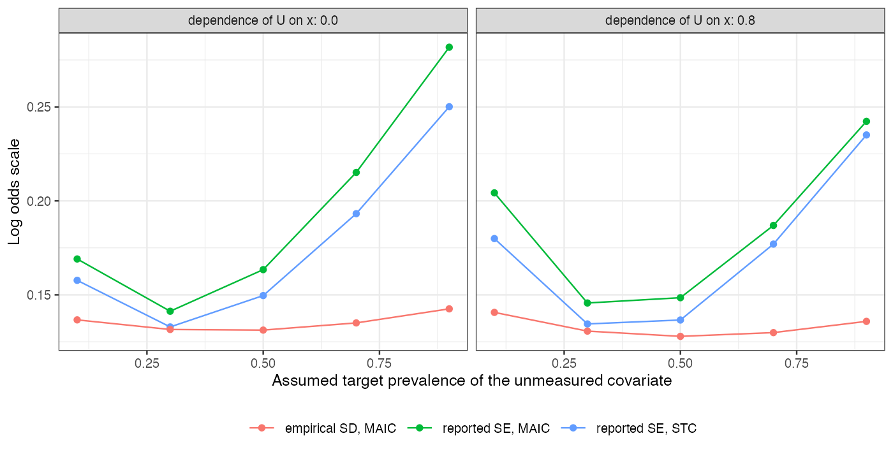

```{r setup}
s <- read.csv("../results/summary.csv")
f3 <- function(x) formatC(x, format = "f", digits = 3); f2 <- function(x) formatC(x, format = "f", digits = 2); f0 <- function(x) formatC(x, format = "f", digits = 0)
```

# Abstract {.unnumbered}

**Background.** A simulated-covariate bias analysis for unanchored comparisons imputes an unmeasured covariate
from assumed relations and adjusts for it. Its authors restricted it to STC, arguing that a MAIC version would lose
too much effective sample size or fail to find weights. Catalog problem QBA-13 tests that reason.

**Methods.** Unanchored transport with an unmeasured binary covariate (prevalence 0.3 in the source), independent
of or dependent on a measured covariate, and an outcome association known to the analyst. The analysis swept the
assumed target prevalence from 0.1 to 0.9, imputing the covariate ten times from its posterior given the measured
covariate and outcome, and adjusted by STC or by MAIC balancing its mean (2 scenarios, 500 replicates each).

**Results.** MAIC weights were feasible in `r f3(min(s$feasible))` to `r f3(max(s$feasible))` of replicates at every
sweep point. Effective sample size fell from about `r f0(max(s$ess))` to `r f0(min(s$ess))` of 300 at the extreme,
and MAIC's reported SE was `r f2(min(s$se_maic / s$se_stc))` to `r f2(max(s$se_maic / s$se_stc))` times STC's. Both routes
were unbiased (at most `r f3(max(abs(c(s$bias_stc, s$bias_maic))))`). Their reported SEs widened toward the extremes
(to `r f3(max(s$se_maic))`) while the estimates' spread stayed near `r f3(mean(s$emp_sd_maic))`, so coverage rose to
`r f3(max(s$cov_maic))`.

**Conclusion.** The restriction to STC was a conservative choice, not a necessity: the MAIC extension is feasible
and nearly as precise. Both routes, combined over imputations, report intervals that widen along the sweep faster
than the estimate's real uncertainty, so a curve should show its effective sample size and not be read as more robust
where it is merely wider.

# The problem {#sec-problem}

Adding a simulated covariate adds a balancing constraint to MAIC [@signorovitch2010]: feasibility can only shrink and
effective sample size only fall as its assumed target mean moves from the source's. Both are computable. For a binary
covariate the constraint is feasible whenever both categories occur in the source, and the loss depends on how far the
assumed prevalence is from the source's, which is the sensitivity parameter itself.

# Design {#sec-design}

Registered protocol: `protocol.md`; ADEMP structure [@morris2019]. 300 patients of A; target mean of the measured
covariate 0.5; outcome log odds ratio of the unmeasured covariate 0.8; dependence on the measured covariate 0 or 0.8
on the log odds scale. Estimand at each sweep point: A's marginal log odds in a target with that prevalence. Imputations
combined by Rubin's rules [@rubin1987].

# Results {#sec-results}

{#fig-se}

@fig-se shows the two routes' reported SEs tracking each other and both departing from the empirical spread toward
the extremes. The between-imputation variance grows as the assumed prevalence moves away from the source's, but the
imputations are drawn from a model the analyst holds fixed, so that variance is not uncertainty about the target
estimate under the stated assumption.

# What this does not answer {#sec-limits}

One binary unmeasured covariate with a logistic dependence (no copula factor); the analyst's assumed relations are
correct; unanchored A side only; no decision-threshold reading of the curve. Peer review has not been done.

# References {.unnumbered}
