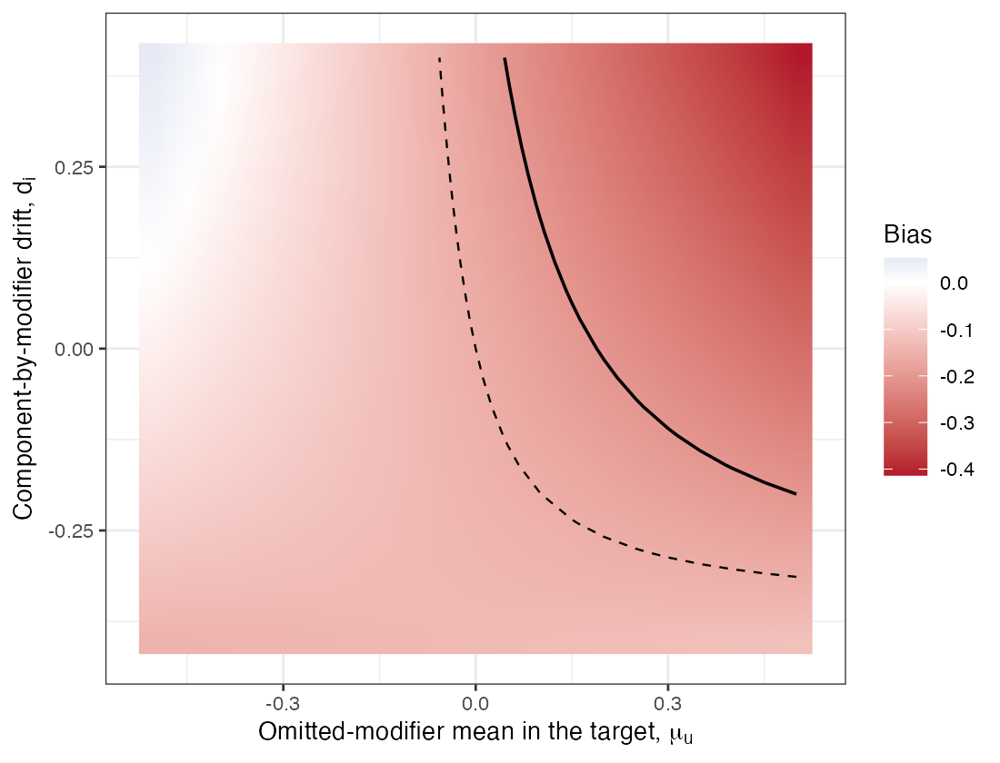

```{r setup}
s <- read.csv("../results/summary.csv"); f2 <- function(x) formatC(x, format = "f", digits = 2); f3 <- function(x) formatC(x, format = "f", digits = 3)
pc <- function(x) sprintf("%.0f%%", 100 * x); r1 <- s[s$scale == 1, ]
```

# Abstract {.unnumbered}

**Background.** A disconnected component comparison with no cross-gap evidence rests
on two unidentified assumptions: that the populations transport, and that shared
components act the same on both sides of the gap. Sensitivity analyses vary one at a
time. Catalog problem QBA-20 asks whether that bounds their joint effect.

**Methods.** A logistic model for the cross-gap contrast with an omitted modifier
(population layer) and component main-effect and component-by-modifier drift (bridge
layer). The bias of the reported target marginal log odds ratio (`r f2(r1$analyst)`,
favoring A) was computed exactly over elicited ranges at three scales, one parameter
at a time and jointly.

**Results.** At the base scale each one-at-a-time curve stayed within
±`r f3(r1$one_hi)` and none reversed the decision; the joint box reached
`r f3(r1$joint_lo)`, and `r pc(r1$box_reversal)` of it reversed the decision.
`r pc(r1$box_outside)` of the box lay outside the one-at-a-time envelope. The
component-by-modifier drift moved the estimate by at most `r f3(r1$di_alone)` alone,
because its effect is its product with the omitted modifier's imbalance. Under
positively dependent elicitation `r pc(r1$el_rev_pos)` of draws reversed the decision.

**Conclusion.** One-at-a-time curves do not bound two layers acting on one contrast,
and the drift form current tooling excludes is the one they cannot see. The layers
must be varied jointly and the region reported.

# The problem {#sec-problem}

A bias analysis that varies each unidentified parameter with the others fixed at
their null values measures a cross through the parameter space, not the space
[@greenland2005]. For additive biases the joint range is the sum of the one-at-a-time
ranges, so the cross never bounds it. Two features make the component case worse. The
drift of a component's interaction with a modifier biases the target contrast only
through that modifier's imbalance between populations, a product of the two layers
that is zero along both axes of the cross. And with no cross-gap evidence, neither
layer can be checked.

# Design {#sec-design}

Registered protocol: `protocol.md`. Individual model
$\operatorname{logit}p = -0.5 + 0.5x + 0.5u + a(-0.45 + 0.3x + 0.4u + d_m + d_iu)$ with $x$
measured and $u$ omitted; target $x \sim N(0.5, 1)$, $u \sim N(\mu_u, 1)$. The analysis assumes
$\mu_u = d_m = d_i = 0$. Elicited half-ranges at scale 1: $\mu_u$ 0.5 (a population-layer
bias of up to about 0.13), $d_m$ 0.2, $d_i$ 0.4; scales 0.5, 1 and 1.5. Exact quadrature; a
$21^3$ grid over the box and 4000 draws from each of three elicited distributions
(independent, or correlation $\pm0.5$ between $\mu_u$ and each drift parameter).

# Results {#sec-results}

{#fig-joint}

| scale | one-at-a-time envelope | joint envelope | box reversing | box outside envelope | masked | outside, elicited ind / + / − | reversing, elicited ind / + / − |
|---:|---|---|---:|---:|---:|---|---|
`r paste(sprintf("| %.1f | %s to %s | %s to %s | %s | %s | %s | %s / %s / %s | %s / %s / %s |", s$scale, f3(s$one_lo), f3(s$one_hi), f3(s$joint_lo), f3(s$joint_hi), pc(s$box_reversal), pc(s$box_outside), pc(s$masking), pc(s$el_outside_ind), pc(s$el_outside_pos), pc(s$el_outside_neg), pc(s$el_rev_ind), pc(s$el_rev_pos), pc(s$el_rev_neg)), collapse = "\n")`

: Reported log odds ratio `r f3(r1$analyst)`; a bias below it reverses the decision. Masked: both layers at least 0.1 in absolute value with net bias below 0.05. {#tbl-main}

The registered failure condition held at every scale: at least
`r pc(min(s$box_outside))` of the box lay outside the one-at-a-time envelope
(@tbl-main). At scale 1 the one-at-a-time analysis declared the decision robust while
the joint box contained reversals, the spurious robustness the entry describes; at
scale 0.5 both declared it robust, and at 1.5 neither did. The reversal region needs
all three parameters to push the same way (@fig-joint): a positive omitted-modifier
imbalance, positive main-effect drift and positive interaction drift. Offsetting
configurations also exist: in `r pc(r1$masking)` of the box both layers were material
and their net bias was under 0.05, so a correct-looking estimate could hide two large
errors.

The elicited dependence mattered as much as the ranges. If the analyst believes the
two layers move together, a quarter to a third of the elicited mass lies outside the
one-at-a-time envelope; if opposite, far less. No data inform that dependence.

# What this does not answer {#sec-limits}

A population-level calculation on one logistic model: no sampling, no component
network fit and no time-to-event scale. The joint law of measured and omitted
covariates was known, so the price of eliciting it (the design's fairness
requirement) is not measured. Component-by-component non-additivity and backbone
interactions were not included and are drift forms this analysis does not cover.
Peer review has not been done.

# References {.unnumbered}
