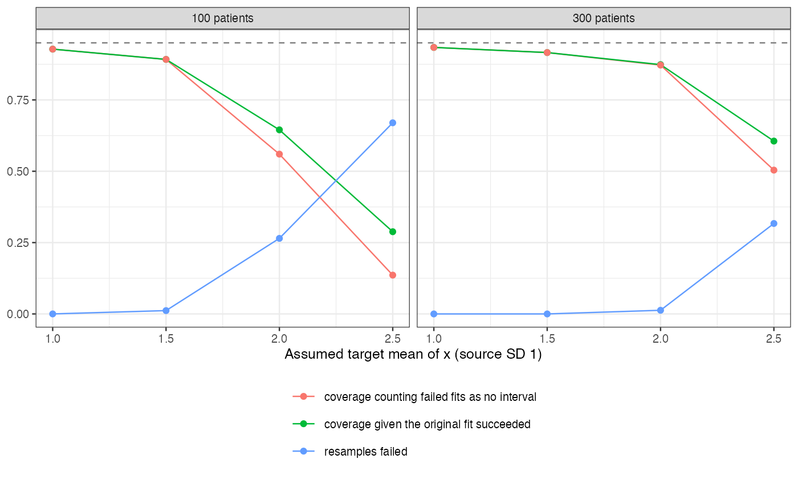

# A bootstrap that drops failed resamples reassures most where the
weighting is least reliable
Ahmad Sofi-Mahmudi
2026-09-23

# Abstract

**Background.** Sensitivity analyses for MAIC often bootstrap over a
grid of assumptions, and resamples whose weights cannot be computed are
dropped. Catalog problem QBA-23 asks whether that conditioning matters.

**Methods.** MAIC of 100 or 300 patients with one covariate, sweeping
the assumed target mean from 1 to 2.5 SD above the source’s (2
scenarios, 500 replicates, 200 bootstrap resamples each). Percentile
intervals from the successful resamples were scored against the
analysis’s own estimand.

**Results.** Where fewer than 10% of resamples failed, coverage was
0.874 to 0.934. Where more failed, it was 0.288 to 0.645 among analyses
whose original fit succeeded, and 0.136 to 0.560 counting failed
original fits as giving no interval. Resample failure reached 0.670 and
effective sample size fell to 2.6.

**Conclusion.** Failed resamples are the ones lacking the few patients
who make the weights possible, so the survivors are a selected sample
and their interval is falsely narrow. Report the failure share at each
grid point as a result; where it is material, the interval should not be
presented.

# The problem

MAIC ([1](#ref-signorovitch2010)) to a target mean is feasible only if
the mean lies inside the sample’s range, and near its edge the weights
rest on a handful of patients. A bootstrap ([2](#ref-efron1993))
resample that omits them cannot reach the target and fails; the
resamples that succeed are those that include them, so their spread
understates the estimate’s.

# Design

Registered protocol: `protocol.md`; ADEMP structure
([3](#ref-morris2019)). $x \sim N(0, 1)$, $y = x + e$; the estimand at
assumed target mean $m$ is $m$. Weights by log-sum-exp minimization,
failed when outside the sample range or when balance was not reached to
$10^{-4}$. A first solver overflowed at the edge of its search interval
and was replaced before the probes.

# Results

Figure 1: Share of failed bootstrap resamples and interval coverage
along the assumed target mean.

Failure and undercoverage rose together
(<a href="#fig-fail" class="quarto-xref">Figure 1</a>). Even where every
resample succeeded, the percentile interval undercovered somewhat, since
effective sample size was already small; beyond the point where failures
began, coverage collapsed. A larger sample moved the collapse further
out but did not remove it.

# What this does not answer

One covariate and a continuous outcome; the cost side of nested
resampling (warm starts, surrogates) and identified-set outputs were not
studied. Peer review has not been done.

# References

1.
James E. Signorovitch, Eric Q. Wu,
Andrew P. Yu, Charles M. Gerrits, Evan Kantor, Yanjun Bao, Shiraz R.
Gupta, Parvez M. Mulani. Comparative effectiveness without head-to-head
trials: A method for matching-adjusted indirect comparisons applied to
psoriasis treatment with adalimumab or etanercept. PharmacoEconomics.
2010;28(10):935–45.
doi:[10.2165/11538370-000000000-00000](https://doi.org/10.2165/11538370-000000000-00000)

2.
Bradley Efron, Robert J.
Tibshirani. An introduction to the bootstrap. New York: Chapman; Hall;
1993.
doi:[10.1007/978-1-4899-4541-9](https://doi.org/10.1007/978-1-4899-4541-9)

3.
Tim P. Morris, Ian R. White,
Michael J. Crowther. Using simulation studies to evaluate statistical
methods. Statistics in Medicine. 2019;38(11):2074–102.
doi:[10.1002/sim.8086](https://doi.org/10.1002/sim.8086)

