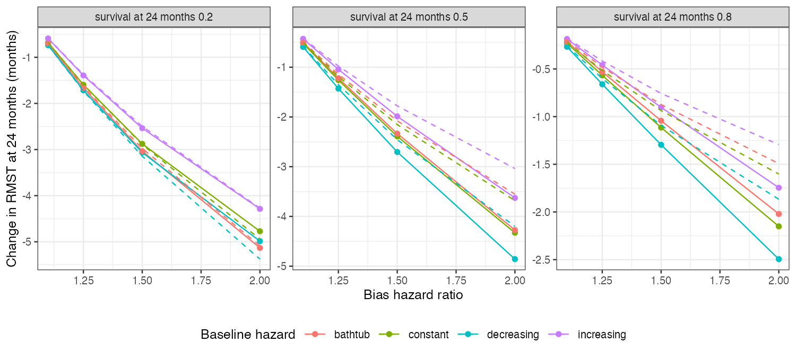

```{r setup}
g <- read.csv("../results/delta.csv"); sp <- read.csv("../results/spread.csv")
f2 <- function(x) formatC(x, format = "f", digits = 2); f0 <- function(x) formatC(x, format = "f", digits = 0)
h2 <- g[g$hr == 2, ]
e <- function(s) h2$lin_error[h2$s_tau == s]
```

# Abstract {.unnumbered}

**Background.** Bias analyses for population-adjusted survival comparisons are usually stated
on the hazard-ratio scale, while decisions use restricted mean survival time (RMST). Catalog
problem QBA-24 asks whether a hazard-scale bias can be reinterpreted as a proportional RMST
bias.

**Methods.** Population-level calculation: four baseline hazard shapes (constant, increasing,
decreasing, bathtub), each at 80%, 50% or 20% survival by 24 months, multiplied by bias hazard
ratios of 1.1 to 2. The change in RMST at 24 months was compared across shapes and with the
first-order (proportional) prediction.

**Results.** At the same survival by 24 months and the same bias, RMST changed by up to
`r f2(max(sp$ratio))` times as much for one baseline shape as another (decreasing against increasing
hazard). The proportional prediction understated the change by about `r f0(-100 * mean(e(0.8)))`%
at 80% survival and a bias hazard ratio of 2, and was off by `r f0(100 * min(e(0.2)))`% to
+`r f0(100 * max(e(0.2)))`% at 20% survival, where RMST saturates.

**Conclusion.** The RMST consequence of a hazard-scale bias depends on the baseline hazard's
shape and the event level, so a hazard-ratio sensitivity analysis cannot be read on the RMST
scale without the baseline curve. State the bias on the decision scale, or translate it with
the target's baseline survival.

# The problem {#sec-problem}

With $h^\star = he^{\gamma}$, RMST over $[0, \tau]$ [@royston2013] changes by
$\int_0^\tau[\exp\{-e^{\gamma}H(u)\} - \exp\{-H(u)\}]\,du$. Its first-order slope in $\gamma$ is
$-\int_0^\tau S(u)H(u)du$, which weights the cumulative hazard by survival and so depends on when
events occur. Beyond first order the change is convex in $\gamma$ when events are few and
saturates when most patients have an event within the window.

# Design {#sec-design}

Registered protocol: `protocol.md`. Cumulative hazards $c\,(t/24)^k$ with $k = 1, 1.5, 0.7$, and
$c\{0.5(t/24)^{0.5} + 0.5(t/24)^3\}$ for the bathtub shape, $c$ set for the survival level. Integrals
by adaptive quadrature.

# Results {#sec-results}

{#fig-delta}

A decreasing hazard concentrates events early, where each extra unit of hazard removes more
remaining time, so the same bias moved RMST most; an increasing hazard moved it least
(@fig-delta). The spread across shapes was largest when events were fewest. The direction of
the proportional prediction's error depended on the event level: convexity dominated with few
events and saturation with many, so no single correction factor applies.

# What this does not answer {#sec-limits}

Only the translation from a hazard-scale bias to RMST. The unanchored comparison with an
unmeasured confounder, pseudo-IPD and curve-based estimation, reconstruction error and
tipping sets were not run. Peer review has not been done.

# References {.unnumbered}
