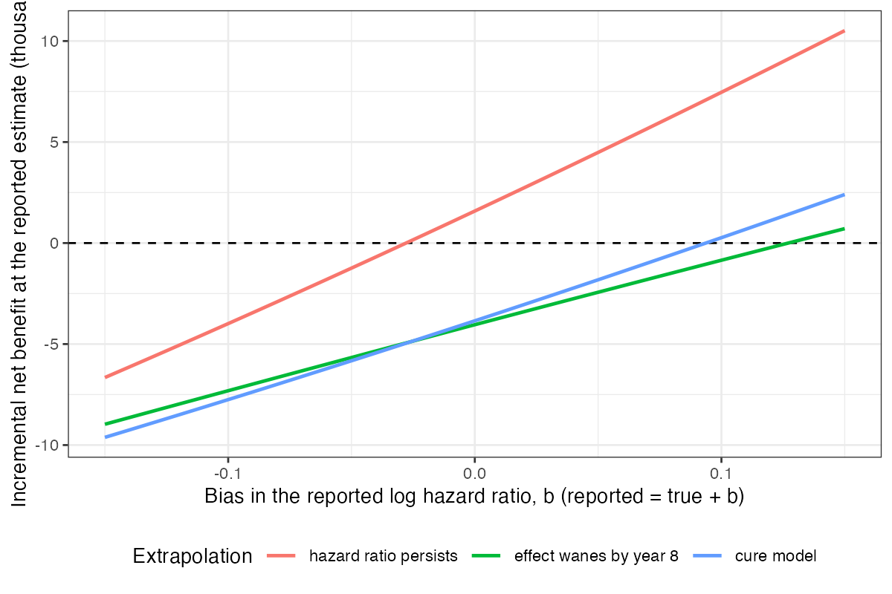

# Carrying a hazard-ratio bias into net benefit: the extrapolation
family moved the decision more than the bias did
Ahmad Sofi-Mahmudi
2026-09-23

# Abstract

**Background.** A bias analysis of an indirect comparison is specified
on the observed hazard ratio, but a reimbursement decision depends
mostly on extrapolated survival. Catalog problem QBA-25 asks whether
propagating a corrected estimate and its interval into the economic
model reproduces the decision uncertainty, or whether the bias must
share a parameter space with the extrapolation.

**Methods.** A decision model with a three-year trial, a reported hazard
ratio of 0.75 (SE of the log 0.10), a bias of up to ±0.15 on the log
hazard ratio, three treatment-effect extrapolations (persisting, waning
by year 8, cure), and a price at which the base case is just favorable.
Point propagation, scenario analysis and a joint probabilistic
reference; 4000 draws.

**Results.** The probability that net benefit was negative was 0.384
under point propagation and 0.668 under the joint reference. Almost all
of the difference came from the extrapolation family: adding the bias
alone, with the persisting effect, moved it to 0.416, while waning or
cure alone reversed the decision at the reported estimate. The worst
joint combination (net benefit -9,618) was worse than any one-at-a-time
scenario (-6,657).

**Conclusion.** Point propagation understated decision uncertainty, but
here because it fixed the extrapolation, not because it omitted the
bias. The bias region and the extrapolation choice should be varied
jointly, and the extrapolation is the larger of the two.

# The problem

Net benefit integrates the survival difference over a lifetime, and most
of that horizon lies beyond the trial. A bias parameter specified on the
observed hazard ratio reaches the decision only through the model that
extrapolates the treatment effect, and that model is itself a choice.
Current guidance recommends feeding sensitivity results into scenario
analyses; a scenario analysis varies one input at a time, which is the
cross-versus-region problem of multiple bias analysis
([1](#ref-greenland2005)) in the decision layer.

# Design

Registered protocol: `protocol.md`. Control survival Weibull (shape 1.3,
median 4 years), or 30% cured plus the same Weibull. Reported log hazard
ratio $\log 0.75$, SE 0.10, over 3 years of follow-up; bias $b$ with
reported = true + $b$, elicited uniform on $[-0.15, 0.15]$. After year 3
the effect persists, wanes linearly to none by year 8, or acts only on
the uncured. Horizon 25 years, discounting 3.5%, utility 0.75,
background cost 5000 per year alive, threshold 30000 per QALY; the
treatment cost for the first three years was set to 90% of the
break-even price under a persisting effect.

# Results

Figure 1: Net benefit at the reported estimate across the bias region,
by extrapolation family.

Table 1: 4000 probabilistic draws.

| propagation | probability of negative net benefit | mean net benefit |
|----|---:|---:|
| point propagation (PH, b = 0) | 0.384 | 1,895 |
| family ph (b = 0) | 0.384 | 1,895 |
| family waning (b = 0) | 0.895 | -3,990 |
| family cure (b = 0) | 0.821 | -3,632 |
| joint over b and family | 0.668 | -1,898 |
| joint over b, ph | 0.416 | 1,988 |
| joint over b, waning | 0.818 | -4,034 |
| joint over b, cure | 0.745 | -3,567 |

The registered primary was confirmed: the joint reference gave a
reversal probability 1.74 times that of point propagation
(<a href="#tbl-main" class="quarto-xref">Table 1</a>). The attribution
matters for what to do about it. Net benefit moved roughly linearly and
symmetrically with the bias under each family
(<a href="#fig-surface" class="quarto-xref">Figure 1</a>), so averaging
over a symmetric bias region barely changed the reversal probability.
The extrapolation family shifted the whole curve: with the effect waning
or confined to the uncured, the decision reversed at the reported
estimate. In scenario analysis, varying the bias under a persisting
effect and varying the family at no bias gave a lowest net benefit of
-6,657; the joint region reached -9,618, a combination no single
scenario showed.

# What this does not answer

A deterministic survival model rather than fitted extrapolations; three
families, not splines; one symmetric bias parameter; no uncertainty in
costs or utilities; one price. With an asymmetric elicited bias the bias
layer would shift the reversal probability directly. Peer review has not
been done.

# References

1.
Sander Greenland. Multiple-bias
modelling for analysis of observational data. Journal of the Royal
Statistical Society Series A. 2005;168(2):267–306.
doi:[10.1111/j.1467-985X.2004.00349.x](https://doi.org/10.1111/j.1467-985X.2004.00349.x)

