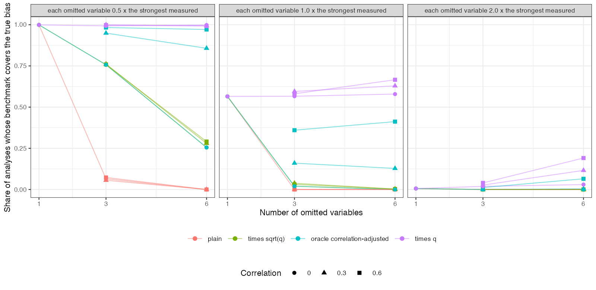

# The strongest measured covariate does not bound the bias from what was
not measured
Ahmad Sofi-Mahmudi
2026-09-23

# Abstract

**Background.** A common argument in bias analysis is that no measured
covariate, when dropped, moves the estimate as much as the assumed
unmeasured bias, so the unmeasured bias is implausible. Catalog problem
QBA-26 asks whether such a single-covariate benchmark bounds omitted
structure that is a sum of several variables.

**Methods.** Unanchored binary-outcome MAIC with four measured
covariates and one, three or six omitted covariates, correlated at 0,
0.3 or 0.6, each 0.5, 1 or 2 times as strong as the strongest measured
covariate: 21 scenarios, 1000 replicates each. The benchmark was the
largest change in the estimate from dropping one measured covariate,
used plain or scaled by $\sqrt q$, by a correlation-adjusted factor with
the true correlation, or by $q$.

**Results.** With three or six omitted variables each no stronger than
the strongest measured one, the plain benchmark covered the true
residual bias in 0.00 to 0.07 of analyses; the bias was 1.43 to 5.67
times the median benchmark. Scaling by $\sqrt q$ covered 0.00 to 0.76.
Scaling by $q$ covered at least 0.99 when each omitted variable was half
as strong as the strongest measured one, and about 0.6 when as strong.
The benchmark itself shrank as the omitted structure grew (from 0.163 to
0.067), because on the odds ratio scale unexplained outcome variation
attenuates every covariate’s marginal effect.

**Conclusion.** A maximum over single measured covariates bounds a sum
over omitted ones only when one variable is omitted and it is weaker.
Any benchmark argument must state an assumption about how many omitted
variables there are and how strong, and scaling for shifts in the same
direction needs a factor near $q$, not $\sqrt q$.

# The problem

With omitted structure $u = \sum_{j \le q}\gamma_ju_j$, the transport
bias of MAIC ([1](#ref-signorovitch2010)) grows with the sum of the
omitted variables’ contributions, while a leave-one-covariate-out
benchmark measures one measured variable at a time. Formal benchmarking
([2](#ref-cinelli2020)) expresses unmeasured strength as a multiple of a
measured covariate’s, which is an explicit assumption; the informal
argument omits it. DESIGN.md proposed a multiplier
$\sqrt{q\{1 + (q - 1)\bar\rho\}}$, the standard deviation of a sum. When
the omitted variables are all shifted in the same direction between
populations their biases add, so the multiplier should be nearer $q$.

# Design

Registered protocol: `protocol.md`; ADEMP structure
([3](#ref-morris2019)). Individual data on 400 patients of A; target
covariate means 0.3 SD higher. Measured coefficients 0.6, 0.4, 0.3, 0.2;
omitted coefficients $0.6s$ each; one latent factor gives the omitted
variables pairwise correlation $\rho$.
$\operatorname{logit}p = -1 + x^\top\gamma_x + u^\top\gamma_u$.
Estimand: A’s marginal log odds in the target. The true residual bias is
MAIC’s limit minus the truth, from $10^6$ draws. The scaled rules were
given the true $q$, which favors them.

# Results

Figure 1: Share of analyses whose benchmark covers the true residual
bias, by rule, number of omitted variables and their strength.

With one omitted variable half as strong as the strongest measured one,
every rule covered
(<a href="#fig-cov" class="quarto-xref">Figure 1</a>); with one as
strong, about half did, because the benchmark and the bias were equal on
average. With more omitted variables coverage by the plain and $\sqrt q$
rules collapsed. The correlation-adjusted factor helped only where
correlation was high, and only with the true correlation, which an
analyst does not have. The $q$ multiplier worked when its premise held
(each omitted variable weaker than the strongest measured one) and
failed when it did not.

# What this does not answer

Omitted variables shifted in the same direction; with random directions
their biases partly cancel and $\sqrt q$ becomes the relevant scale.
Continuous latent-factor correlation; one overlap level; the
negative-control route was not run. Peer review has not been done.

# References

1.
James E. Signorovitch, Eric Q. Wu,
Andrew P. Yu, Charles M. Gerrits, Evan Kantor, Yanjun Bao, Shiraz R.
Gupta, Parvez M. Mulani. Comparative effectiveness without head-to-head
trials: A method for matching-adjusted indirect comparisons applied to
psoriasis treatment with adalimumab or etanercept. PharmacoEconomics.
2010;28(10):935–45.
doi:[10.2165/11538370-000000000-00000](https://doi.org/10.2165/11538370-000000000-00000)

2.
Carlos Cinelli, Chad Hazlett.
Making sense of sensitivity: Extending omitted variable bias. Journal of
the Royal Statistical Society Series B. 2020;82(1):39–67.
doi:[10.1111/rssb.12348](https://doi.org/10.1111/rssb.12348)

3.
Tim P. Morris, Ian R. White,
Michael J. Crowther. Using simulation studies to evaluate statistical
methods. Statistics in Medicine. 2019;38(11):2074–102.
doi:[10.1002/sim.8086](https://doi.org/10.1002/sim.8086)

