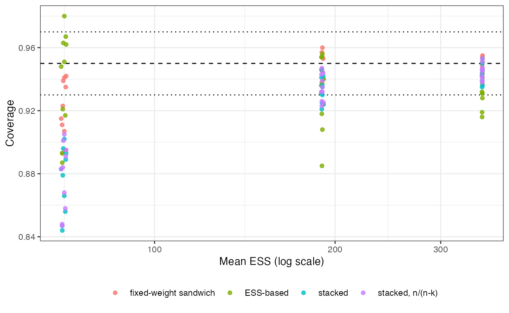

```{r setup}
s <- read.csv("../results/summary.csv"); u <- s[s$trim == "none", ]; t <- s[s$trim != "none", ]
f3 <- function(x) formatC(x, format = "f", digits = 3)
inb <- function(x) sum(x >= 0.93 & x <= 0.97)
rng <- function(x) sprintf("%s to %s", f3(min(x)), f3(max(x)))
```

# Abstract {.unnumbered}

**Background.** MAIC weights are estimated, and a variance that treats them as fixed
omits a term. Catalog problem SFW-10 asks whether stacking the weight and outcome
estimating equations improves on the fixed-weight sandwich and on the ESS-based
conventional variance that Chandler and Proskorovsky found accurate
[@chandler2024], and what a trimmed analysis estimates.

**Methods.** Binary-outcome MAIC with three covariates, 90 scenarios crossing target
shift, event risk, effect modification, its alignment with the prognostic direction
and weight trimming, 1000 replicates each. Four variance estimators: fixed-weight
sandwich, ESS-based, stacked sandwich, stacked with an $n/(n-k)$ correction. Trimmed
analyses were scored against the declared target and against the population the
capped weights induce.

**Results.** Stacking lowered the standard error relative to the fixed-weight sandwich
in all 30 untrimmed scenarios (ratio `r rng(u$ratio_stack_fixed)`), so the weighting
term had one sign here, not the two DESIGN.md expected. Because intervals already
undercovered at poor overlap, stacking made coverage worse: `r rng(u$cov_se_stack)`
against `r rng(u$cov_se_fixed)` for the fixed-weight sandwich and `r rng(u$cov_se_ess)`
for the ESS-based variance. Coverage within 0.93 to 0.97 held in
`r inb(u$cov_se_fixed)`, `r inb(u$cov_se_ess)` and `r inb(u$cov_se_stack)` of 30
scenarios respectively. Trimming moved the estimand by up to
`r f3(max(abs(t$gap)))` on the log odds ratio scale.

**Conclusion.** The stacked sandwich is the asymptotically correct variance, and at the
effective sample sizes where MAIC variance matters it is the most anticonservative of
the four. The fixed-weight sandwich or the ESS-based variance, as current guidance
recommends, is the better default. A trimmed analysis should report the population
its weights induce.

# The problem {#sec-problem}

MAIC solves $\sum_i w_i(x_i - m_T) = 0$ with $w_i = \exp(\alpha^\top(x_i - m_T))$ and then
computes weighted arm risks. Stacking both sets of estimating equations gives
$A^{-1}BA^{-\top}$, whose outcome block carries a term through
$\partial g_{\text{outcome}}/\partial\alpha$ that the fixed-weight sandwich drops. For
calibration-type weights, estimating the weights projects out outcome variation
explained by the balancing covariates, which lowers the variance. Trimming caps the
weights, breaks the calibration, and so changes the population the analysis
describes.

# Design {#sec-design}

Registered protocol: `protocol.md`. Individual-data trial A versus C, 200 per arm,
three independent normal covariates; $\operatorname{logit} p = \operatorname{logit}(\pi) +
0.5\sum_j x_j + A(-0.5 + \beta x_1)$; MAIC on means to $N(s\mathbf 1, I)$. Factors:
$s \in \{0.2, 0.5, 0.8\}$, $\pi \in \{0.1, 0.3\}$, $\lvert\beta\rvert \in \{0, 0.5, 1\}$ with
$\beta$ of either sign, trimming none or capped at the 99th or 95th weight percentile.
Truths by Monte Carlo over 400,000 draws with population-level weights.

# Results {#sec-results}

{#fig-cov}

All four estimators lose coverage as ESS falls (@fig-cov). The stacked sandwich falls
fastest because it is the smallest; the $n/(n-k)$ correction, with $k = 5$ parameters
and 400 patients, is too small to matter. The registered comparison of the ESS-based
and stacked variances reads "holds" (in band in `r inb(u$cov_se_ess)` against
`r inb(u$cov_se_stack)` scenarios): stacking adds nothing an analyst can use. The
ESS-based variance overcovered at good overlap (up to `r f3(max(u$cov_se_ess))`), the
fixed-weight sandwich was closest to nominal overall.

In trimmed analyses the declared and induced truths differed by up to
`r f3(max(abs(t$gap)))`, most at the 95th-percentile cap, and the estimate was closer to
the induced truth in `r round(100 * mean(abs(t$bias_induced) < abs(t$bias_target)))`% of
trimmed scenarios: trimming changes what is estimated, not only how precisely.

# What this does not answer {#sec-limits}

No bootstrap arm and no small-sample correction beyond $n/(n-k)$; one sample size, so
the point at which stacking's asymptotic advantage appears is not located. Binary
outcome, three covariates, MAIC on means. The induced population is computed from
population-level weights and a population cap. Peer review has not been done.

# References {.unnumbered}
