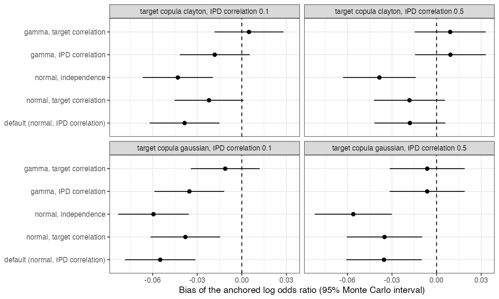

```{r setup}
s <- read.csv("../results/summary.csv"); r <- read.csv("../results/range.csv"); f3 <- function(x) formatC(x, format = "f", digits = 3)
q <- function(tc, sr, m) s[s$target_copula == tc & s$source_rho == sr & s$method == m, ]
```

# Abstract {.unnumbered}

**Background.** outstandR [@outstandr] standardizes an individual-data trial's outcome model
over a pseudo-population simulated from the aggregate trial's published means and SDs,
by default with normal margins and a Gaussian copula whose correlation is taken from the
individual data. Catalog problem SFW-12 asks how far its estimate depends on that
reconstruction.

**Methods.** Skewed target covariates (gamma margins) joined by a Clayton or Gaussian copula
at correlation 0.5; individual data with the same or a lower correlation; an anchored
binary-outcome comparison; the package's G-computation routine under five reconstructions;
400 replicates per cell.

**Results.** Within a dataset the estimate ranged over `r f3(min(r$range))` to `r f3(max(r$range))` on the log
odds ratio scale across the five reconstructions, at the registered materiality threshold of
0.05, and about a fifth of the estimate's sampling SD (0.24 to 0.26). The default's bias was
`r f3(min(s$bias[s$method == "default"]))` to `r f3(max(s$bias[s$method == "default"]))`; specifying gamma margins removed most of it
(`r f3(min(s$bias[s$method == "gamma_target"]))` to `r f3(max(s$bias[s$method == "gamma_target"]))` with the target's correlation). Whether the true
copula was tail-dependent changed the range by at most 0.002.

**Conclusion.** The reconstruction moves an outstandR estimate by an amount comparable to a
materiality threshold but small against its sampling error. The margin family matters more
than the copula; reporting the estimate across reconstructions is cheap with the package's
own arguments.

# The problem {#sec-problem}

G-computation integrates the fitted outcome model over the target's covariate law, which a
publication describes only by marginal summaries. The package fills the gap with an
assumption: normal margins unless told otherwise, and the individual data's correlation.
Each is an analyst choice that the published output does not display.

# Design {#sec-design}

Registered protocol: `protocol.md`. Target $x_1 \sim \text{Gamma}(2, 2)$, $x_2 \sim \text{Gamma}(4, 4)$, Clayton or
Gaussian copula at Pearson 0.5; individual data from $\text{Gamma}(2, 2.5)$ and $\text{Gamma}(4, 5)$ with a
Gaussian copula at 0.5 or 0.1; 300 per arm per trial;
$\operatorname{logit}p = -1 + 0.5x_1 + 0.5x_2 + a(\delta + 0.6x_1 + 0.4x_2)$ with $\delta = -0.5$ (A) and $-0.7$ (B). The package's
internal `gcomp_ml_means()` was called directly with 20000 pseudo-patients and no bootstrap.

# Results {#sec-results}

{#fig-bias}

| target copula | IPD correlation | mean range across reconstructions | from the correlation choice | from the margin family |
|---|---:|---:|---:|---:|
`r paste(sprintf("| %s | %.1f | %s | %s | %s |", r$target_copula, r$source_rho, f3(r$range), f3(r$range_normal), f3(r$range_margin)), collapse = "\n")`

: Mean over 400 replicates of the within-dataset range. {#tbl-main}

The registered primary called the sensitivity material, and it sat on the threshold in every
cell (@tbl-main). The margin family and the correlation each accounted for about half of the
range (@fig-bias). Normal margins on skewed covariates biased the estimate by 0.02 to 0.06;
independence was worst; using the individual data's correlation when the target's differed
added bias. The copula's tail dependence changed the range by at most 0.002, which agrees with
CMP-15's finding that the family's effect on the logit scale is a few hundredths.

# What this does not answer {#sec-limits}

Pairwise anchored comparison, two covariates, a correctly specified outcome model, point
estimates only; no Bayesian G-computation, multiple-imputation marginalization or network
use. Peer review has not been done.

# References {.unnumbered}
