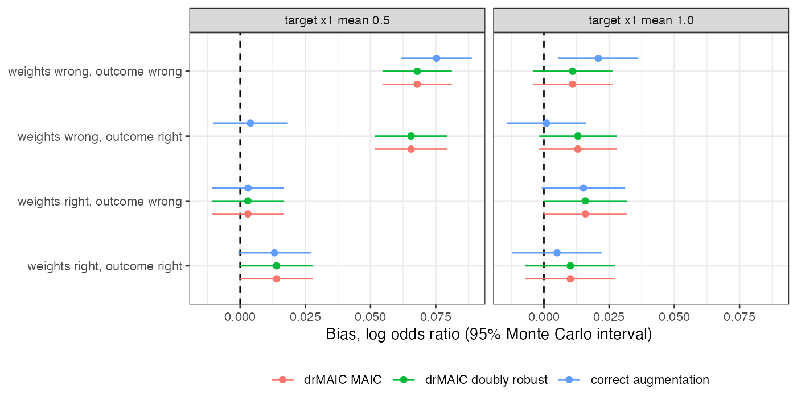

# drMAIC 0.1.0 returns the MAIC estimate as its doubly robust estimate,
with an interval six times too narrow
Ahmad Sofi-Mahmudi
2026-09-23

# Abstract

**Background.** drMAIC ([1](#ref-drmaic)) is a CRAN package offering a
doubly robust matching-adjusted indirect comparison with analytic and
bootstrap intervals. It has no methods publication or independent
evaluation. Catalog problem SFW-14 asks whether it implements what it
claims.

**Methods.** Code inspection, then an unanchored binary-outcome
simulation: a 2 by 2 of correct or incorrect weighting and outcome
models at two levels of overlap, 600 replicates per cell, against a
correctly augmented estimator; the package’s percentile bootstrap in two
cells (150 replicates each).

**Results.** The package’s doubly robust estimate equaled its MAIC
estimate in every replicate (largest difference 1.6e-15). With wrong
weights and a correct outcome model it therefore kept MAIC’s bias
(0.066, MCSE 0.007), which correct augmentation removed (0.004). The
analytic standard error was 0.028 to 0.029 against an empirical SD of
0.166 to 0.215, and 95% intervals covered 0.198 to 0.260. The percentile
bootstrap covered 0.780 to 0.793.

**Conclusion.** drMAIC 0.1.0 is not doubly robust and its intervals are
invalid. It should not be used in submissions until the four defects
below are fixed.

# The problem

An augmented weighting estimator is consistent if either the weighting
model or the outcome model is correct ([2](#ref-bang2005)). That is a
theorem; a simulation can test only whether code implements it. MAIC
([3](#ref-signorovitch2010)) supplies the weights. The augmentation must
average the outcome model’s predictions over the **target** population
and add the weighted mean residual in the individual-data trial.

# What the code does

Four defects in `dr_maic()` and `bootstrap_ci()`, read before the run:

1.  **The outcome-model term is averaged over the wrong population.**
    The code sets `theta_stc <- sum(w_norm * m_hat)`, the weighted mean
    of predictions over the individual-data patients, then adds
    `dr_correction`, the weighted mean residual. The sum is
    $\sum_i w_i \hat m_i + \sum_i w_i (Y_i - \hat m_i) = \sum_i w_i Y_i$,
    the MAIC estimate, whatever the outcome model. The weights never
    meet the target covariate law except through the moments they
    balance.
2.  **The variance is divided by $n$ twice.** `.dr_variance()` returns
    `sum((w_norm * (Y - theta))^2) / n`; with normalized weights,
    `sum(...)` is already the variance of the weighted mean.
3.  **The scales are mixed.** That probability-scale variance, plus the
    comparator’s probability-scale squared SE, is reported as the SE of
    a log odds ratio.
4.  **The bootstrap resamples a different analysis.** `bootstrap_ci()`
    recomputes weights on means only, refits the outcome model with the
    default formula, and holds the comparator’s estimate fixed, so its
    interval omits the comparator’s sampling error.

The time-to-event path returns a weighted median survival time labeled
as a hazard ratio; it is reported here from the code and not simulated.

# Design

Registered protocol: `protocol.md`. Individual data on A (300 patients);
the target publishes $x_1$’s mean and SD, the proportion with $x_2 = 1$,
and B’s response proportion and SE (300 patients). Source
$x_1 \sim N(0, 1)$, $x_2 \sim \text{Bern}(0.4)$; target
$x_1 \sim N(m, 0.8^2)$, $x_2 \sim \text{Bern}(0.6)$, $m \in \{0.5, 1\}$.
Outcome
$\operatorname{logit} P(Y = 1) = -0.5 + 0.6x_1 + 0.5x_2 + 0.4x_1^2$ for
A, B adding $-0.4$. Estimand: the target marginal log odds ratio, A
versus B. Correct weights balance means and $x_1$’s second moment (the
true density ratio); wrong weights balance means only. The correct
outcome model includes $x_1^2$; the wrong one is linear. The comparator
is augmentation done correctly, with the outcome model averaged over the
published target law and a 50-resample bootstrap SE.

# Results

Figure 1: Bias of the package’s two estimates and of correct
augmentation. The package’s two estimates coincide in every cell.

Table 1: Per cell, 600 replicates. MCSE of bias 0.007 to 0.009.

| weights | outcome model | target $x_1$ mean | drMAIC DR bias | correct augmentation bias | drMAIC SE | empirical SD | drMAIC coverage | augmentation coverage |
|----|----|---:|---:|---:|---:|---:|---:|---:|
| right | right | 0.5 | 0.014 | 0.013 | 0.029 | 0.175 | 0.248 | 0.958 |
| wrong | right | 0.5 | 0.066 | 0.004 | 0.029 | 0.174 | 0.237 | 0.945 |
| right | wrong | 0.5 | 0.003 | 0.003 | 0.029 | 0.171 | 0.240 | 0.960 |
| wrong | wrong | 0.5 | 0.068 | 0.075 | 0.029 | 0.166 | 0.260 | 0.930 |
| right | right | 1.0 | 0.010 | 0.005 | 0.028 | 0.215 | 0.198 | 0.933 |
| wrong | right | 1.0 | 0.013 | 0.001 | 0.028 | 0.185 | 0.218 | 0.962 |
| right | wrong | 1.0 | 0.016 | 0.015 | 0.028 | 0.200 | 0.252 | 0.945 |
| wrong | wrong | 1.0 | 0.011 | 0.021 | 0.028 | 0.191 | 0.240 | 0.940 |

All three registered failure conditions held
(<a href="#fig-bias" class="quarto-xref">Figure 1</a>,
<a href="#tbl-main" class="quarto-xref">Table 1</a>). Where MAIC with
wrong weights was biased ($m = 0.5$), the package’s doubly robust
estimate carried the same bias and correct augmentation did not. At
$m = 1$ wrong weights produced little bias for either, so that cell does
not discriminate. With both models wrong, correct augmentation was
biased, as the theorem allows. The analytic SE was essentially the
comparator’s probability-scale SE, about one sixth of the true SD on the
log odds ratio scale. Correct augmentation’s intervals covered 0.930 to
0.962.

The percentile bootstrap, 150 replicates per cell with 200 resamples,
covered 0.793 and 0.780. The comparator’s sampling variance it omits is
44% of the total variance at $m = 0.5$, and the resampled weights
balance means only.

# What this does not answer

One package version, binary outcome, one sample size. G-MAIC, the
published augmented weighting comparator named in the design, was not
run. Continuous outcomes follow the same identity in defect 1 but were
not simulated. Peer review has not been done.

# References

1.
Anupama Singh.
drMAIC: Doubly robust matching-adjusted
indirect comparison for HTA \[Internet\]. 2026. Available from:
<https://CRAN.R-project.org/package=drMAIC>

2.
Heejung Bang, James M. Robins.
Doubly robust estimation in missing data and causal inference models.
Biometrics. 2005;61(4):962–73.
doi:[10.1111/j.1541-0420.2005.00377.x](https://doi.org/10.1111/j.1541-0420.2005.00377.x)

3.
James E. Signorovitch, Eric Q. Wu,
Andrew P. Yu, Charles M. Gerrits, Evan Kantor, Yanjun Bao, Shiraz R.
Gupta, Parvez M. Mulani. Comparative effectiveness without head-to-head
trials: A method for matching-adjusted indirect comparisons applied to
psoriasis treatment with adalimumab or etanercept. PharmacoEconomics.
2010;28(10):935–45.
doi:[10.2165/11538370-000000000-00000](https://doi.org/10.2165/11538370-000000000-00000)

